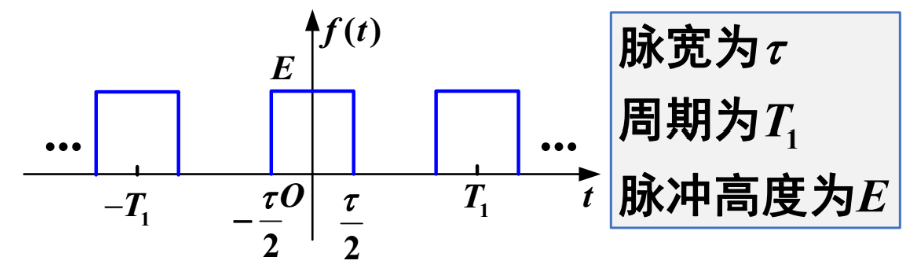

## 信号的正交分解

### 信号的正交函数分解

误差函数：
$$
f_e(t) = f_1(t) - c_{12}f_2(t)
$$
$c_{12}$​ 是 **投影系数**。

### 以矢量正交分解类比

- 两个矢量正交时，误差分量 **最小**。

### 信号正交的分量提取

$$
c_{12} = \frac {\int_{t_1}^{t_2} f_1(t)\cdot f_2(t)dt} {\int_{t_1}^{t_2}f_2^2(t)dt}
$$

$c_{12}=0$，则两个函数位正交函数，满足
$$
\int_{t_1}^{t_2} f_1(t)\cdot f_2(t)dt = 0
$$

### 例题1

余弦函数在 **一个周期内** 不包含正弦函数。

### 实正交函数集

所有函数两两正交。任意实信号 $f(t)$ 可表示为 n 维 **正交函数** 之和。

### 例题3：三角函数集是正交函数集

证明三角函数数集 $\left\{\sin(k\omega_0 t), \cos(k\omega_0 t)\right\}, k = 0, 1, 2, \dots$ 在区间 $(0, T_0)$ 上，其中 $T_0 = \frac{2\pi}{\omega_0}$，是正交函数数集。

### 复变正交函数集

$$
\int_{t_{1}}^{t_{2}} g_{i}(t) g_{j}^{*}(t) d t=\left\{\begin{array}{ll}0& i\neq j\\ K_{i}& i=j\end{array}\right.
$$

则这个复变函数集为正交函数集。

### 例题4：虚指数函数集是正交函数集

$\left\{e^{j k\omega_{1} t}\right\}, k=0,\pm 1,\pm 2,\cdots$ 在区间 $\left(0, T_{1}\right)$ 上是正交函数集，其中 $2\pi T_{1} = \omega_1$。

### 完备正交函数集

不解释。

### 帕塞瓦尔定理

$$
\int_{t_{1}}^{t_{2}} |f(t)|^2dt = \sum_{r=1}^\infty \int_{t_{1}}^{t_{2}} |c_rg_r(t)|^2dt
$$

一个信号的能量（功率）= 此信号在完备正交函数集中个分量能量（功率）之和。

## 周期信号的傅里叶级数分析

### 三角函数形式

- 周期信号 $f(t)$
- 基波周期 $T_0$
- 基波角频率 $\omega_0 = 2\pi/T_0$

$$
f(t)=a_{0}+\sum_{n=1}^{\infty}\left[a_{n}\cos\left(n\omega_{0} t\right)+b_{n}\sin\left(n\omega_{0} t\right)\right]
$$

$$
a_{0}=\frac{1}{T_{0}}\int_{t_{0}}^{t_{0}+T_{0}} f(t) d t
$$

$$
a_{n}=\frac{2}{T_{0}}\int_{t_{0}}^{t_{0}+T_{0}} f(t)\cos\left(n w_{0} t\right) d t
$$

$$
b_{n}=\frac{2}{T_{0}}\int_{t_{0}}^{t_{0}+T_{0}} f(t)\sin\left(n w_{0} t\right) d t
$$

谐波形式：
$$
f(t) = c_0+\sum_{k=1}^{\infty}c_k\cos(k\omega_0t+\phi_k)
$$

- k = 0，$c_0=a_0$ 称为 **直流、平均值**
- k = 1 称为基波（1 次谐波）

$$
c_{k}=\sqrt{a_{k}^{2}+b_{k}^{2}}\quad\left(c_{k}\geq 0\right)\quad\varphi_{k}=\arctan\left(-\frac{b_{k}}{a_{k}}\right)
$$

### 指数函数形式

$$
f(t)=\sum_{n=-\infty}^{+\infty} F_{n} e^{j n\omega_{1} t}
$$

其中的傅里叶级数 **系数** $F_n$：
$$
F_{n}=\frac{1}{T_{1}}\int_{t_{0}}^{t_{0}+T_{1}} f(t) e^{-j n\omega_{1} t} d t
$$

### 例题1：幅度频谱图和相位频谱图

重要转换：
$$
c\cos t = \frac 12c\left[e^{-jt}+e^{jt}\right]
$$
注意：中级序列的频谱不满足收敛性。

### 函数对称性与 $F_k$ 的关系

- $f(t)$​ 为偶函数：$F_k = \frac 12 a_k$，为实函数。
- $f(t)$ 为奇函数：$F_k = -\frac 12 jb_k$​，为虚函数。

- 奇谐函数：平移半个周期并上下翻转，波形不变。
- 偶谐函数：平移半个周期与原波形重合。

### 帕塞瓦尔定理

$$
P = \frac{1}{T_1} \int_{0}^{T_1} |f(t)|^2 \, dt =
\begin{cases}
a_0^2 + \frac{1}{2} \sum_{k=1}^{\infty} (a_k^2 + b_k^2) & \text{三角函数形式} \\
c_0^2 + \frac{1}{2} \sum_{k=1}^{\infty} c_k^2 & \text{谐波形式} \\
\sum_{k=-\infty}^{\infty} |F(k\omega_1)|^2 & \text{指数形式}
\end{cases}
$$

### 周期矩形脉冲序列的频谱结构

#### 三角形式的谱系数

$$
F_k=\frac12 a_k
$$

#### 指数形式的谱系数

$$
F_k=\frac {E\tau} {T_1} Sa(k\omega \frac \tau 2)
$$

#### 频谱及其特点

- 周期 $T_1$：谱线间隔 $\omega_l = \frac{2\pi}{T_1}$，$T_1$ 越大，谱线间隔越小。

### 频带宽度

将包络函数的第一个零点作为信号的频带宽度：
$$
B_{\omega} = \frac {2\pi} \tau
$$
系统的通频带 > 信号的带宽，才能 **不失真**。

## 典型非周期信号的傅里叶变换

### 表示方法

正变换：
$$
F(\omega) = \int_{-\infty}^{+\infty} f(t)e^{-j\omega t}dt = \mathcal{F}[f(t)]
$$
反变换：
$$
f(t) = \frac{1}{2\pi} \int_{-\infty}^{+\infty} F(\omega)e^{j\omega t}d\omega = \mathcal{F}^{-1}[F(\omega)]
$$

### 门函数  $E[u(t + \frac{T}{2}) - t(t - \frac{T}{2})]$

$$
F(\omega)=E\tau Sa(\frac\tau2 \omega)
$$

### 单边指数 $Ee^{-\alpha t}u(t)$

$$
F(\omega)=\frac E {\alpha+j\omega}
$$

### 直流 $E$

$$
F(\omega) = 2\pi E \delta(\omega)
$$

### 冲激信号

$$
F(\omega) =1
$$

### 符号函数

$$
F(\omega) = \frac 2 {j\omega}
$$

### 阶跃函数

$$
F(\omega) = \pi \delta(\omega) + \frac 1 {j\omega}
$$

### 更多信号

[YouXam 的笔记](https://youxam.github.io/note/学业/大二上/信号与系统/第3章 连续时间信号的频域分析.html#倒数信号-dfrac-1-t)

## 傅里叶变换的基本性质

[YouXam 的笔记](https://youxam.github.io/note/学业/大二上/信号与系统/第3章 连续时间信号的频域分析.html#傅里叶变换的基本性质)