## 稳恒磁场

### 磁场、磁感应强度

#### 磁场的基本性质

#### 磁感应强度

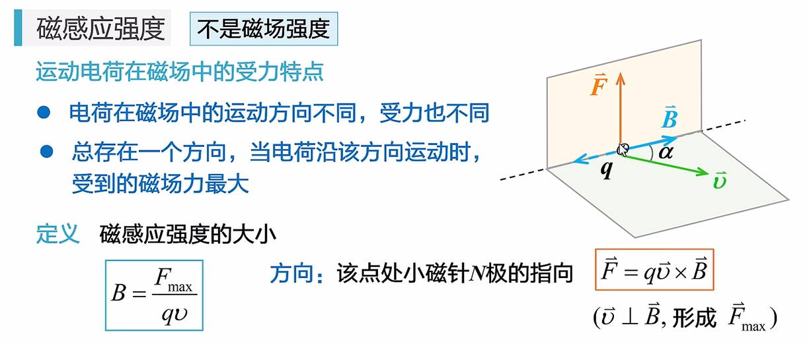

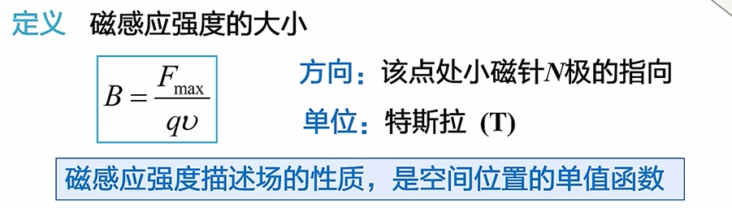

### 毕奥—萨伐尔定律

#### 磁场的叠加原理

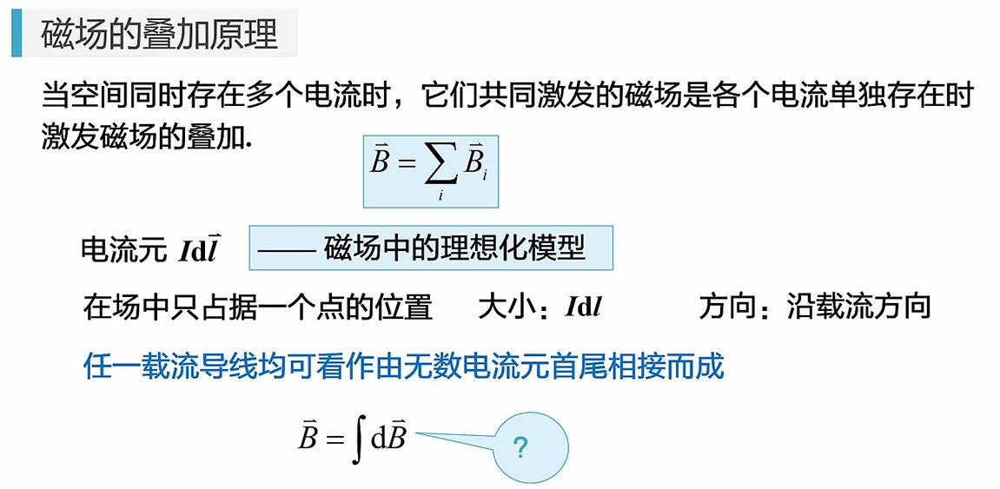

#### 毕奥—萨伐尔定律

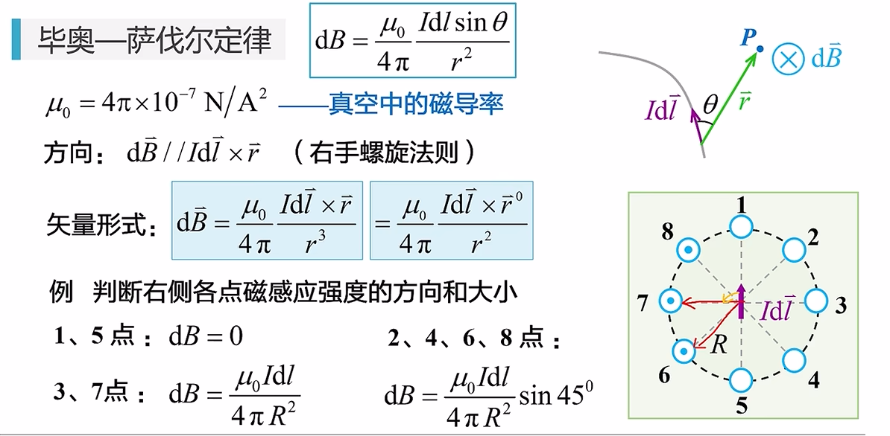

#### 毕萨定律的应用

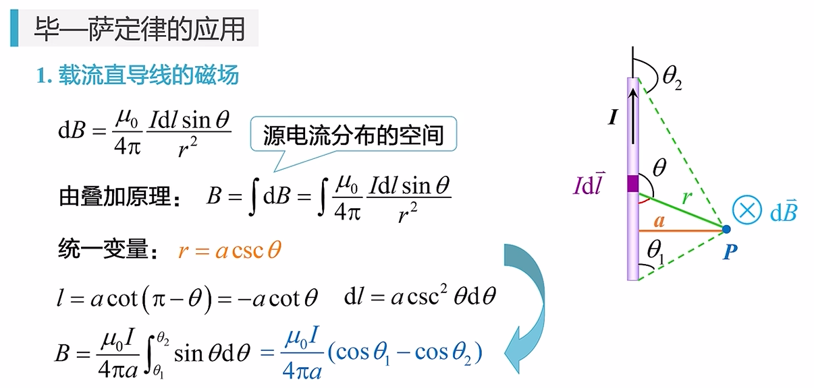

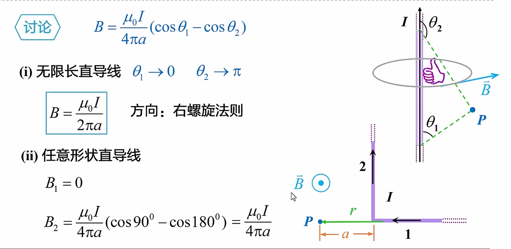

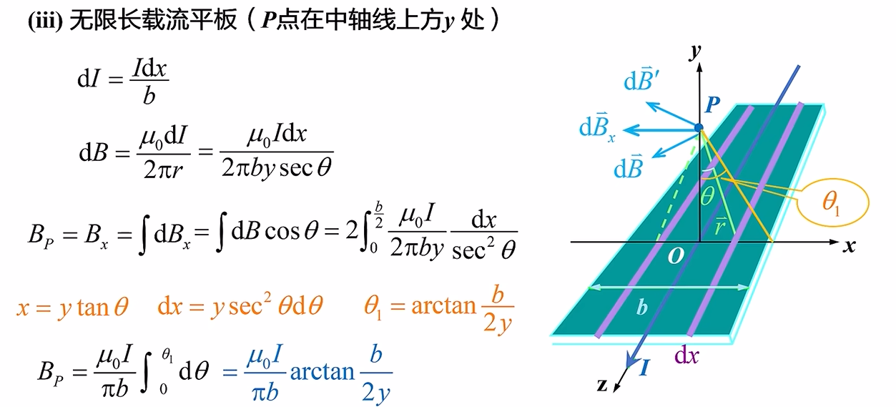

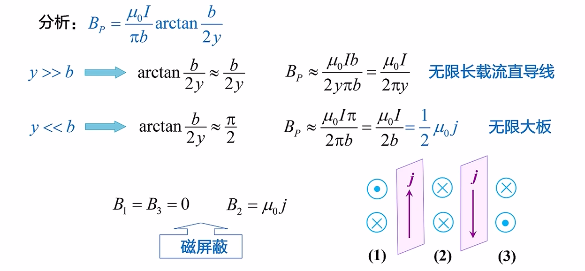

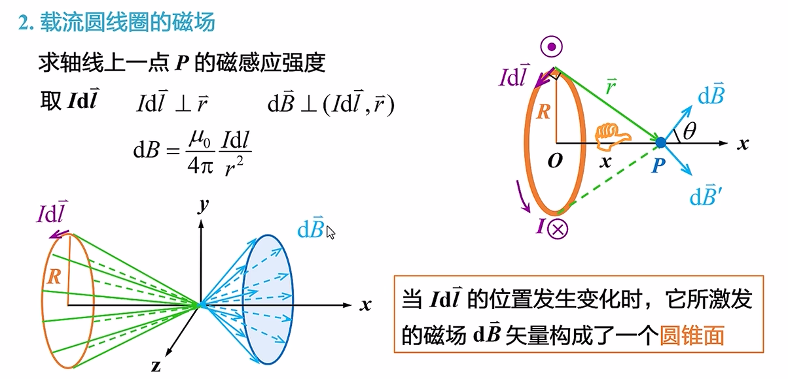

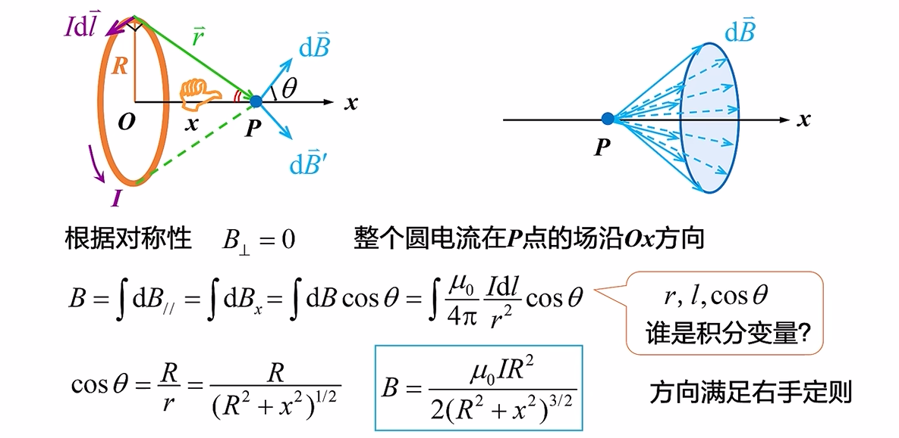

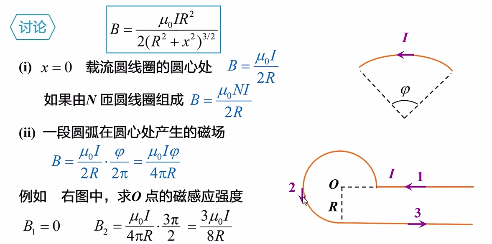

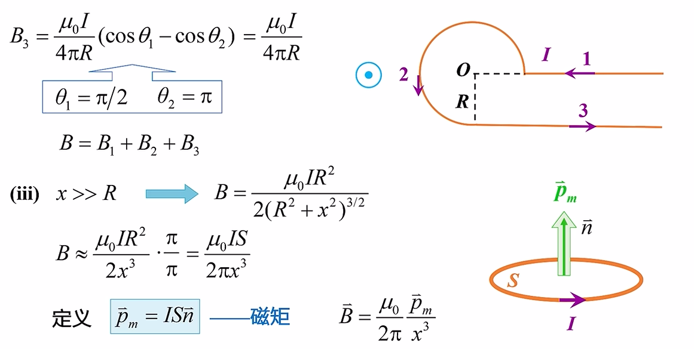

- 这里提到了“**磁矩**” ⬆️

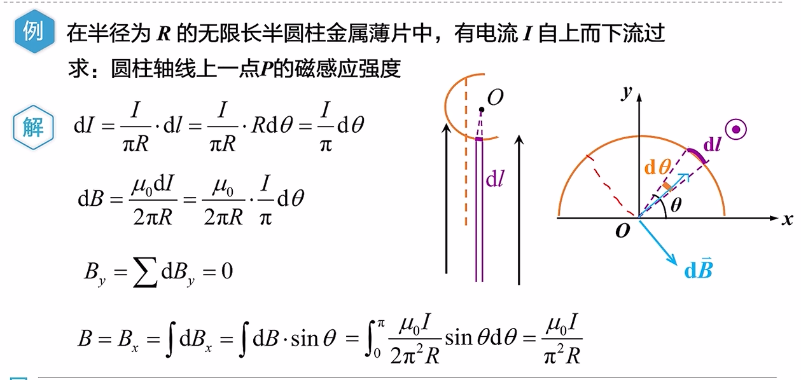

#### 运动电荷的磁场

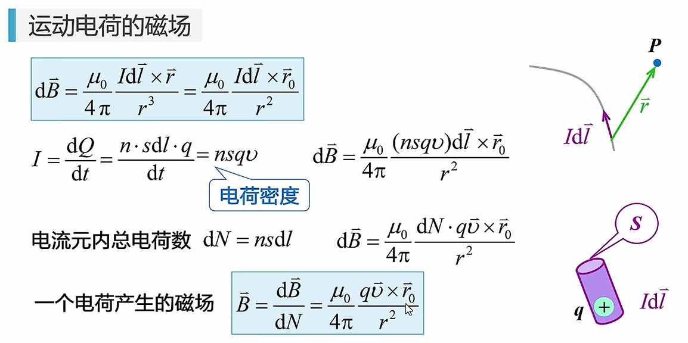

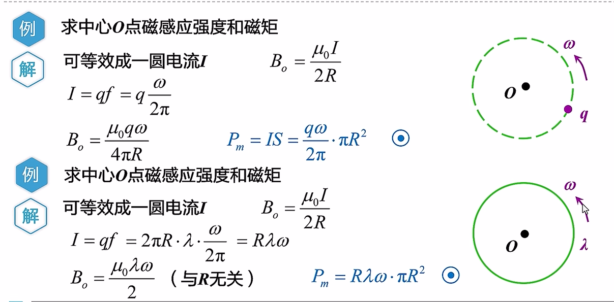

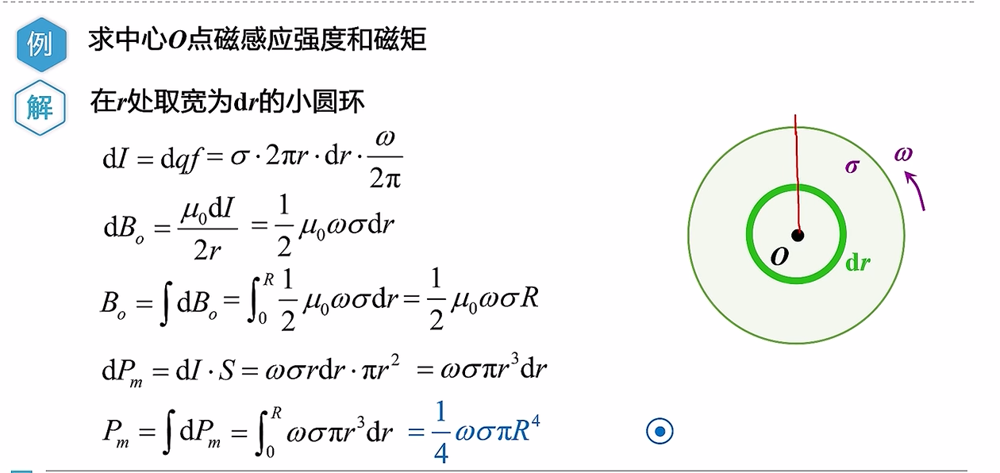

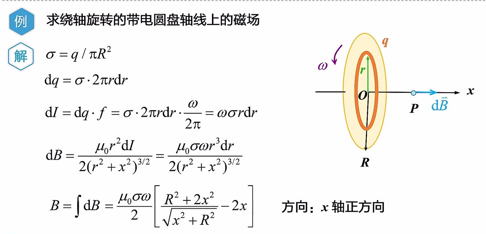

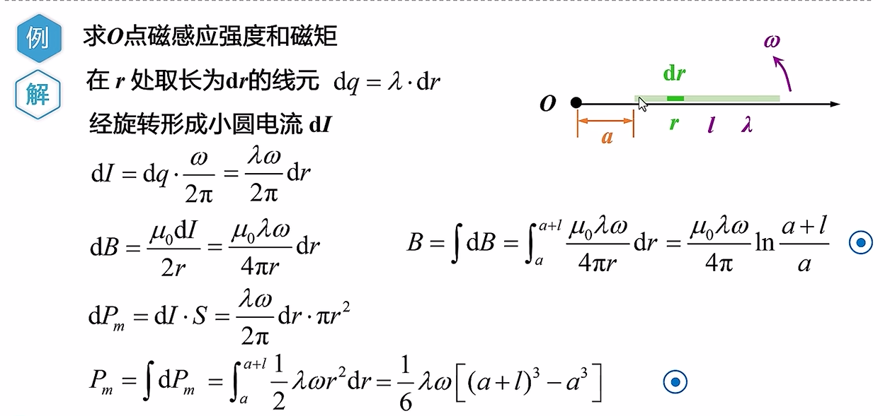

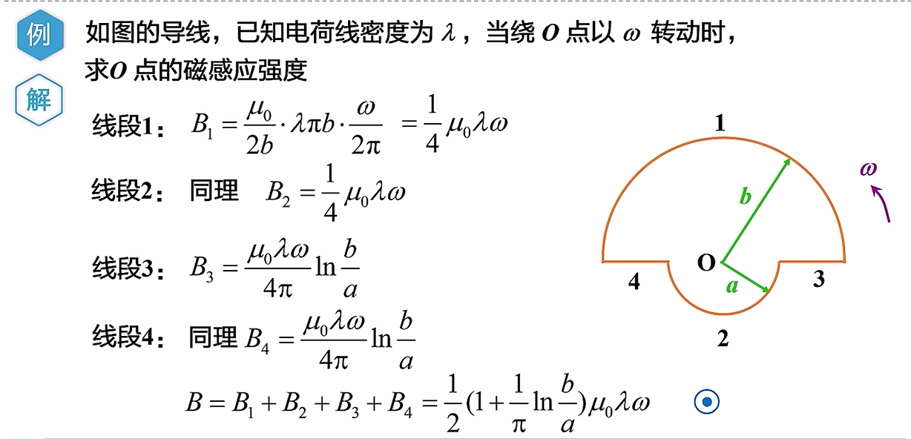

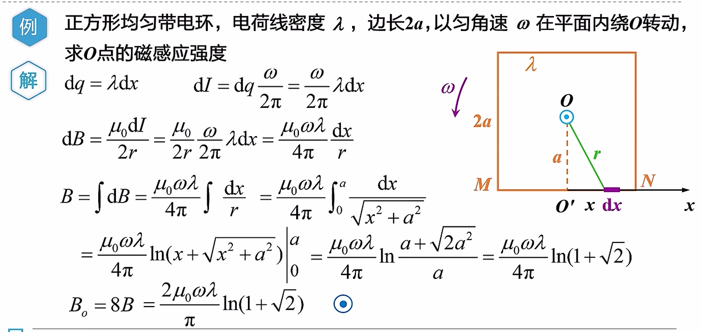

### 磁通量、磁高斯定理

#### 

### 安培环路定理

### 磁场对电流的作用

### 磁场对运动电荷的作用

### 物质的磁性