## 静电场

### 电荷 库伦定律

#### 电荷

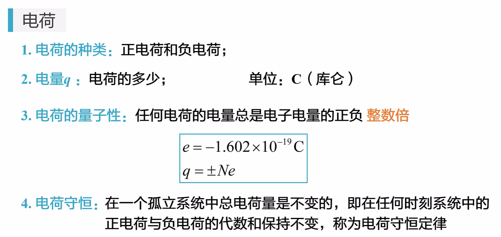

#### 库伦定律

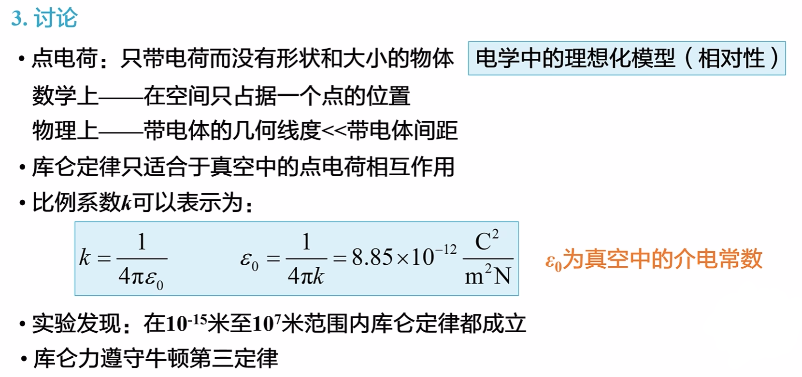

### 静电场 电场强度

#### 电场

#### 电场强度

#### 场强的计算

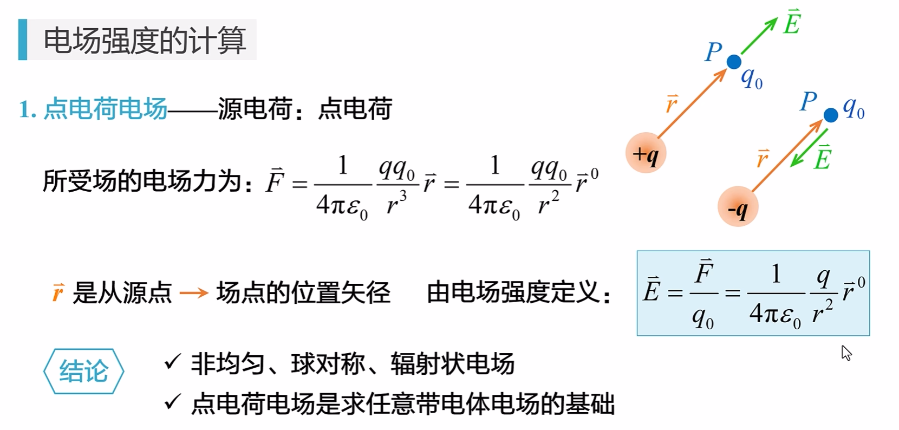

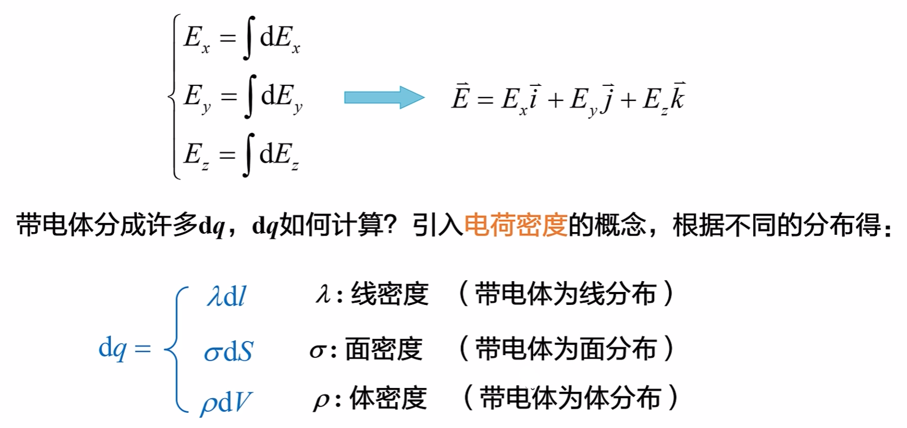

------

例题 1（圆环）：

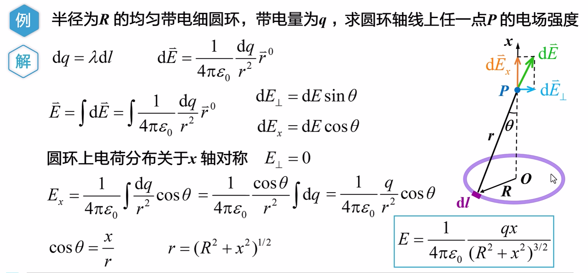

------

例题 2（圆盘）：

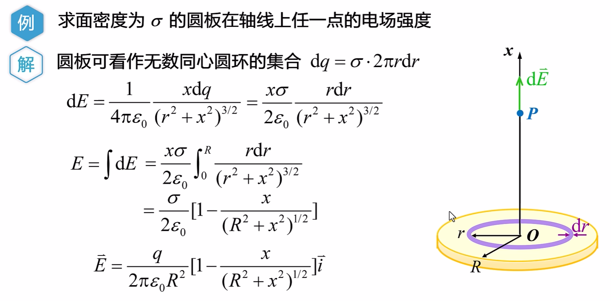

------

例题 3（线段）：

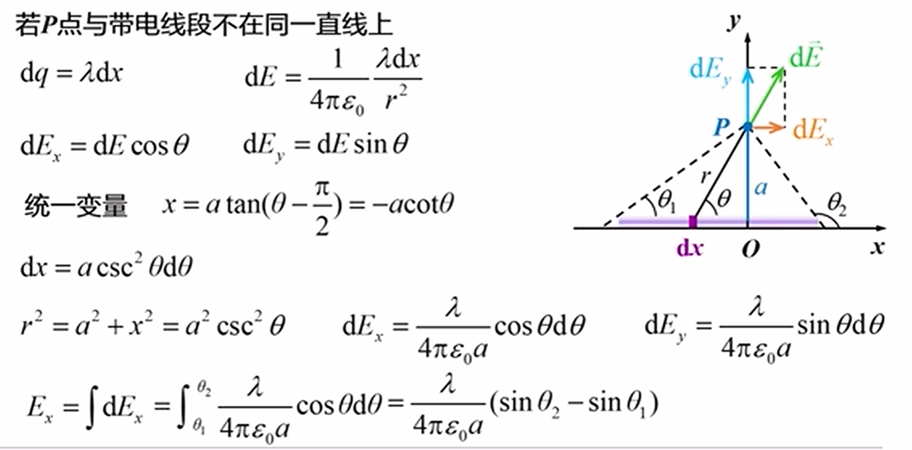

讨论：

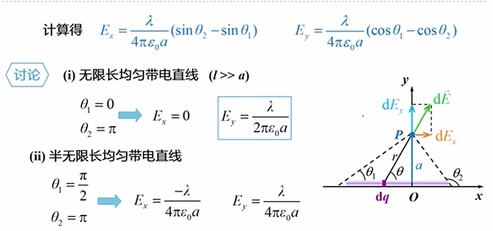

------

例题 4：

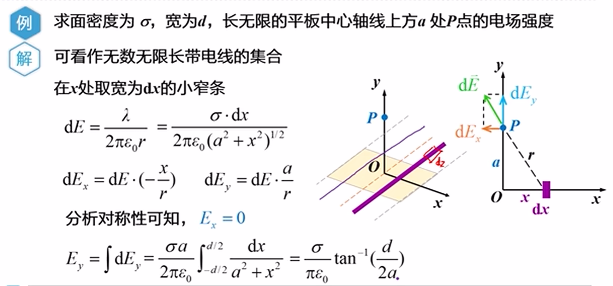

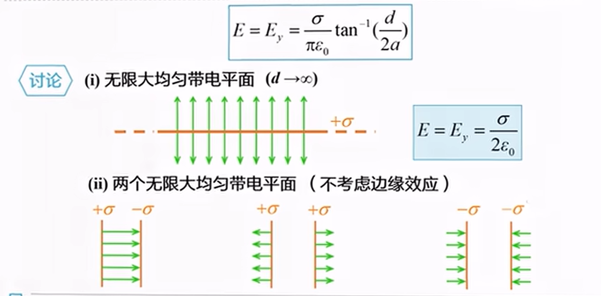

### 电通量 高斯定理

#### 电通量

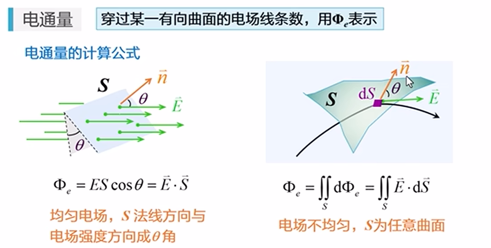

- 规定：法向方向指向曲面凸面

??? note "通量与环流"
	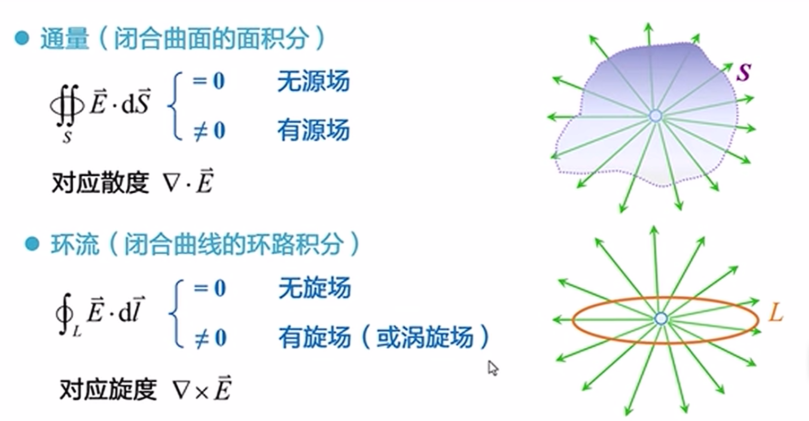

#### 高斯定理

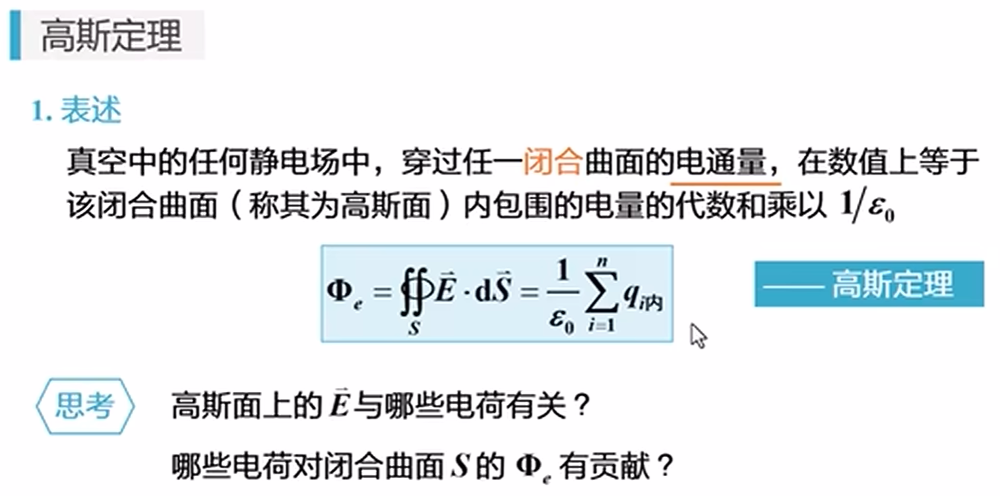

