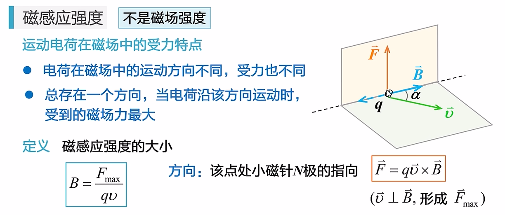
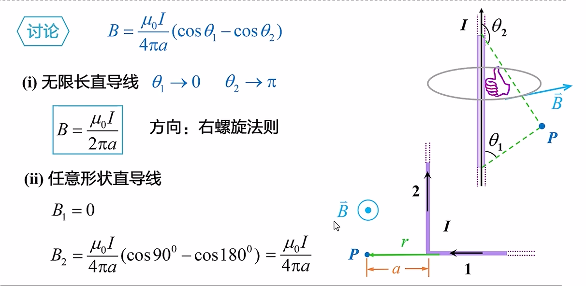
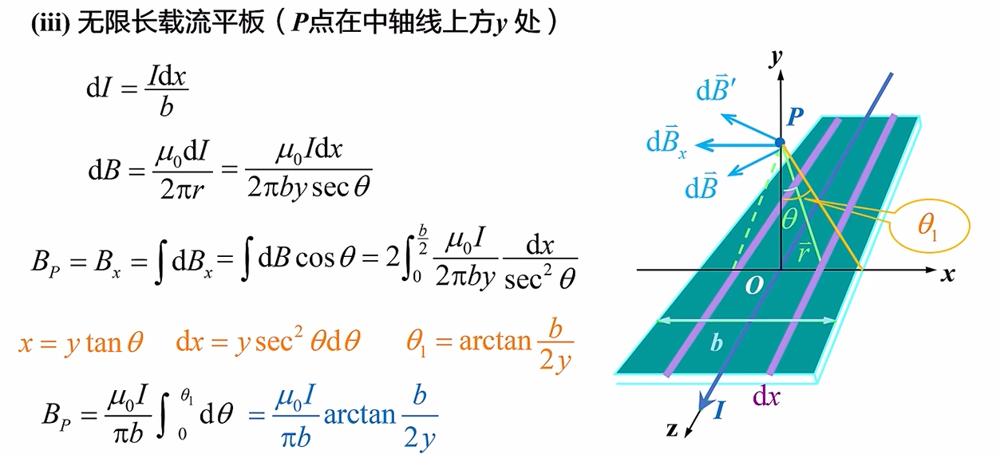
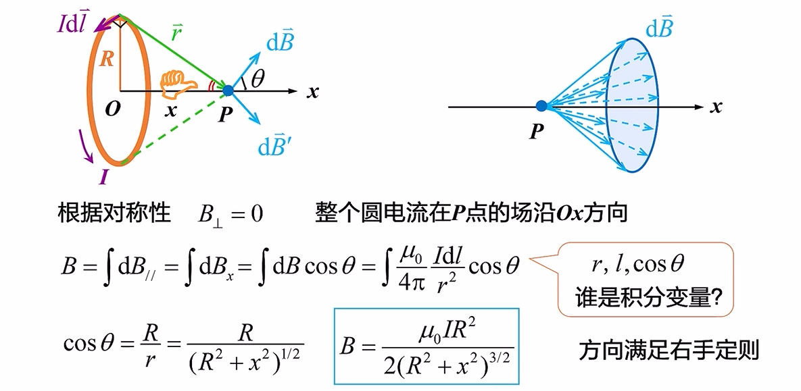
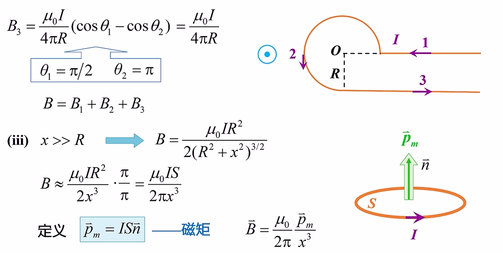
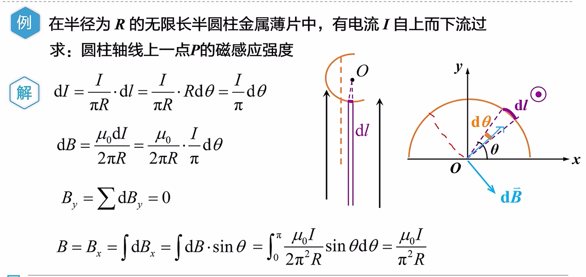
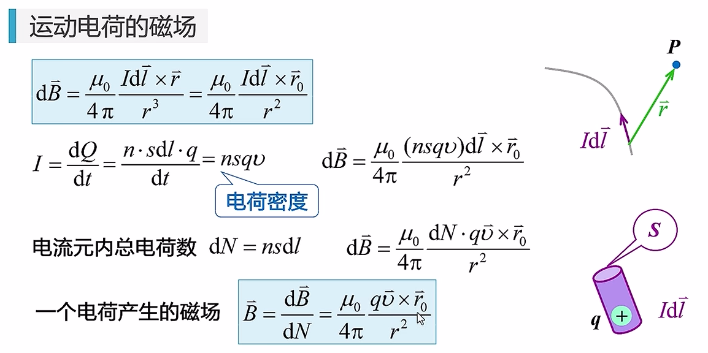
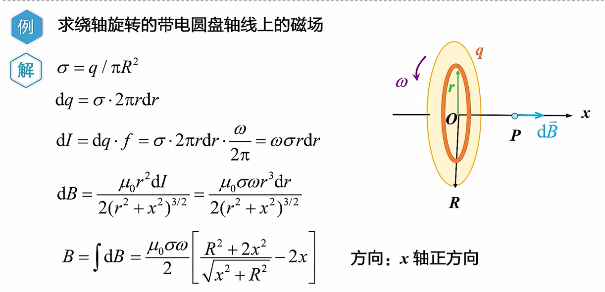
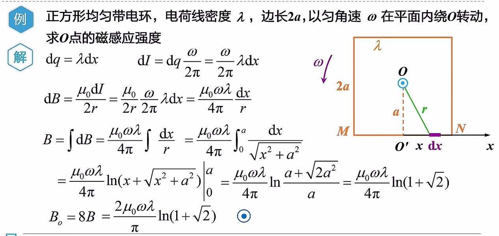

## 稳恒磁场

### 磁场、磁感应强度

#### 磁场的基本性质

#### 磁感应强度

### 毕奥—萨伐尔定律

#### 磁场的叠加原理

#### 毕奥—萨伐尔定律

#### 毕萨定律的应用

- 这里提到了“**磁矩**” ⬆️

#### 运动电荷的磁场

### 磁通量、磁高斯定理

#### 磁通量

#### 磁高斯定理

- 静电场是有源场，磁场是无源场

### 安培环路定理

#### 思考与对比

#### 安培环路定理

#### 例题

补偿法？没例题。

### 磁场对电流的作用

#### 安培力

#### 安培力的计算

#### 磁场对平面载流线圈

#### 磁力的功

### 磁场对运动电荷的作用

#### 洛伦兹力

#### 霍尔效应

### 物质的磁性

#### 磁介质

#### 磁介质的高斯定理

#### 磁介质的安培环路定理

#### 铁磁质

## 变化电场与磁场

### 电磁感应

#### 法拉第电磁感应实验

#### 电动势的概念

#### 电磁感应定律

#### 楞次定律

### 感应电动势

#### 动生电动势

- 产生原因：运动电荷在磁场中的洛伦兹力。

#### 感生电动势

- 直接看导线与 O 围成的面积

### 自感和互感

### 磁场能量

### 麦克斯韦电磁理论

