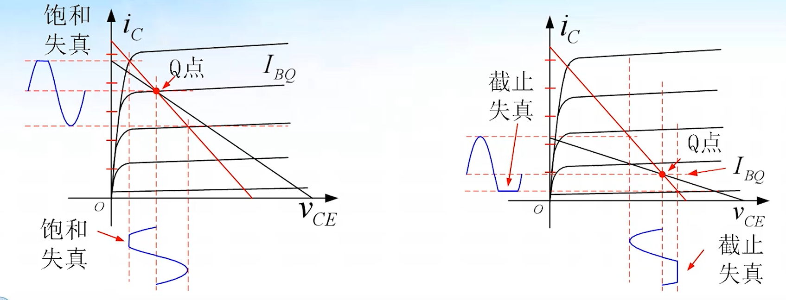
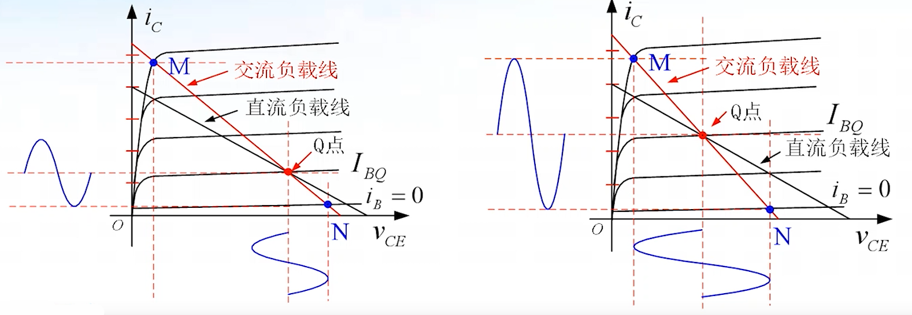
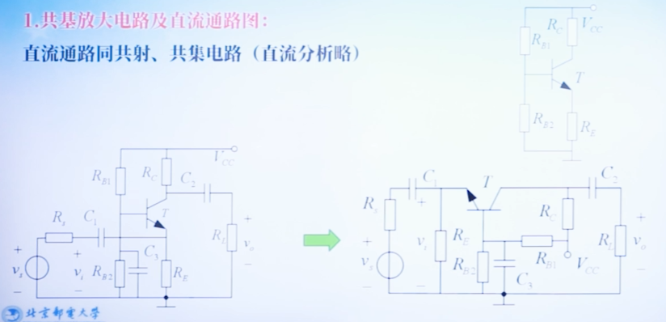

## 双极性晶体管

## 放大电路基本知识

## 基本共射放大电路原理

### 直流通路与交流通路

#### 直流通路图

构成原则：

1. 电容视为开路。
2. 电感线圈视为短路，保留电感线圈上的电阻（近似分析时可忽略）。
3. 交流电压源视为短路，保留其内阻。
4. 交流电流源视为开路，保留其内阻。
5. 工作在击穿区的稳压二极管，等效为等值的直流电压源
(正偏普通二极管可等效为 0.7V（硅）的直流电压源)。

#### 交流通路图

构成原则：

1. 容量大的电容（如耦合电容、旁路电容）视为交流短路；容量小的电容（如晶体管结电容、分布电容等）视为交流开路

2. 感抗大的电感线圈视为交流开路；感抗小的电感线圈视为交流短路

3. 直流电压源视为交流短路，如有内阻则保留其内阻

4. 直流电流源视为交流开路，如有内阻则保留其内阻。

5. 工作在击穿区的稳压二极管，视为交流短路（考虑击穿区动态电阻时，保留该电阻)


> 正偏的二极管，视为交流短路。若需考虑交流电阻时，保留交流电阻

### 共射放大电路图解分析

#### 图解直流分析

#### 图解交流分析

- 交流负载线斜率：$- \frac 1 {R_C//R_L}$
- 交流负载过 Q 点

#### 交流信号分析

- 交流信号的移动轨迹实在交流负载线上
- 交流输入信号与输出信号反相
- 通过信号幅值可计算电流和电压的增益（左右两个图的 x 轴信号曲线）

#### 静态工作点与波形失真

- 工作点过**高**（$I_{BQ}$、$I_{CQ}$ 大）输出电压易产生**饱和**失真（NPN 管，**底**部失真）
- 工作点过**低**（$I_{BQ}$、$I_{CQ}$ 小）输出电压易产生**截止**失真（NPN 管，**顶**部失真）

#### 动态输出范围

- 意思是：输出波形没有明显失真的最大电压/电流幅值
- 交流负载线上 Q-M、Q-N 中对应横轴电压（纵轴电流）较小的一个值
- Q 点应选择交流负载线上放大区的中间点，可以得到最大的、无明显饱和失真及截止失真的信号

### 晶体管模型

#### 晶体管放大状态简化直流模型

#### 用简化模型计算静态工作点

#### 晶体管放大状态交流小信号模型

1. 晶体管混合 π 模型

    

    

    

2. 简化高频混合 π 模型

    

3. 简化中低频混合 π 模型

    

4. 中低频混合 π 模型的参数

    

    - $V_A$ 为厄尔利电压（基区调宽效应）

5. 中低频 H 参数模型

    

### 直流偏置电路

#### 固定偏置电路

固定偏置电路是最简单的、为晶体管提供静态工作点的电路形式。

当电源电压 $V_{CC}$ 较高时，晶体管基极电流 $I_{BQ}$ 由输入偏置电阻 $R_B$ 决定。

这个方式不稳定，参数会随着温度而变化。

{width="50%"}

{width="70%"}

??? success "例题"
	
	
		
	- $V_{CES}$ 为饱和压降

#### 分压式负反馈偏置电路

#### 静态工作点的近似计算

#### 静态工作点的精确计算

#### 分压式负反馈偏置电路的应用

### 基本共射电路的等效分析

#### 分析步骤

1. 确定放大电路的静态工作点（ $I_{BQ}$、$I_{CQ}$、$I_{CEQ}$ 等）
2. 求出 Q 点处的混合 π 模型参数 $r_{b'e}、r_{ce}、g_m$（或 H 参数的 $r_{be}$）
3. 画出放大电路的交流通路图，将交流通路图中的晶体管用低频混合 π 模型
（或 H 参数模型）代替，得到小信号交流等效电路（微变等效电路）
4. 求解放大电路的交流性能指标：$A_v、A_i、R_i、R_o$ 等

#### 直流分析

#### 交流分析

1. 画出交流通路图

    

2. 求混合 π 模型的参数

    

3. 求电压增益
   
    $$
    \dot{A}_v = \frac{\dot{V}_o}{\dot{V}_i} = \frac{-g_m \dot{V}_{b'e} R_L'}{\dot{V}_{b'e} \frac{r_{bb'}}{r_{b'e}} + \dot{V}_{b'e}} = \frac{-g_m R_L'}{\frac{r_{bb'}}{r_{b'e}} + 1} = \frac{-g_m r_{b'e} R_L'}{r_{bb'} + r_{b'e}} = -87.5
    $$

7. 求 H 参数模型参数

    

## 放大电路的静态工作点稳定问题

### 有射极电阻的共射电路分析

### 分析举例

补充（深负反馈）：

$$
\dot{A}_v = -\frac{\beta R_L'}{r_{be} + (\beta + 1)R_E} \approx -\frac{R_L'}{R_E} = -2.8
$$

## 晶体管放大电路三种基本组态

### 共集电路等效分析

#### 直流分析

1. 共集放大电路

    

2. 直流分析

    

#### 交流分析

1. 电压增益与电流增益（🌟）

    

2. 输入电阻

    

    - 共集电路，输入电阻较大，且和负载电阻有关！

3. 输出电阻

    

    - 共集电路，输出电阻很小（几十Ω），且与信号源电阻有关！

#### 分析举例

#### 特点与应用

特点：

- 高输入阻抗
- 低输入阻抗
- 电流增益较大
- 电压增益同相且小于 1

应用：

- 作为多级放大的输入级，有较高的输入阻抗
- 作为多级放大的中间隔离级，减小后级较小的输入阻抗对前级增益的影响
- 作为多级放大的输出级，提供较小的输出阻抗，提提高带负载能力

### 共基电路等效分析

#### 直流分析（略）

#### 交流分析

1. 电压增益

    

2. 电流增益

    

3.  输入输出电阻

    

#### 分析举例

特点：

- 低输入阻抗
- 电压增益和输出阻抗与共射放大电路相同，但为同相放大
- 电流增益小于 1


应用：基放大电路多用于高频段电压放大（详见第四章）

### 三种组态电路特点对比

#### 直流偏置方式

#### 电压增益

#### 电流增益

#### 输入阻抗

#### 输出阻抗

#### 高频特性与应用

## 电流源及其应用

### 电流源的基本要求及晶体管电流源

### 基本镜像电流源

后面发现不考，这一节就不记了。

## 差分放大电路

### 差放电路结构与功能

#### 温度漂移

#### 电路的组成

#### 共模信号与差模型号

1. 共模信号

    

2. 差模信号

    

3. 共模抑制比 $K_{CMK}(CMRR)$：见上图

#### 双电源长尾式差放

#### 电流源射极偏置差放

### 差放静态分析及转移特性

#### 长尾式差放静态分析（估算）

- $V_{CEQ1}=V_{CC}- \frac 1 2 R_{C}I_{EE} + V_{BE}$，其中 $V_{BE}$ 是因为基极电位为零，发射极电位为 $-V_{BE}$

#### 电流源偏置差分静态分析（估算）

#### 差放的直流转移特性

#### 差分输入线性范围扩展

### 差放的交流小信号差模分析

#### 差模和共模信号的分解

#### 输入、输出方式

#### 双入双出

- 对于（2）因为交流时，$V_{E}$ 与 $V_{EE}$ 之间没有电流流过，所以 $R_{id}=2r_{be}$ 

#### 双入单出

### 差放的交流小信号共模分析

#### 共模等效电路

#### 共模电压增益

#### 共模输入输出电阻

#### 共模抑制比

### 差分电路例题

------

