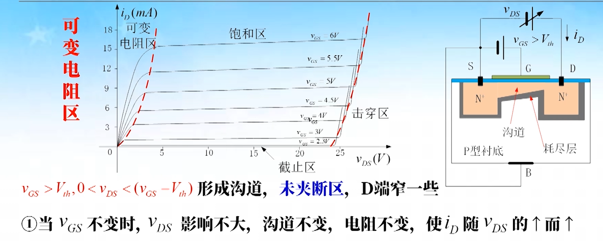

## MOS 场效应管

### N 沟道增强型 MOS 管

#### 结构

#### 工作原理

1. $v_{GS}$ 对沟道的控制作用

    

    

2. $v_{DS}$ 对沟道的控制作用（$v_{GS}>v_{th}$）
	
	当 $V_{DS} > 0$ 将产生 $i_D$，且由 D 极沿沟道到 S 极将产生压降，使 G 极与沟道中各点电压差不再相同，$V_{GS}$ 最大，$V_{GD} = V_{GS} - V_{DS}$ 最小，使沟道中各点厚度不同,S 极最厚，D 极最薄。

    1. 当 $V_{DS} < (V_{GS} - V_{th})$ 时，$V_{GD} = V_{GS} - V_{DS} > V_{th}$ 则 D 极仍存在一定厚度的沟道，尚未夹断 (未夹断区)，(同理 $V_{GD} > V_{th}$ 才可能产生沟道)。
   
       $$
       0 < V_{DS} < (V_{GS} - V_{th})
       $$
   
    2. 如图：
   
		
   
    3. 如图：
   
		

可见只有多子电子导电，所以：

- 为单极型，而少子受温度影响大
- MOS 管的温度稳定性好，抗辐射能力强

### N 沟道增强型 MOS 特性曲线

#### 输出特性曲线

1. 截止区

    

2. 可变电阻区

    

    

    3️⃣ 存在沟道长度调制效应（对应晶体管的放大区）：

    

    

    

3. 击穿区：

    

