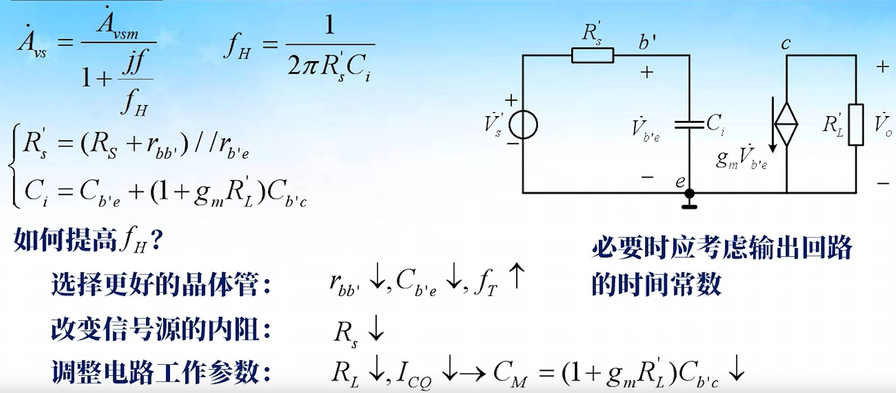

## 频率特性概述

### 频率特性基本概念

### 放大电路理想频率特性

#### 线性失真

- 非线性失真：饱和、截止失真

#### 理想频率特性

- 理想幅频特性：通频带覆盖输入信号的频谱范围且通频带内的幅度增益为一常数。
- 理想相频特性：在输入信号的频谱范围内相频特性为线性时延为常数。

## 晶体管结电容对放大电路高频特性的影响

### 波特图

#### 低通滤波器的波特图

## 双极性晶体管放大电路的频率特性

### 晶体管的频率特性

#### 高频小信号模型

#### 频率参数

### 单管共射放大电路的高频特性

#### 单向化

#### 高频特性

#### 提高上截止频率的方法

#### 增益带宽积

