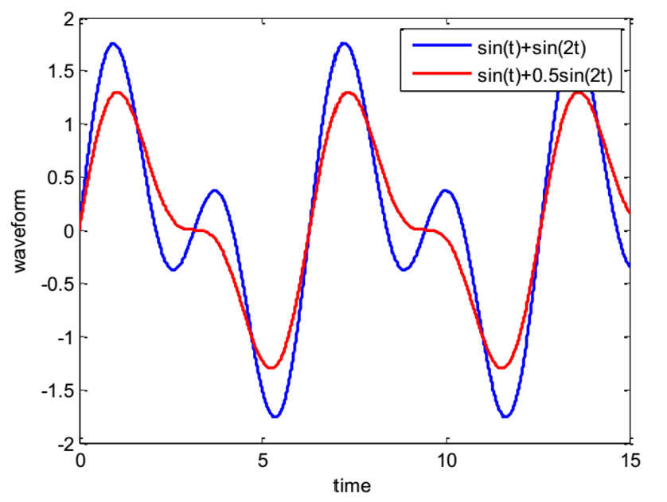
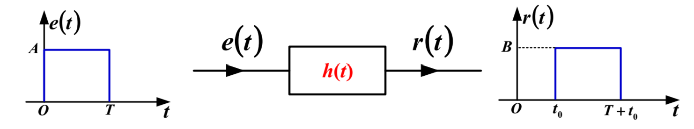

## 系统的频域响应特性

### 系统函数（傅里叶形式）

$$
H(\omega)=\frac {R(\omega)}{E(\omega)}
$$

- $H(\omega)$ 可以写成 $H(j\omega)$

### 正弦激励下的稳态响应

$e(t)=\cos (\omega_0 t)$ 时：
$$
r_{ss}= |H(\omega)|\cos \left[\omega_o t + \phi(\omega_o)\right]
$$
其中的参数：

$$
\begin{cases}
H\left(\omega\right)=\frac\alpha{\alpha+\mathbf{j}\omega}\\
\left|H(\omega)\right|=\frac\alpha{\sqrt{\alpha^2+\omega^2}}
\end{cases}
$$

$$
\phi(\omega)=-\arctan \frac \omega \alpha
$$

$e(t)=\sin (\omega_0 t)$ 时：
$$
r_{ss}= |H(\omega)|\sin \left[\omega_o t + \phi(\omega_o)\right]
$$
推广：
$$
e\left(t\right)=\sum_{k=-\infty}^\infty E_k\mathrm{e}^{\mathrm{j}\bold{k}\omega_1t}\to r\left(t\right)=\sum_{n=-\infty}^\infty E_k ~H\left(\bold{k}\omega_1\right)~\mathrm{e}^{\mathrm{j}\bold{k}\omega_1t}
$$

### 非周期信号经过系统的零状态响应

#### 例题 3

已知输入信号 $f\left(t\right)=\mathrm{e}^{-t}u\left(t\right)$，系统的单位冲激响应为 $h(t)=\mathrm{e}^{-2t}u(t)$，求系统的零状态响应 $r_zs(t)$？
$$
\mathscr{F}\left[\mathrm{e}^{-\alpha t}u(t)\right]=\frac1{\alpha+\mathrm{j}\omega}
$$

$$
r_{zs}(t)=f(t)*h(t)
$$

$$
\begin{aligned}
R_{zs}\left(\omega\right)& =F(\omega)H(\omega) \\
&=\frac1{1+\mathrm{j}\omega}\cdot\frac1{2+\mathrm{j}\omega}=\frac1{1+\mathrm{j}\omega}-\frac1{2+\mathrm{j}\omega}
\end{aligned}
$$

$$
r_{zs}\left(t\right)=\mathrm{e}^{-t}u\left(t\right)-\mathrm{e}^{-2t}u\left(t\right)
$$

## 无失真传输

### 失真

#### 非线性失真

半波整流：产生了直流项和谐波项。

#### 线性失真

##### 幅度失真

 {: style="zoom: 60%"} 

##### 相位失真

$$
\begin{aligned}\cos(\omega_0t)&\to\left|H(\mathrm{j}\omega_0)\right|\cos\left[\omega_0t+\varphi(\omega_0)\right]\\&=\left|H(\mathrm{j}\omega_0)\right|\cos\left[\omega_0\left(t+\frac{\varphi(\omega_0)}{\omega_0}\right)\right]\end{aligned}
$$

当 **相延迟** 为常数，延迟后各次谐波叠加方能不失真。
$$
\tau_p = -\frac {\phi(\omega_0)} {\omega_0}
$$

### 无失真传输条件

 {: style="zoom: 60%"}
$$
r(t)= Ke(t-t_0)
$$

#### 频率响应特性

$$
\begin{cases}
|H(j\omega)|=K \\
\phi(\omega) = -\omega t_0
\end{cases}
$$

#### 单位冲激响应

$$
\begin{cases}
H(j\omega)=Ke^{-j\omega t_0} \\
h(t) = K\delta(t- t_0)
\end{cases}
$$

#### 群延时（包络延时）

$$
\tau_g = - \frac {d\phi(\omega)}{d\omega}
$$

## 理想低通滤波器 TODO

### 频域特性

## 信号的抽样与重建

