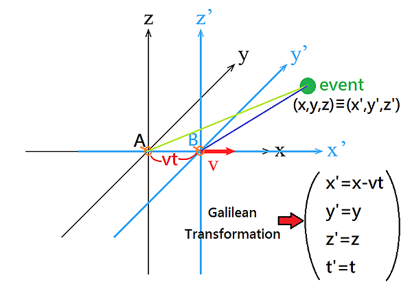
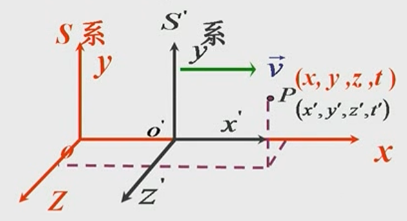
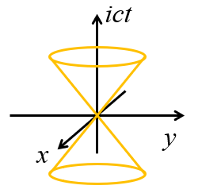

## 伽利略变换与经典时空观

### 伽利略相对性原理

在所有匀速运动的参考系中，物理定律的形式都是相同的。

### 伽利略坐标变换

{: style="zoom:60%"}

正变换：

$$
\begin{cases}
x'=x-ut\\
y'=y\\
z'=z\\
t'=t
\end{cases}
$$

逆变换：$x'=x+ut$

### 伽利略速度变换

$$
\vec{\nu}'=\frac{d\vec{r}'}{dt'}=\frac{d\vec{r}'}{dt}=\vec{\nu}-\vec{u}
$$

正变换：

$$
\begin{cases}
\nu_x'=\frac{dx'}{dt}=\nu_x-u\\
\nu_y'=\frac{dy'}{dt}=\nu_y\\
\nu_z'=\frac{dz'}{dt}=\nu_z
\end{cases}
$$

逆变换（速度合成公式）：

$$
\begin{cases}
\nu_x=\nu_x^{\prime}+u\\
\nu_y=\nu_y^{\prime}\\
\nu_z=\nu_z^{\prime}
\end{cases}
$$

### 伽利略加速度变换

$$
\vec{a}'=\frac{d\vec{\nu}'}{dt'}=\frac{d\vec{\nu}'}{dt}=\vec{a}
$$

### 经典时空观

时间绝对、空间绝对、时空分离。

## 狭义相对论的基本假设

### 相对性原理

- 物理定律在所有惯性系中都具有相同的形式 
- 不存在绝对静止参考系

### 光速不变原理

- 在所有惯性系中，光在真空中的传播速率具有相同的值 $c$
- 伽利略速度变换不成立，需要新的坐标变换关系
- 存在不是无穷大的速度极限，光速 $c$ 恰好是这个速度极限

## 洛伦兹变换

### 洛伦兹坐标变换

{: style="zoom:60%"}

#### 正变换

$$
\begin{cases}
&x^{\prime}=\frac{x-\nu t}{\sqrt{1-(\frac{\nu}{c})^{2}}}\\&y^{\prime}=y\\&z^{\prime}=z\\&t^{\prime}=\frac{t-\frac{\nu}{c^{2}}x}{\sqrt{1-(\frac{\nu}{c})^{2}}}
\end{cases}
$$

#### 逆变换

$$
\begin{cases}
&x^{\prime}=\frac{x+\nu t}{\sqrt{1-(\frac{\nu}{c})^{2}}}\\&y^{\prime}=y\\&z^{\prime}=z\\&t^{\prime}=\frac{t+\frac{\nu}{c^{2}}x}{\sqrt{1-(\frac{\nu}{c})^{2}}}
\end{cases}
$$

### 洛伦兹速度变换

#### 正变换

$$
\begin{cases}
u_x^{\prime}=\frac{u_x-\nu}{1-\frac\nu{c^2}u_x}\\u_y^{\prime}=\frac{u_y}{1-\frac\nu{c^2}u_x}\sqrt{1-\beta^2}\\u_z^{\prime}=\frac{u_z}{1-\frac\nu{c^2}u_x}\sqrt{1-\beta^2}
\end{cases}
$$

#### 逆变换

$$
\begin{cases}
u_x=\frac{u_x'+\nu}{1+\frac\nu{c^2}u_x'}\\
u_y=\frac{u_y'}{1+\frac\nu{c^2}u_x'}\sqrt{1-\beta^2}\\
u_z=\frac{u_z'}{1+\frac\nu{c^2}u_x'}\sqrt{1-\beta^2}
\end{cases}
$$

#### 例题

例：设 A、B 两飞船相对地球分别以 $0.6c$ 和 $0.8c$ 的速率相对飞行。求：

（1）在地面上看，两飞船的相对运动速度是多少？
$$
\nu=\nu_A+\nu_B=1.4c
$$
（2）在A、B飞船上看，对方飞船的运动速度是多少？

在 A 飞船参考系，地球运动速度为：
$$
u=-\nu_A=-0.6c
$$
由洛伦兹速度变换，B 飞船运动速度为：
$$
\nu_B^{\prime}=\frac{\nu_B-u}{1-u\nu_B/c^2}=\frac{0.8c+0.6c}{1+0.8\times0.6}=0.946c<c
$$

## 狭义相对论时空观

### 同时相对性

同时的话，$\Delta t = 0$：
$$
\Delta t^{\prime}=\gamma\left(\Delta t-\frac{\beta}{c}\Delta x\right)\Longrightarrow\Delta t^{\prime}=\gamma\left(-\frac{\beta}{c}\Delta x\right)\neq0
$$

### 时间间隔相对性

$$
\Delta t^{\prime}=\gamma\left(\Delta t-\beta\frac{\Delta x}{c}\right)={\Delta t}{\gamma}
$$

例：设在地球大气层上层，由于宇宙射线与大气分子碰撞，产生的 m 子以相对地球 $0.99c$ 的速度运动。已知静止 m 子的寿命为 $2.6\times 10^{-6}~s$，求在地面参考系看，(1) m 子的寿命是多少？(2) 能飞行多远的距离？

解：在相对 μ 子静止的参考系，μ 子寿命是**固有时间**

$$
\Delta t^{\prime}=\Delta\tau=2.6\times10^{-6}s
$$

在地面参考系，μ 子寿命是**一般时间**

$$
\Delta t=\gamma\Delta\tau=2.6\times10^{-5}s
$$

飞行距离为 $\Delta L=0.99c\times\Delta\tau=7.7\times10^3m$​

### 空间间隔相对性

在火车参考系，火车是静止的，所以火车的长度是固有长度：

$$
\Delta x^{\prime}=L_0
$$

在地面参考系，火车是运动的，所以火车的长度是一般长度：

$$
\Delta x=L=\frac{L_0}\gamma
$$

### 时空间隔不变性

定义：在某参考系中两个事件的时空间隔为
$$
\left(\Delta s\right)^2=\left(c\Delta t\right)^2-\left(\Delta x\right)^2-\left(\Delta y\right)^2-\left(\Delta z\right)^2
$$

$$
(\Delta s)^2 = (\Delta s')^2
$$

- 如果两个事件在某参考系的同一地点先后发生，则

$$
\left(\Delta s\right)^2=\left(c\Delta t\right)^2-\left(\Delta x\right)^2-\left(\Delta y\right)^2-\left(\Delta z\right)^2=\left(c\Delta t\right)^2>0
$$

- 如果两个事件在某参考系的不同地点同时发生，则

$$
\left(\Delta s\right)^2=-\left[\left(\Delta x\right)^2+\left(\Delta y\right)^2+\left(\Delta z\right)^2\right]<0
$$

- 如果两个事件由光的传播联系起来的，则

$$
\left(\Delta s\right)^2=\left(c\Delta t\right)^2-\left(\Delta x\right)^2-\left(\Delta y\right)^2-\left(\Delta z\right)^2=0
$$

### 闵可夫斯基四维时空

$$
\begin{cases}
x_1=x \\
x_2=y \\
x_3=z \\
x_4=ict
\end{cases}
$$

则时空间隔为：

$$
-\left(\Delta s\right)^2=\left(\Delta x_1\right)^2+\left(\Delta x_2\right)^2+\left(\Delta x_3\right)^2+\left(\Delta x_4\right)^2
$$

## 狭义相对论动力学

### 相对论动量

$$
\vec{p}=m\vec{\nu}=\frac{m_0\vec{\nu}}{\sqrt{1-\nu^2/c^2}}=\gamma m_0\vec{\nu}
$$

### 相对论能量

动能 = 总能量 - 静能：
$$
E_k = E - E_0 = mc^2 - m_0c^2
$$

### 能量与动量的关系

$$
E^2 = p^2c^2 + E_0^2
$$

### 能量-动量变换

和洛伦兹变换形式类似：

$$
\begin{cases}
p_x^{\prime}c=\gamma\left(p_xc-\beta E\right) \\
p_y^{\prime}=p_y \\
p_z^{\prime}=p_z \\
E^{\prime}=\gamma\left(E-\beta cp_x\right) & 
\end{cases}
$$
