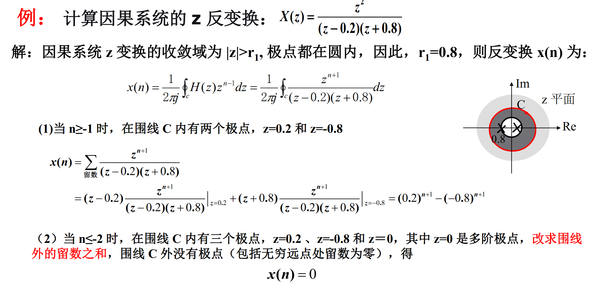

## 取样和内插

### 取样

**取样：**从连续时间信号中提取离散样本的过程，即时间轴上离散化的过程。

$$
\hat{x}_a(t) = x_a(t) \delta_T(t) = \sum_{n=-\infty}^{+\infty} x_a(t) \delta(t - nT) \\
x(n) = x_a(t)|_{t=nT} = x_a(nT)
$$

- $T$：取样周期
- $f_s= \frac 1 T$：取样频率
- $\Omega_s=2\pi f_s $：取样角频率

**奈奎斯特取样定理：**

（重点！）当

$$
T=\frac 1 {f_s} \le \frac 1 {2f_m}
$$

$\hat{x_a}(t)$ 的频谱 $\hat{X_a}(\Omega)$ 不发生混叠，可以不失真地恢复 $x_a(t)$。

**奈奎斯特取样频率：**

$$
f_s = 2f_m
$$

### 内插

TODO

## 离散时间信号 & 系统

### 常用时间序列及运算

#### 正弦序列

$$
x(n) = \sin(n\omega)
$$

数字角频率 $\omega$：

- $\omega = \Omega T_s$，单位是弧度
- 表示序列变化的速率

重要参数关系：

$$
\omega = \Omega T_s = \frac {\Omega} {f_s}
$$

#### 周期序列

正弦（余弦、指数）序列周期性的判别：

$$
\frac {2\pi} {\omega_0} = \frac N M
$$

#### 卷积的计算

- 解析式法：

$$
y(n) = \sum_{k= -\infty}^{\infty} x_1(k)x_2(n-k)
$$

- 图解法：TODO

### 离散时间系统的描述与特性

!!! note 

	要求会证明各种性质，PPT 49 页之前

#### 线性非时变系统（LTI）

- 线性：满足叠加性和齐次性的系统

- 非时变：系统响应特性（参数或特征）不随时间而变化

- LTI 系统输出的时域表示就是离散卷积 $x(n) * h(n)$

#### 离散时间系统

- 因果性：输出只能由过去的输入决定，$h(n) = 0, ~ n \lt 0$

	- $y(n)=x(n+1)$​ 不是因果系统。
	- $y(n) = x(-n)$ 和 $y(n)=x(n^3)$​ 要分类讨论。

- 稳定性：系统的所有输入有界，则输出亦有界

$$
|x(n)| < \infty \rightarrow |y(n)| < \infty
$$

重要推论，对于 LTI，稳定的充要条件：
$$
\sum_{k= -\infty}^{\infty} |h(k)|<\infty
$$

### LTI 系统的差分方程

#### 递归型（IIR，无限冲激响应）

一句话。

#### 非递归型（FIR，有限冲激响应）

一句话。

### 信号流图

能列写方程就行。

## 离散时间傅里叶变换（DTFT）

### 定义

- 正变换：

$$
X(e^{j\omega}) = \sum_{n=-\infty}^{\infty} x(n)e^{-jn\omega}
$$

上式收敛的条件，收敛才存在 DTFT：
$$
\sum_{n=-\infty}^{\infty} |x(n)e^{-jn\omega}| = \sum_{n=-\infty}^{\infty} |x(n)| < \infty
$$

- 反变换：

$$
x(n) = \frac{1}{2\pi} \int_{-\pi}^{\pi} X(e^{j\omega})e^{jn\omega} d\omega
$$

求下列信号 DTFT：

1. $x_1(n) = 2\delta(n) - \delta(n-1) + 3\delta(n-2) + \delta(n-4)$
2. $x(n)=0.5^n u(n)$
3. $x(n)=\cos(n\omega_0)$​

解 1：

$$
\begin{aligned}
X_1(e^{j\omega}) &= \sum_{n=-\infty}^{\infty} x_1(n)e^{-jn\omega} \\
&= 2\delta(n)e^{-jn\omega}\Big|_{n=0} - \delta(n-1)e^{-jn\omega}\Big|_{n=1} + 3\delta(n-2)e^{-jn\omega}\Big|_{n=2} + \delta(n-4)e^{-jn\omega}\Big|_{n=4} \\
&= 2 - e^{-j\omega} + 3e^{-j2\omega} + e^{-j4\omega}
\end{aligned}
$$

!!! note 

	一般情况下，DTFT 都是复数

解 2：

$$
\begin{aligned}
X(e^{j\omega}) &= \sum_{n=-\infty}^{\infty} x(n)e^{-jn\omega} 
&= \sum_{n=0}^{\infty} 0.5^n e^{-jn\omega} \\
&= \sum_{n=0}^{\infty} (0.5 e^{-j\omega})^n \\
&= \frac{1}{1 - 0.5 e^{-j\omega}}
\end{aligned}
$$

推论：$a^n u(n) \overset{DTFT}{\underset{|a|<1}{\longleftrightarrow}} \frac{1}{1 - ae^{-j\omega}}$

解 3：

$$
\begin{aligned}
\mathcal{F}[\cos(n\omega_0)] &= \mathcal{F}\left[\frac{1}{2}(e^{jn\omega_0} + e^{-jn\omega_0})\right] \\
&= \pi \sum_{k=-\infty}^{\infty} [\delta(\omega - \omega_0 - 2\pi k) + \delta(\omega + \omega_0 - 2\pi k)]
\end{aligned}
$$

### 性质

#### 线性

对于 IIR 系统差分方程  $y(n) = \sum_{m=0}^{M} b_m x(n-m) - \sum_{k=1}^{N} a_k y(n-k)$

$$
\begin{aligned}
Y(e^{j\omega}) &= \mathcal{F}\left[ \sum_{m=0}^{M} b_m x(n-m) - \sum_{k=1}^{N} a_k y(n-k) \right] \\
&= \sum_{m=0}^{M} b_m \mathcal{F}[x(n-m)] - \sum_{k=1}^{N} a_k \mathcal{F}[y(n-k)]
\end{aligned}
$$

#### 时移

$$
x(n-n_0) \stackrel{DTFT}{\longleftrightarrow} e^{-jn_0\omega} X(e^{j\omega})
$$

#### 频移

$$
e^{jn\omega_0} x(n) \stackrel{DTFT}{\longleftrightarrow} X(e^{j(\omega - \omega_0)})
$$

#### 周期性

$$
X(e^{j(\omega+2\pi)}) = X(e^{j\omega})
$$

#### 时间翻转

$$
x(-n) \stackrel{DTFT}{\longleftrightarrow} X(e^{-j\omega})
$$

#### 共轭

$$
x^*(n) \stackrel{DTFT}{\longleftrightarrow} X^*(e^{-j\omega})
$$

#### 微分

$$
nx(n) \stackrel{DTFT}{\longleftrightarrow} j \frac{dX(e^{j\omega})}{d\omega}
$$

#### 对称性

难点，没看懂

#### 调制定理

频谱搬移

#### 时域相关定理

若 r(n) 是实信号 x(n) 和 h(n) 的相关函数，有：

$$
r(m) = \sum_{n=-\infty}^{\infty} x(n)h(m+n) \stackrel{DTFT}{\longleftrightarrow} R(e^{j\omega}) = X^*(e^{j\omega})H(e^{j\omega}) 
$$

与卷积的区别：

1. 形式相似

2. 可以利用卷积计算相关，不过要把 x(n) 翻转后再卷积

3. 物理意义不同：卷积描述的是离散系统；相关是两个信号的相似性，与系统无关

### LTI 系统的频率响应

有点题 TODO

## Z 变换

### 定义

用于把差分方程变成代数方程。

- 正变换（双边）：

$$
X(z) = \mathcal{Z}\{x(n)\} = \sum_{n=-\infty}^{\infty} x(n)z^{-n}
$$

- 反变换：

$$
x(n) = \frac{1}{2\pi j} \oint_C X(z)z^{n-1}dz
$$

z 变量可以拆解为：$Re(z) + jIm(z)=re^{j\omega}$​

### 收敛域

!!! abstract
	
	PPT 12~19 页 

- 收敛域：对于任意序列 *x*(n)，使其 Z 变换收敛的所有 z 值集合
- 收敛条件：$|X(z)| = \left| \sum_{n=-\infty}^{+\infty} x(n)z^{-n} \right| < \infty$​

!!! warning

	1. 并非所有的序列 x(n) 都存在 Z 变换
	
	2. Z 变换并非在 z 平面上处处存在

#### 有限长序列

在区域 $0 < |z| < \infty$ 上，可满足 $|x(n)z^{-n}| < \infty$，因此有限长序列的收敛域为：
    
$$
0 < |z| < \infty
$$

（不包含 $0$ 和 $\infty$ 值）

在特殊的 $n_1, n_2$ 值下，收敛域会有不同。

* **情况一：$n_1 \geq 0$** 

	收敛域：$0 < |z| \leq \infty$

* **情况二：$n_2 \leq 0$**

	收敛域：$0 \leq |z| < \infty$

#### 右边序列

$$
R_{x-} < |z|< \infty 
$$

但因果序列：

$$
R_{x-} < |z| \leq \infty 
$$

#### 左边序列

$$
0 < |z| < R_{x+}
$$

但当 $n_2 \leq 0$ 时，收敛域包含 $z=0$ ：

$$
|z| < R_{x+}
$$

#### 双边序列

若满足 $R_{x^-} < R_{x^+}$：
   
$$
R_{x^-} < |z| < R_{x^+}
$$

若不满足 $R_{x^-} < R_{x^+}$：

* 则不存在公共收敛域
* 双边序列的收敛域不存在

??? success "例题 1"
	
	求 $x(n) = a^n u(n)$

	**解**

	$$
	X(z) = \sum_{n=-\infty}^{\infty} a^n u(n) z^{-n} = \sum_{n=0}^{\infty} (az^{-1})^n
	$$
	
	当 $|az^{-1}| < 1$ 即 $|z| > |a|$ 时，上式收敛为：
	
	$$
	X(z) = \frac{1}{1 - az^{-1}} = \frac{z}{z - a}
	$$

	$X(z)$ 极点为 $z = a$ 且 $x(n)$ 为右边序列，故 ROC: $|z| > |a|$

??? success "例题 2"
	
	求 $x_1(n) = -b^n u(-n-1)$ 的 Z 变换

	**解：**

	$$
	X_1(z) = \sum_{n=-\infty}^{-1} -b^n z^{-n}
	$$
	
	令 $m = -n$，则当 $n = -\infty$ 时，$m = \infty$；
	
	当 $n = -1$ 时，$m = 1$。因此：
	
	$$
	X_1(z) = \sum_{m=1}^{\infty} -b^{-m} z^{m} = -\sum_{m=1}^{\infty} (b^{-1} z)^{m}
	$$
	
	这是一个等比级数，当 $|b^{-1} z| < 1$ 即 $|z| < |b|$ 时收敛为：
	
	$$
	X_1(z) = - \left( \frac{b^{-1} z}{1 - b^{-1} z} \right) = - \frac{z}{b - z} = \frac{z}{z - b}
	$$

	$X_1(z)$ 极点为 $z = b$ 且 $x_1(n)$ 为左边序列，故 ROC: $|z| < |b|$

??? success "例题 3"
	**例：** 设 $x(n) = a^n u(n) - b^n u(-n-1)$

	求：$X(z)$

	**解：**
	$$
	X(z) = \sum_{n=0}^{\infty} a^n z^{-n} - \sum_{n=-\infty}^{-1} b^n z^{-n}
	$$

	$$
	= \left\{ \frac{z}{z - a}, \text{ROC}: |z| > |a| \right\} + \left\{ \frac{z}{z - b}, \text{ROC}: |z| < |b| \right\}
	$$

	$$
	= \frac{z}{z - a} + \frac{z}{z - b}; \quad \text{ROC}: \text{ROC1} \cap \text{ROC2}
	$$

	若 $|b| \leq |a|$，则收敛域是一个空集，$X(z)$ 不存在；

	若 $|a| < |b|$，则收敛域为 $|a| < |z| < |b|$，$X(z)$ 存在于此区域。

### 常用 Z 变换对

$$
\begin{array}{|c|c|c|}
\hline
序列 & Z 变换 & 收敛域 \\
\hline
\delta(n) & 1 & \forall z \\
\hline
u(n) & \frac{1}{1 - z^{-1}} & |z| > 1 \\
\hline
-u(-n-1) & \frac{1}{1 - z^{-1}} & |z| < 1 \\
\hline
a^n u(n) & \frac{1}{1 - az^{-1}} & |z| > |a| \\
\hline
-b^n u(-n-1) & \frac{1}{1 - bz^{-1}} & |z| < |b| \\
\hline
[a^n \sin \omega_0 n] u(n) & \frac{(a \sin \omega_0) z^{-1}}{1 - (2a \cos \omega_0) z^{-1} + a^2 z^{-2}} & |z| > |a| \\
\hline
[a^n \cos \omega_0 n] u(n) & \frac{1 - (a \cos \omega_0) z^{-1}}{1 - (2a \cos \omega_0) z^{-1} + a^2 z^{-2}} & |z| > |a| \\
\hline
na^n u(n) & \frac{az^{-1}}{(1 - az^{-1})^2} & |z| > |a| \\
\hline
-nb^n u(-n-1) & \frac{bz^{-1}}{(1 - bz^{-1})^2} & |z| < |b| \\
\hline
\end{array}
$$

### Z 反变换：留数法

??? success "例题 1"

	

### Z 变换的性质

## 频域分析

### 判断稳定性

- 收敛域包括单位圆
- 极点在单位圆内

### 零极点和频率响应的关系

- 对于 0～π 弧度的数字频率 ω，$e^{j\omega}$ 离滤波器**极点越近**，零点越远，则**幅度就越大**

- **极点附近出现峰值** 靠近单位圆的极点，将导致滤波器形状在某一频率上有非常大的幅值；当极点在单位圆上时，频响出现 $\infty$，极点在单位圆外，系统不稳定

- **零点附近频响出现谷值** 靠近单位圆的零点，将导致滤波器形状在某一频率上有非常小的幅值；零点在单位圆上时，频响为零，零点可以在单位圆外

- 幅值大小的剧烈变化可增加滤波器的**选择性**

### 全通系统

系统的幅度响应恒为 1 或其他常数。

极点和零点均以共轭对出现，形成四个零极点一组的形式。

### 最小相位系统

如果离散线性时不变因果稳定系统的系统函数的所有零点，都在 z 平面的单位圆内，则称该系统为最小相位系统。

在幅频特性相同的条件下，最小相位系统具有最小的相位延迟。

