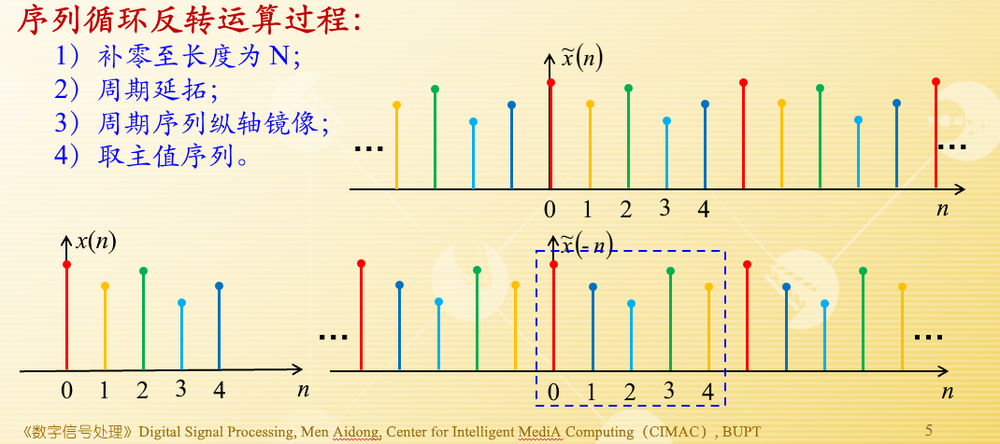
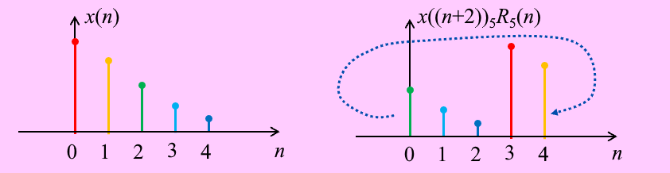
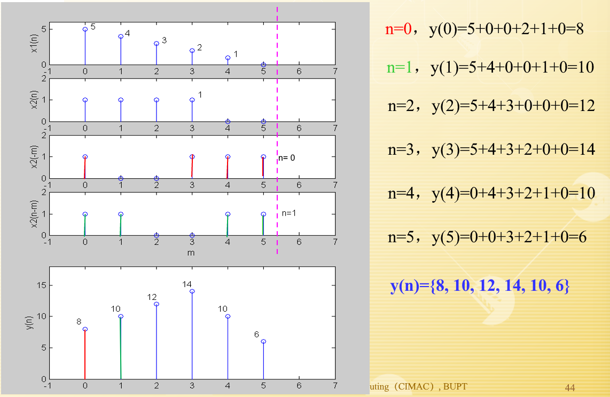
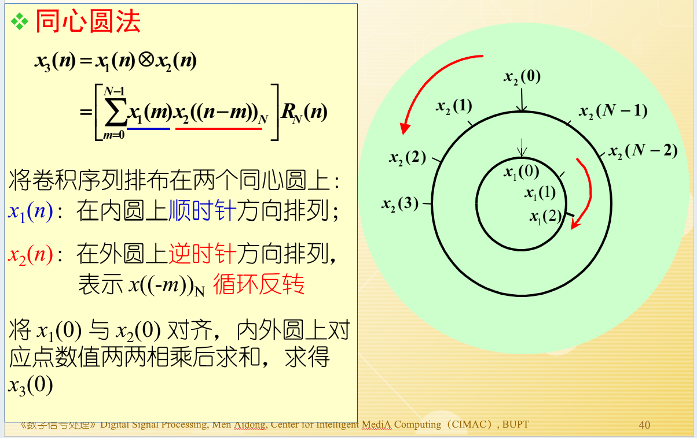

## 预备知识

### 周期序列和有限长序列的关系

周期序列：
$$
\tilde{x}(n) = \sum_{r=-\infty}^{\infty} x(n+rN) = x(n) * \sum_{r=-\infty}^{\infty} \delta(n+rN)
$$
主值序列：
$$
x(n)=\tilde{x}(n)R_N(n)
$$

### 求模运算

$$
\tilde{x}(n) = \sum_{r=-\infty}^{\infty} x(n+rN) = x((n))_N
$$

在 $x((n))_N$ 中，$n$ 的取值范围被限定在了 $0 \sim N-1$，因而简化了运算。

## 有限长的 DFT

### 4 种信号的傅里叶分析

#### 傅里叶变换（非周期模拟信号的频谱）

#### 傅里叶级数（周期为 T 的模拟信号的频谱）

## DFT 性质

### 线性

若两序列 $x_1(n)$ 和 $x_2(n)$​ 的长度均为 N，且其 N 点 DFT 分别为：

$$
X_1(k) = DFT[x_1(n)]
$$

$$
X_2(k) = DFT[x_2(n)]
$$

则：
$$
DFT[ax_1(n) + bx_2(n)] = aX_1(k) + bX_2(k)
$$

- 很重要的一点，是要保证两个序列长度及 DFT 点数均为 **N**

- 若两序列长度分别为 $N_1$、$N_2$，且 $N_1 \neq N_2$，则需补零使两序列长度均为 $N$ (相等)，且 $N \geq \max[N_1, N_2]$

### 帕塞瓦尔定理

若： $x(n) \stackrel{DFT}{\longleftrightarrow} X(k)$ 

则：

$$
\sum_{n=0}^{N-1} |x(n)|^2 = \frac{1}{N} \sum_{k=0}^{N-1} |X(k)|^2
$$

### 反转定理

#### 循环反转运算

如果 $x(n)$ 是长度为 N 的序列，则称 $x((-n))_NR_N(n)$ 为 $x(n)$​ 的循环反转运算。
$$
x((-n))_N R_N(n) = \begin{cases}
x(0) & n = 0 \\
x(N-n) & n = 1, \cdots, (N-1)
\end{cases}
$$

#### 反转定理

若 $x(n) \stackrel{DFT}{\longrightarrow} X(k)$

则 $x((-n))_N R_N(n) \stackrel{DFT}{\longrightarrow} X((-k))_N R_N(k)$

### 循环移位

#### 循环移位（圆周移位）

$$
x_m(n) =x((n+m))_NR_N(n)
$$

#### 序列循环移位后的 DFT

若 $x(n) \stackrel{DFT}{\longrightarrow} X(k)$，则：

$$
x_m(n) = x((n+m))_N R_N(n) \stackrel{DFT}{\longrightarrow} W_N^{-mk} X(k)
$$

#### 频域循环移位后的IDFT

也叫“调制特性”。根据 DFT 的对偶特性，**频域内循环移位**与**时域内循环移位**有类似的结果，即：
$$
X((k+l))_N R_N(k) \stackrel{IDFT}{\longrightarrow} W_N^{nl} x(n) = x(n) e^{-j\frac{2\pi}{N}nl}
$$

$$
DFT\left[x(n)\cos\left(\frac{2\pi nl}{N}\right)\right] = \frac{1}{2}\left[X((k-l))_N + X((k+l))_N\right]R_N(k)
$$

$$
DFT\left[x(n)\sin\left(\frac{2\pi nl}{N}\right)\right] = \frac{1}{2j}\left[X((k-l))_N - X((k+l))_N\right]R_N(k)
$$

### 对称性

周期序列的定义：

$$
\tilde{x}(n) = \tilde{x}_e(n) + \tilde{x}_o(n)
$$

周期共轭偶对称分量：

$$
\tilde{x}_e(n) = \frac{1}{2}\left[\tilde{x}(n) + \tilde{x}^*(-n)\right]
$$

周期共轭奇对称分量：

$$
\tilde{x}_o(n) = \frac{1}{2}\left[\tilde{x}(n) - \tilde{x}^*(-n)\right]
$$

若 $x(n) \stackrel{DFT}{\longrightarrow} X(k)$​，则：

1. $x^*(n) \leftrightarrow X^*((-k))_NR_N(k)$
2. $x^*((-n))_N R_N(n) \leftrightarrow X^*(k)$​
3. $\text{Re}[x(n)] \leftrightarrow X_e(k)$​ —— $X(k)$ 共轭偶对称部分
4. $j\text{Im}[x(n)] \leftrightarrow X_o(k)$ —— $X(k)$ 共轭奇对称部分
5. $x_e(n) \leftrightarrow \text{Re}[X(k)]$​
6. $x_o(n) \leftrightarrow j\text{Im}[X(k)]$

若 $x(n)$​ 为实序列，则：

1. $X(k) = X^*((-k))_N = X^*((N-k))_N$
2. $\text{Re}[X(k)] = \text{Re}[X((-k))_N]$
3. $\text{Im}[X(k)] = -\text{Im}[X((-k))_N]$
4. $|X(k)| = |X(-k)|$
5. $\text{arg}[X(k)] = -\text{arg}[X((-k))_N]$

>  注意看 PPT 的例题。

### 循环卷积

#### 线性卷积

两个有限长序列：

$$
x_1(n),\quad 0 \le n \le N_1 - 1 \\
x_2(n),\quad 0 \le n \le N_2 -1
$$

他们俩的线性卷积为：

$$
y(n) = x_1(n) * x_2(n) = \sum_{m=-\infty}^{\infty} x_1(m) x_2(n-m)
= \sum_{m=-\infty}^{\infty} x_2(m) x_1(n-m)
$$

- 线性卷积结果 $y(n)$ 长度为 $N_1 + N_2 -1$
- 线性卷积结果的起始、结束位置，为输入序列相应位置之和

#### 循环卷积

定义：
$$
x_3(n) = x_1(n) \otimes x_2(n) = \left[ \sum_{m=0}^{N-1} \tilde{x}_1(m) \tilde{x}_2(n-m) \right] R_N(n)
$$

##### 作图法

##### 同心圆法

## DFT 应用

### 求离散线性卷积

#### 误差分析

循环卷积等于线性卷积的条件是：
$$
N \ge N_1 + N_2 -1
$$
误差分析：
$$
e(n) = y(n+N), \quad 0 \le n \le N-1
$$

> 后面很多例题，看 PPT

#### 重叠相加法

TODO

#### 重叠保留法

TODO

### 频谱分析

#### 参数选择

| 参数  | 描述                       |
| ----- | -------------------------- |
| $f_h$ | 信号最高频率               |
| $T$   | 时域取样间隔               |
| $f_s$ | 时域取样频率               |
| $T_0$ | 信号记录长度（时域周期）   |
| $F_0$ | 频域取样间隔（频率分辨率） |
| $N$   | 取样点数                   |

参数关系：

- $f_s \ge 2f_h$ 
- $f_s = 1/T$    
- $T_0 = 1/F_0$  
- $T_0 = NT$     
- $f_s = NF_0$

为便于 FFT 计算，一般选择 $N = 2^r$ ($r$ 为正整数)。

#### 各种近似

TODO

## FFT 快速傅里叶变换

### $W^{nk}_N$ 的性质

- 对称性

- 周期性
- 可约性
- 特殊点

//TODO

