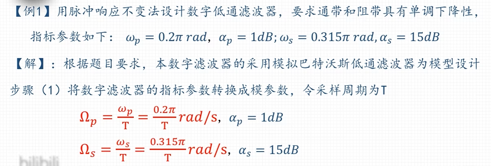

## 模拟滤波器设计

1. 模拟低通滤波器的幅频响应 $|H(j\Omega)|$

    {width="80%"}

2. 巴特沃斯滤波器幅频特性与 N 的关系

    {width="80%"}

巴特沃斯归一化参数表：

??? success "例题 1"
	
	

	1. 计算 N
	2. 查表 (表 6.2.1 之二) 求归一化低通滤波器的传输函数 $G_a(p)$
	3. 计算 3dB 截止频率 $\Omega_c$
	4. 令 $P = \frac{s}{\Omega_c}$ 代入 $G_a(p)$ 得到 $H_a(s)$ 即为所求滤波器的传输函数
	
	
	

??? success "例题 2"
		

## 数字滤波器及其原理

### 模拟与数字

### 模拟频率 $\Omega$ 与 $f$

### 模拟频率 $\Omega$ 与数字频率 $\omega$

### 模拟、数字频响特性曲线比较

快速判断数字滤波器类型的方法：

{width="70%"}

## 脉冲响应不变法

#### s 域和 z 域的转换

	
	

??? success "例题 1"
	
	
	
	
??? success "例题 2"