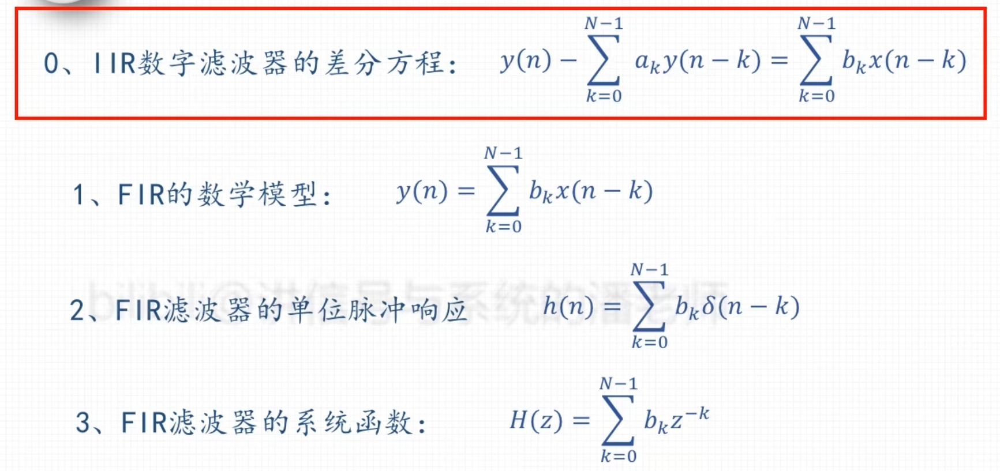
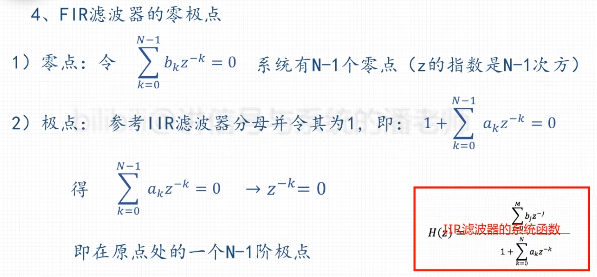
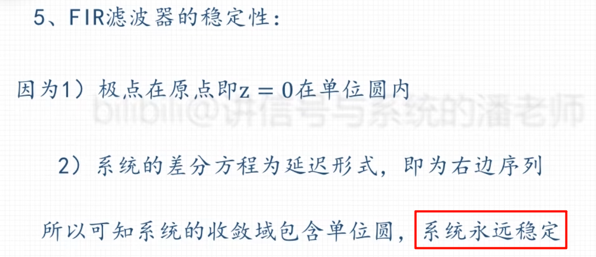
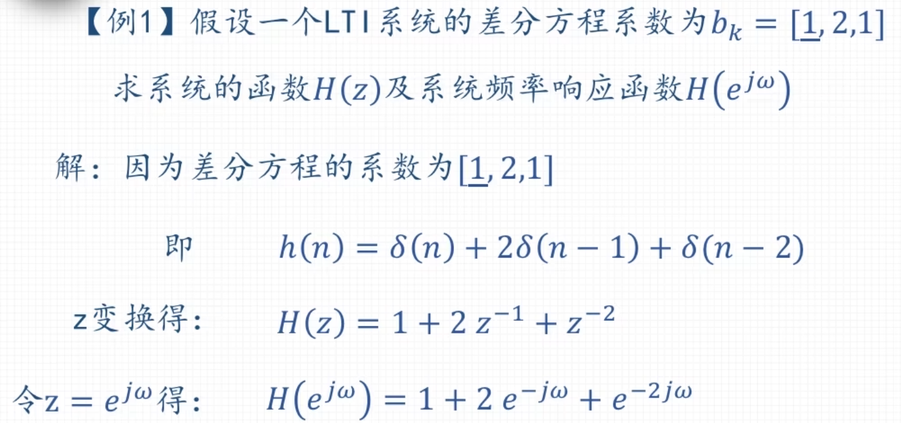

### 基本原理

### 频响特性与分类

| 类型 | h(n) 对称性 | 长度 N | 频率响应特点 | 适合设计的滤波器 |
| :--: | :----------: | :----: | :----------------------------------------------------------: | :--------------------: | 
| **I** |   **偶对称** | **奇数** | 最自由，对 Hr(ω) 在 0 和 π 处没有限制            | 低通、高通、带通、带阻 | 
| **II** |   **偶对称** | **偶数** | 在 ω=π 处，Hr(π)=0                             | **不能**设计高通、带阻     | 
| **III**|   **奇对称** | **奇数** | 在 ω=0 和 ω=π 处，Hr(0)=0,Hr(π)=0 | **不能**设计低通、高通、带阻 (可用于设计微分器) | 
| **IV** |   **奇对称** | **偶数** | 在 ω=0 处，Hr(0)=0                                 | **不能**设计低通、带阻     |

| 窗函数 | 主瓣宽度 (近似) | 旁瓣峰值衰减 | 最小阻带衰减 (加窗后) | 过渡带宽 | 特点 | 
| :-- | :-- | :-- | :-- | :-- | :-- | 
| **矩形窗** | 4π/N  | -13 dB  | -21 dB  | 1.8π/N  | 性能最差，但主瓣最窄 | | **汉宁窗** | 8π/N  | -31 dB  | -44 dB  | 6.2π/N  | 性能均衡，常用 | 
| **汉明窗** | 8π/N  | -41 dB  | -53 dB  | 6.6π/N  | 比汉宁窗旁瓣更低 | 
| **布莱克曼窗** | 12π/N  | -57 dB  | -74 dB  | 11π/N  | 旁瓣抑制最好，但主瓣很宽 | 
| **凯泽窗** | 可调 | 可调 | 可调 | 可调 | 最灵活的窗，有参数 β 可调  |
