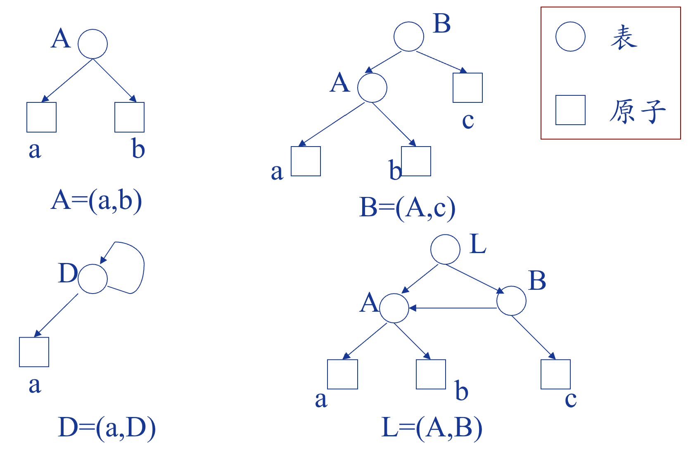

## 数组

### 数组的顺序存储

??? success "例题 1"
	例：有数组定义：`int a[5];`

    每个元素占用 4 字节，假设 `a[0]` 存储在地址 2000，`a[3]` 的地址是多少？
    
    - 数组存储示意图：
    
    | 地址 | 元素 |
    |------|------|
    | 2000 | a[0] |
    | 2001 |      |
    | 2002 |      |
    | 2003 |      |
    | 2004 | a[1] |
    | 2005 |      |
    | 2006 |      |
    | 2007 |      |
    | 2008 | a[2] |
    | 2009 |      |
    | 2010 |      |
    | 2011 |      |
    | 2012 | a[3] |
    | 2013 |      |
    | 2014 |      |
    | 2015 |      |
    | 2016 | a[4] |
    | 2017 |      |
    | 2018 |      |
    | 2019 |      |
    
    - 地址计算公式：
        - `LOC(0) = a = 2000`
        - `L = 4`
        - `LOC(3) = ?`
        - `LOC(i) = ?`，公式为：`a + i * L`
    
    - 地址计算规则：
    
    $$
    LOC(i) =
    \begin{cases}
    a, & \text{if } i = 0 \\
    LOC(i-1) + L = a + i \cdot L, & \text{if } i > 0
    \end{cases}
    $$
    
    - 计算 `LOC(3)`：
    根据公式 `LOC(i) = a + i * L`：
    $$
    LOC(3) = 2000 + 3 \cdot 4 = 2000 + 12 = 2012
    $$
    
    - 结论：
    `a[3]` 的地址是 **2012**

??? success "例题 2"
	设有一个二维数组 $A[m][n]$ 按行优先顺序存储，假设 $A[0][0]$ 存放位置在 $644_{(10)}$，$A[2][2]$ 存放位置在 $676_{(10)}$，每个元素占一个空间，问 $A[3][3]_{(10)}$ 存放在什么位置？（脚注 $_{(10)}$ 表示用 10 进制表示。）

    ---
    
    设数组元素 $A[i][j]$ 存放在起始地址为 $Loc(i, j)$ 的存储单元中：
    
    $$
    \because Loc(2, 2) = Loc(0, 0) + 2 \cdot n + 2 = 644 + 2 \cdot n + 2 = 676.
    $$
    
    $$
    \therefore n = \frac{676 - 2 - 644}{2} = 15.\quad（每行 ~n~ 个元素）
    $$
    
    $$
    \therefore Loc(3, 3) = Loc(0, 0) + 3 \cdot 15 + 3 = 644 + 45 + 3 = \boxed{692}.
    $$

### 矩阵的压缩存储

#### 对称矩阵

以行序为主序存储下三角

| $a_{11}$ | $a_{21}$ | $a_{22}$ | $a_{31}$ | $a_{32}$ | $\dots$ | $a_{n1}$   | $\dots$ | $a_{nn}$       |
| -------- | -------- | -------- | -------- | -------- | ------- | ---------- | ------- | -------------- |
| $k = 0$  | $1$      | $2$      | $3$      | $4$      | $\dots$ | $n(n-1)/2$ | $\dots$ | $n(n+1)/2 - 1$ |

一维数组 `sa` 的索引 $k$ 与矩阵元素 $(i, j)$ 的对应关系可以通过公式计算得出：
$$
k = \frac{i(i-1)}{2} + j - 1 \quad (1 \leq j \leq i)
$$
**示例：**
假设 $n = 3$，则下三角部分的元素为：

$$
\begin{bmatrix}
a_{11} & & \\
a_{21} & a_{22} & \\
a_{31} & a_{32} & a_{33}
\end{bmatrix}
$$

存储在一维数组中为：

$$
sa = [a_{11}, a_{21}, a_{22}, a_{31}, a_{32}, a_{33}]
$$

## 广义表

### 定义

广义表（又称为列表 Lists）是 $n \ge 0$ 个元素 $a_0,~ a_1,~ \dots, a_{n-1}$ 的有限序列。其中每一个 $a_i$ 或者是原子或者是又一个广义表。

- 记作：$LS= (a_1,~ a_2,~ \dots, a_{n})$
- 表头：$head(LS) = a_1$
- 表尾：$tail(LS) = (a_2,~\dots,~ a_n)$，表尾一定是一个**表**

??? success "例"
	- A = ( )，长度为 0
	- B = ( ( ) )，长度为 1

### 深度

深度定义为该广义表展开后，所含左括号数。

- A = (b, c) 深度为 1
- B = (A, d) 深度为 2
- C = (f, B, h) 深度为 3

### 图形表达方式

{width="70%"}
