## 树的定义

- 结点的度：结点拥有的子树数。
- 树的度：树内各结点的度的最大值。
- 结点的层：通常约定根节点位于第 1 层。
- 结点的深度：根节点的深度为 0。
- 叶子：终端的结点。

## 树和二叉树的 ADT

## 二叉树的性质和存储结构

### 性质

- 性质 1：在二叉树的第 i 层上至多有 $2^{i-1}$ 个结点（$i \ge 1$）。

    - 提问：第 i 层上至少有 1 个结点。

    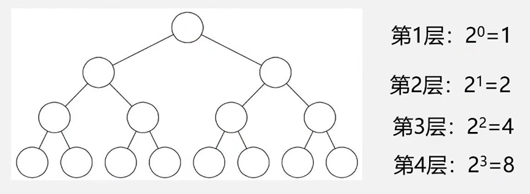{width="60%"}

- 性质 2：深度为 k 的二叉树，至多有 $2^{k}-1$ 个结点（$k \ge 1$）。

    - 提问：深度为 k 时，至少有 k 个结点。

- 性质 3：对任何一棵二叉树 T，如果它的叶子数为 $n_0$，度为 2 的结点数为 $n_2$，则 $n_0 = n_2 +1$。

    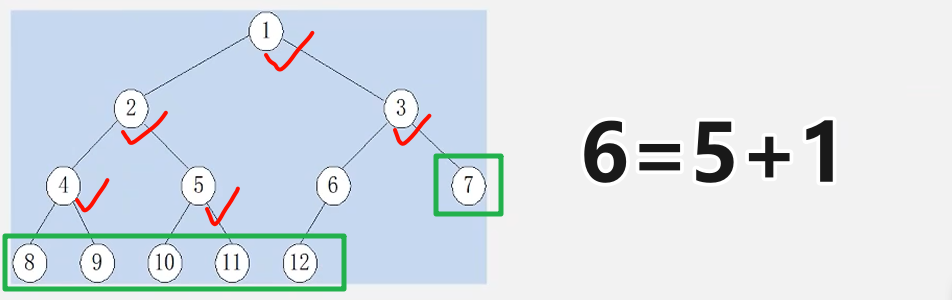{width="65%"}

??? note "满二叉树"
	一棵深度为 k 且有 $2^k-1$ 个结点的二叉树，称为满二叉树。
	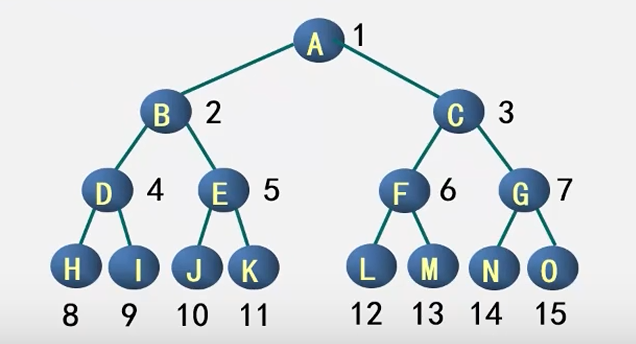{width="55%"}
	
	- 同样深度的二叉树，满二叉树中的结点个数最多。
	- 同样深度的二叉树，满二叉树中的叶子结点个数最多。

??? note "完全二叉树"
	深度为 k 的具有 n 个结点的二叉树，当且仅当其每一个结点都与深度为 k 的满二叉树中编号为 1～n 的结点一一对应时，称之为完全二叉树。
	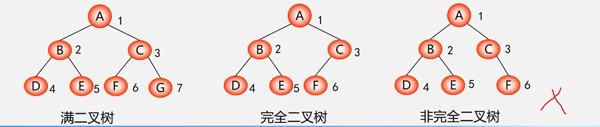{width="90%"}

	1. 叶子只可能分布在层次最大的两层上。
	2. 对任一结点，如果其右子树的最大层次为 i，则其左子树的最大层次必为 i 或 i+1。 

- 性质 4：具有 n 个结点的完全二叉树的深度为 $\lfloor \log_2 n \rfloor + 1$。

- 性质 5： 完全二叉树中，双亲结点编号与孩子结点编号之间的关系。

    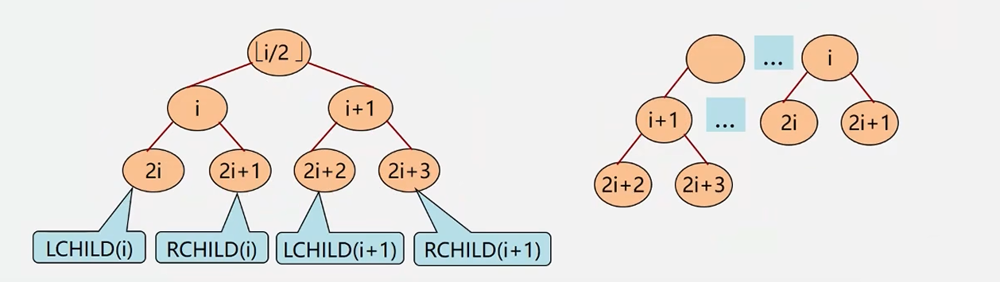{width="90%"}

### 存储结构

#### 顺序存储

```c
#define MAXTSIZE 100
typedef TElemType SqBiTree[MAXSIZE];
SqBiTree bt;  
```

??? success "例题"
	二叉树的结点数值采用顺序存储结构，请填空：
	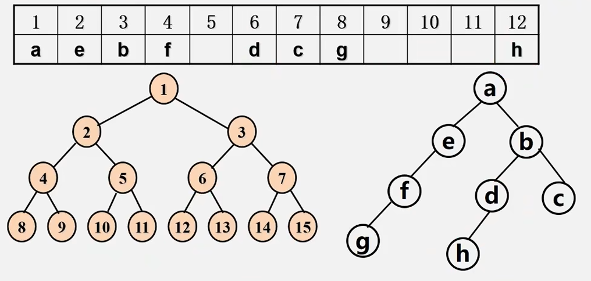{width="80%"}

#### 链式存储结构

```c
typedef struct BiNode {
    TElemType data;
    struct BiNode *lchild, *rchild;
} BiNode, *BiTree;
```

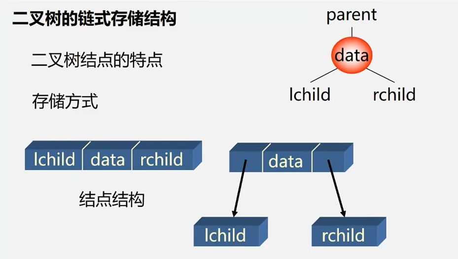{width="60%"}

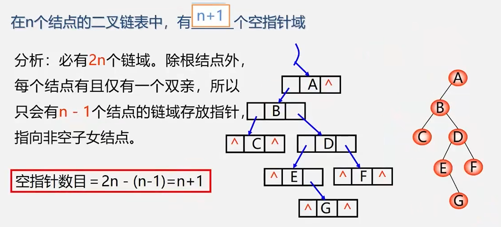{width="80%"}

## 遍历二叉树和线索二叉树

### 遍历二叉树

- 先（根）序遍历

    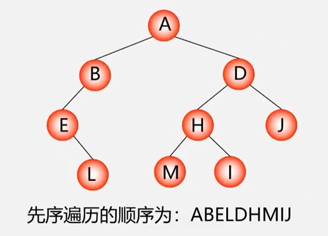{width="50%"}

- 中（根）序遍历

    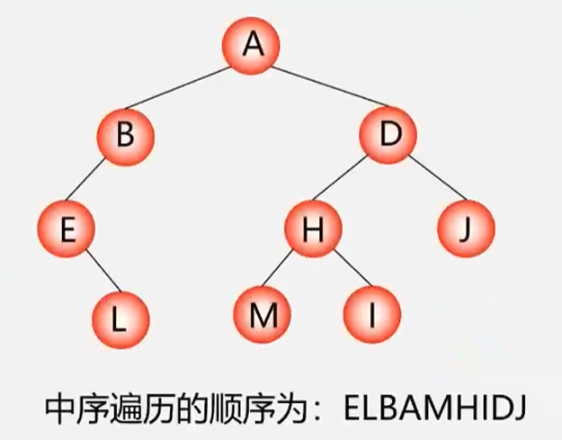{width="50%"}

- 后（根）序遍历

    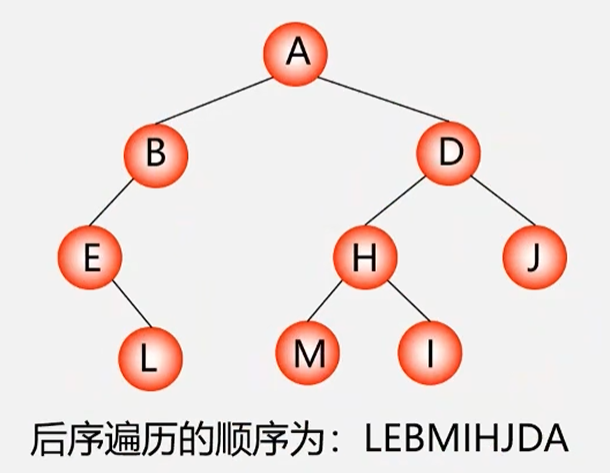{width="50%"}

### 序列逆推二叉树

### 先序递归遍历

### 中序非递归遍历

### 层次遍历

### 二叉树遍历算法应用

#### 建立二叉树

#### 复制二叉树

```c
int Copy(BiTree T, BiTree &NewT){
    if (T==NULL) { //如果是空树返回0
        NewT=NULL;
        return 0;
    }
    else {
        NewT = new BiTNode;
        NewT->data = T->data;
        Copy(T->IChild, NewT->lchild);
        Copy(T->rChild, NewT->rchild);
    }
}
```

#### 计算二叉树深度

```c
int Depth(BiTree T){
    if (T==NULL){
        return 0；//如果是空树返回0
    }
    else {
        m=Depth(T->IChild);
        n =Depth(T->rChild);
        if(m>n) return (m+1);
        else return(n+ 1);
    }
}
```

#### 计算二叉树结点总数

#### 计算二叉树叶子结点总数

### 线索二叉树

## 树和森林

### 树的存储结构

#### 双亲表示法

#### 孩子链表

#### 孩子兄弟表示法

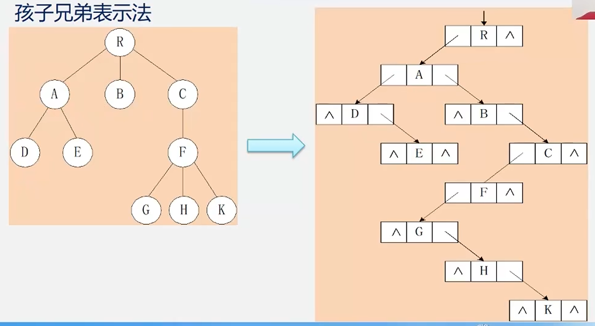{width="60%"}

### 树和二叉树的转换

- 树 ➡️ 二叉树：兄弟相连留长子。

- 二叉树 ➡️ 树：左孩右右连双亲，去掉原来右孩线。

    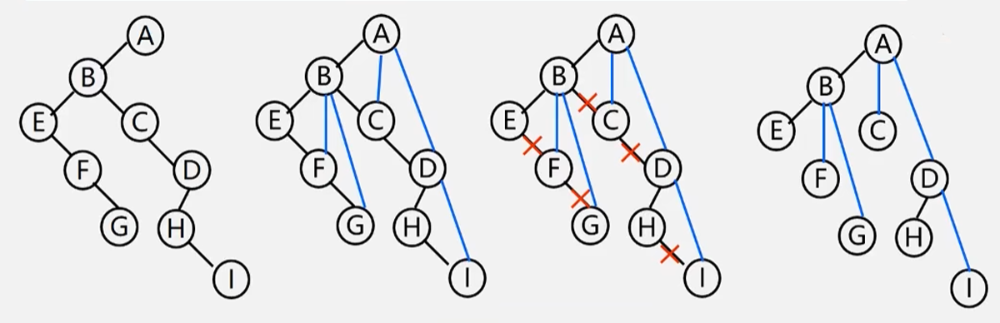{width="60%"}

### 森林和二叉树的转换

- 森林 ➡️ 二叉树：树变二叉连树根。

- 二叉树 ➡️ 森林：去掉全部右孩线，孤立二叉再还原。

    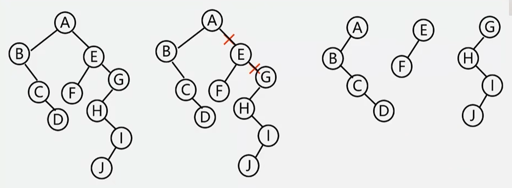{width="60%"}

### 树和森林的遍历

- 森林的先序遍历：照常。

- 森林的中序遍历：对每棵树进行**后序**遍历。

    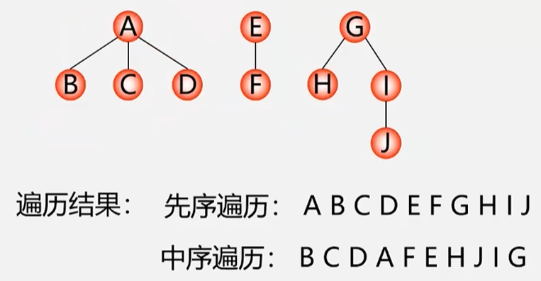{width="60%"}

## 哈夫曼树（最优）

### 基本概念

### 哈夫曼树构造算法

1. 构造森林全是根。
2. 选用两小造新树。
3. 删除两小添新人。
4. 重复2️⃣3️⃣剩单根。

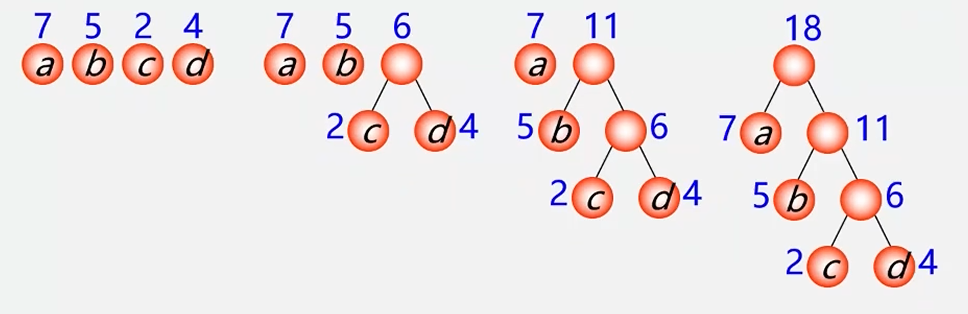{width="65%"}

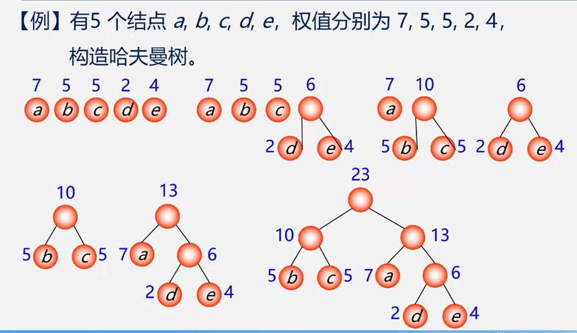{width="65%"}

### 哈夫曼编码

#### 哈夫曼编码思想

1. 哈夫曼编码保证，任何编码都不是另一个编码的前缀（哈夫曼编码是前缀码）。
2. 因为哈夫曼树的带权路径长度最短，故字符编码的总长最短（哈夫曼编码是**最优**前缀码）。

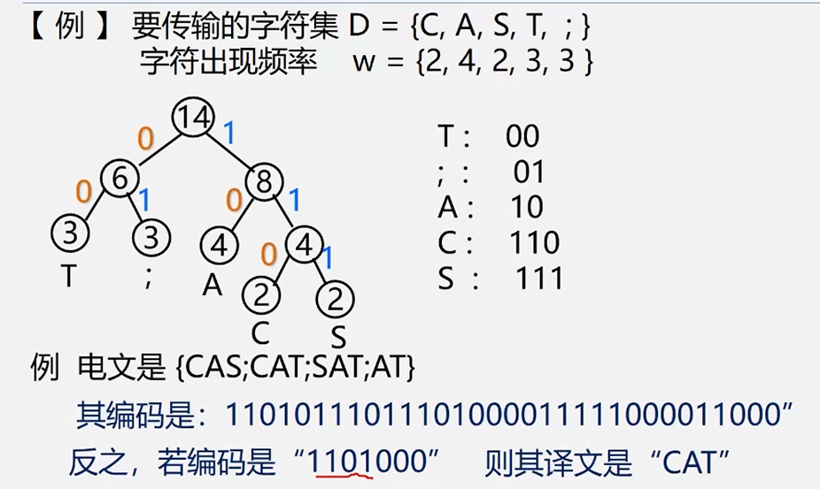{width="70%"}

#### 哈夫曼编码算法

```c++
void CreatHuffmanCode(HuffmanTree HT, HuffmanCode &HC, int n){
    
    HC = new char *[n+1];//分配n个字符编码的头指针矢量
    cd = new char [n];   //分配临时存放编码的动态数组空间
    cd[n-1]= '\0'’;      //编码结束符
    
    for(i=1; i<=n; + +i){	//逐个字符求哈夫曼编码
        start=n-1; c=i; f=HT[i].parent;
        while(f!=0) {		//向上回溯直到根结点
            --start;		//回溯一次start向前指一个位置
            if (HT[f].lchild==c) 
                cd[start]='0';
            else 
                cd[start]='1';
            c=f; f=HT[f].parent;
        }
        
        //求出第i个字符的编码
        HC[i]= new char [n-start];//为第i个字符串编码分配空间
        strcpy(HC[i], &cd[start]);//将求得的编码从临时空间cd复制到HC的当前行中
    }
    
    delete cd;//释放临时空间
}
```

