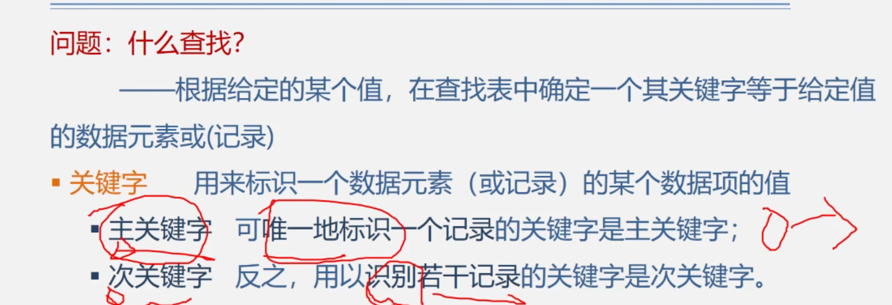

## 查找的基本概念

{width="70%"}

{width="70%"}

{width="70%"}

## 线性表的查找

### 顺序查找

#### 类型定义

```c
typedef struct {
    KeyType key; //关键字域
    ...          //其他域
} ElemType; 
```

```c
typedef struct {//顺序表结构类型定义
    ElemType *R;//表基址
    int length; //表长
} SSTable;      //Sequential Search Table
SSTable ST;     //定义顺序表ST
```

#### 算法

{width="80%"}

```c
int Search_Seq(SSTable ST, KeyTypekey){
    //若成功返回其位置信息，否则返回0
    for (i=ST.length; i>=1; --i) {
        if (ST.R[i].key==key) return i;  
    }
    return 0;
}
```

改进（哨兵）：

{width="80%"}

```c
int Search_Seq(SSTable ST, KeyType key){
    ST[0].key = key;
    for (i=ST.length; i>=1; --i);
    return i;
}
```

### 折半查找

#### 算法

{width="80%"}

```c
int Search_Bin (SSTable ST, KeyType key) {
    low = 1; 
    high = ST.length;// 置区间初值
    while (low <= high) {
        mid = (low + high) / 2;
        if (ST.R[mid].key == key) return mid; // 找到待查元素
        else if (key < ST.R[mid].key) //缩小查找区间
            high = mid - 1;//继续在前半区间进行查找
        else low = mid + 1;//继续在后半区间进行查找
    }    
    return 0 ;//顺序表中不存在待查元素
}// Search_Bin
```

#### 性能分析

{width="80%"}

{width="80%"}

### 分块查找

{width="80%"}

{width="80%"}

- 折半法：$log_2(n+1)$
- 顺序法：$\frac {n+1} 2$

## 树表的查找

### 二叉排序树 (BST)

#### 基本概念

{width="80%"}

{width="80%"}

{width="80%"}

#### 递归查找

{width="80%"}

存储结构：

```c
typedef struct {
    KeyType Key;         //关键字项
    InfoType Otherinfo ; //其他数据域
} ElemType;
```

```c
typedef struct BSTNode{
    ElemType data;//数据域
    struct BSTNode *Ichild, *rchild;//左右孩子指针
} BSTNode, *BSTree;

BSTree T;//定义二叉排序树T
```

算法：

```c
BSTree SearchBST(BSTree T,KeyType key) {
    if((!T) || (key==T->data.key)) return T;
    else if (key<T->data.key)
        return SearchBST(T->Ichild,key); //在左子树中继续查找
    else return SearchBST(T->rchild,key); //在右子树中继续查找
}// SearchBST
```

查找分析！：

{width="80%"}

{width="80%"}

{width="80%"}

#### 插入

{width="80%"}

#### 生成

{width="80%"}

#### 删除

{width="80%"}

{width="80%"}

{width="80%"}

### 平衡二叉树 (AVL)

#### 定义

{width="80%"}

{width="80%"}

{width="80%"}

#### 调整失衡

{width="80%"}

{width="80%"}

- 二叉排序树的性质：大小的顺序不能变！

##### 调整 LL 型

{width="80%"}

##### 调整 RR 型

{width="80%"}

{width="50%"}

##### 调整 LR 型

{width="80%"}

##### 调整 RL 型

{width="80%"}

#### 例题

{width="80%"}

{width="80%"}

{width="80%"}

{width="80%"}

{width="80%"}

## 散列表的查找

### 基本概念

就是哈希表。

{width="80%"}

{width="80%"}

{width="80%"}

### 散列函数的构造

{width="80%"}

#### 直接定址法

{width="80%"}

#### 除留余数法

{width="80%"}

### 处理冲突

#### 开放地址法

{width="80%"}

##### 线性探测法

{width="90%"}

##### 二次探测法

{width="80%"}

##### 伪随机探测法

不说了，$d_i$ 就是伪随机数。

#### 链地址法（拉链法）

{width="80%"}

### 查找与性能分析

{width="90%"}

{width="90%"}

{width="90%"}

{width="90%"}

{width="80%"}