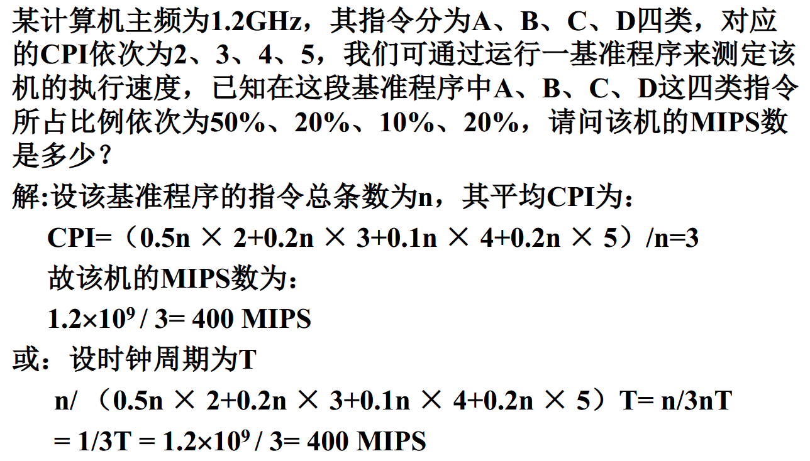

## 计算机硬件

五大组成要素：

1. 运算器
2. 控制器：从内存中取出指令加以分析，然后发出控制信号执行某种操作
3. 存储器：存储命令与数据
4. 输入设备
5. 输出设备

### 适配器和 IO 设备

- 数据总线
- 控制总线
- 地址总线

## 计算机软件

- 系统程序
    - 操作系统  
    - 调试程序、诊断程序  
    - 汇编器、编译器、解释程序  
    - 数据库管理系统
- 应用程序

## 计算机系统的性能评价

### 计算机性能指标

- 处理机字长：指处理机运算器中一次能够完成二进制数运算的位数。如 32 位、64 位等。 
- 总线宽度：通常指处理器与存储器之间进行互连用于传送数据的信号线数。
- 存储器容量：存储器中所有存储单元的总数。通常用 KB、MB、GB和 TB 表示。
    - $K=2^{10}$、$M=2^{20}$、$G=2^{30}$
- 存储器带宽：单位时间内从存储器读出的字节数，一般用字节数/秒表示。  
- 主频/时钟周期：CPU的工作节拍受主时钟控制，主时钟的频率 f 称为 CPU 的主频。
    - 度量单位是 MHz、GHz
    - 主频的倒数称为 CPU 时钟周期 T，T=1/f，度量单位是 s、ns
- 吞吐量：表示单位时间内完成的任务数。也称为带宽。
- 利用率：在给定的时间间隔内系统被实际使用的时间所占的比率，用百分比表示。
- 响应时间：计算机完成某任务所需的总时间。包括硬盘访问、内存访问、I/O 活动、操作系统开销和 CPU 执行时间。也称为执行时间。
- CPU 执行时间：执行某一任务在CPU上花费的时间。进一步分为：
    - 用户 CPU 时间（程序本身所花费的 CPU 时间）
    - 系统 CPU 时间（为执行程序而花费在操作系统上的时间）

!!! note 
	时间是唯一对计算机性能进行测量的完整而可靠的指标，只用一种因素去评价性能是危险的。

**CPU 性能公式：**

$$
程序的~CPU~执行时间 = 指令数 \times CPI \times CPU~时钟周期长度
$$

- CPI：每条指令需要的时钟周期数

------

- MIPS：每秒百万指令数
    - MIPS=(指令总数 $\div$ 程序执行时间) $\times 10^{-6}$

- MFLOPS：每秒百万次浮点操作次数
    - MFLOPS=(程序中浮点运算次数 $\div$ 程序执行时间)$\times 10^{-6}$

- TFLOPS：每秒万亿次浮点操作次数
    - TFLOPS=(程序中浮点运算次数 $\div$ 程序执行时间)$\times 10^{-12}$

### CPU 性能指标

??? success "例题"
	

## 计算机系统的层次结构

- 冯诺依曼（普林斯顿）结构：数据和指令放在**同一**存储器中。
- 哈佛结构：数据和指令放在**两块**独立存储器中，有两条独立总线。

