## 概述

### 存储系统的层次结构

1. 局部性原理：在某一段时间内，频繁访问某一局部的存储器地址空间，而对此范围以外的地址空间则很少访问的现象。

2. 多级存储系统的组成：

    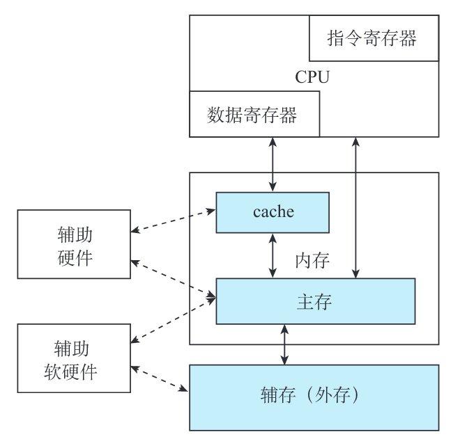{width="60%"}

    + 外存：解决存储容量问题，便宜
    + 内存：
        * 高速缓冲存储器（cache）：用于提升访问速度
        * 主存：常规内存。介于 cache 与外存之间，要求选取适当的存储容量和存取周期，使它能容纳系统的核心软件和较多的用户程序

### 存储器的分类

- 存储位元：存储器中最小的存储单位。一个双稳态半导体电路或一个 CMOS 晶体管或磁性材料的存储元，均可以存储一位二进制代码。
- 存储介质：半导体器件、磁性材料和光存储器。
- 存取方式：
    - 随机存取存储器
    - 顺序存储存储器：磁带
    - 半顺序（直接）存取存储器：磁盘，沿磁道方向顺序存取、垂直半径方向随机存取
- 读写功能：
    - ROM：只读存储器
    - RAM：随机存取存储器（读写存储器）
- 信息易失性：
    - ROM：可以掉电
    - RAM：掉电就失去信息
- 与 CPU 的耦合程度：
    - 内存：
        - 主存
        - Cache
    - 外存

计算机的主存可以分成：

- RAM：
    - SRAM：静态。用半导体管的“导通”或“截止”来记忆的，只要不掉电，储存信息就不会丢失。
    - DRAM：动态。用电荷储存在电容上，随着时间的推移，电荷会逐渐漏掉，储存信息也会丢失，因此要周期性地对其“刷新”。
- ROM：
    - 掩膜 ROM
    - PROM：一次性可编程
    - EPROM：可擦除的编程
        - 紫外线擦除（UV-EPROM）
        - 电擦除（EEPROM）
        - 闪速（Flash）

### 存储器的编址和端模式

- 存放一个机器字的存储单元，通常称为**字存储单元**，相应的单元地址称为**字地址**。
- 存放一字节的单元，称为**字节存储单元**，相应的地址称为**字节地址。**
- 端模式：存在⼀个存储字内部的，多字节的排列顺序问题：

	​	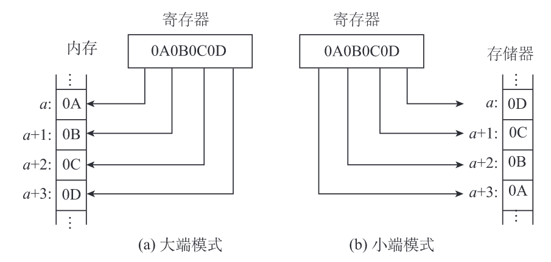{width="90%"} 
	
	+ 大端模式（big-endian）：将一个字的高有效字节放在内存的低地址端，低有效字节放在内存的高地址端。
	+ 小端模式（little-endian）：恰恰相反。
	
### 技术指标

- 存储容量
- 存储时间：从存储器接收到读/写命令开始，到信息被读出或写入完成所需的时间。
- 存取周期：CPU 连续两次访问存储器的最小间隔时间。通常，存储周期略大于存取时间。
- 存储器带宽（数据传送速率）：单位时间里存储器所存取的信息量。带宽=W/存取周期(bit/s)。

## SRAM

### 基本静态存储元阵列

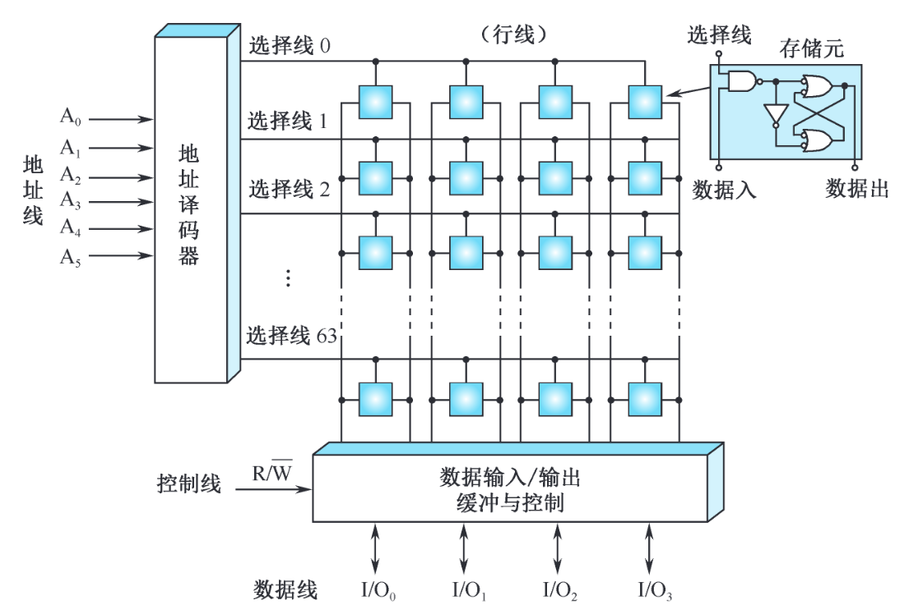{width="90%"}

- 地址线 6 位：$2^6=64$，则地址译码器输出有 64 条选择线，称为行线
- 数据线 4 位
- 总存储位元的数量：$64 \times 4=256$

### 基本 SRAM 逻辑结构

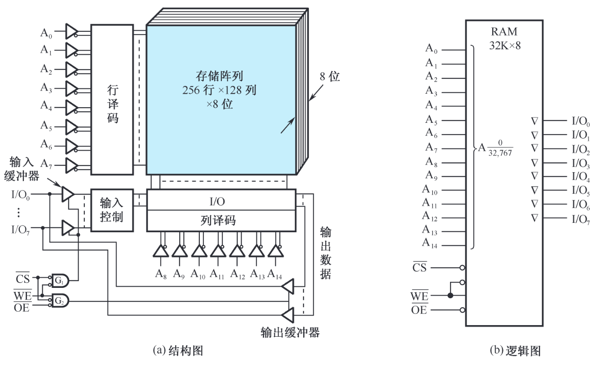{width="90%"}

- 采用双译码方式
- 输入地址
    - 行：$2^8 = 256$
    - 列：$2^7=128$
- 输出 8 位

### SRAM 读写时序

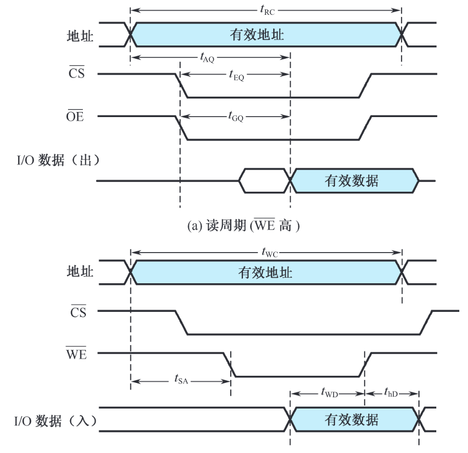{width="70%"}

### 存储器容量的扩充

#### 位拓展

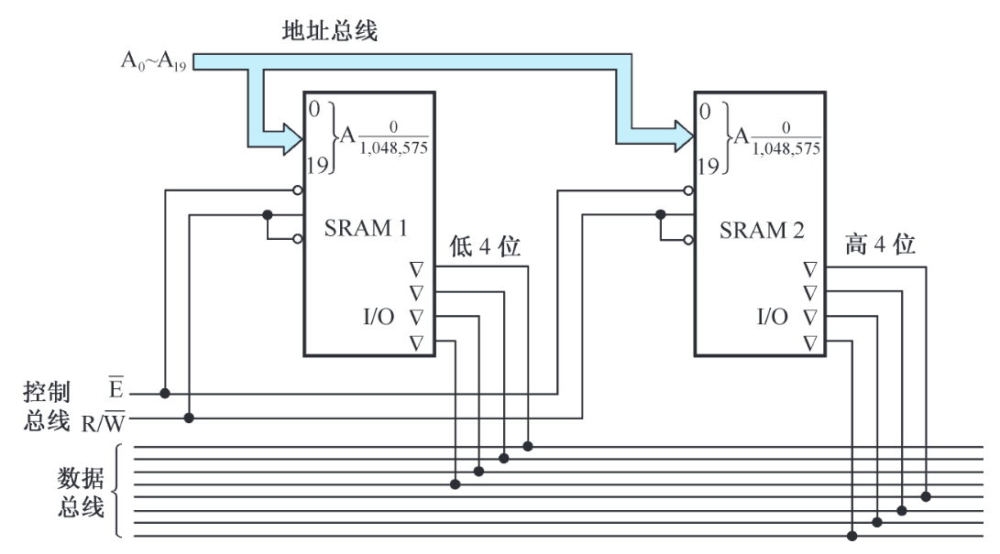{width="90%"}

#### 字拓展

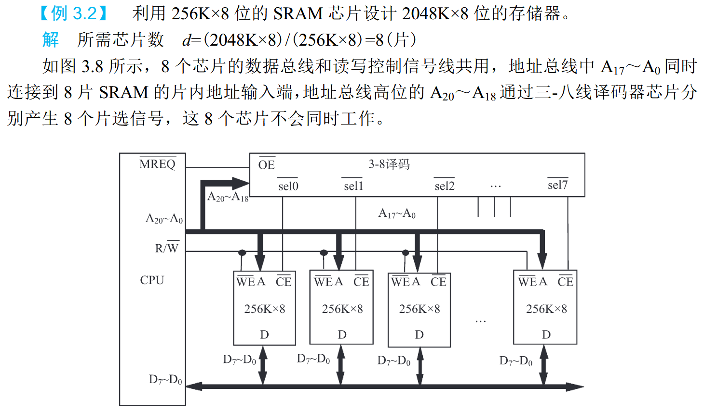{width="90%"}

## DRAM

与 SRAM 相比，DRAM 的存储元所需元件更少，所以存储密度更高。

### DRAM 存储元工作原理

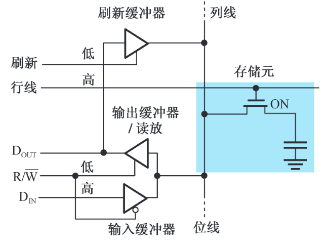{width="60%"}

### DRAM 芯片的逻辑结构

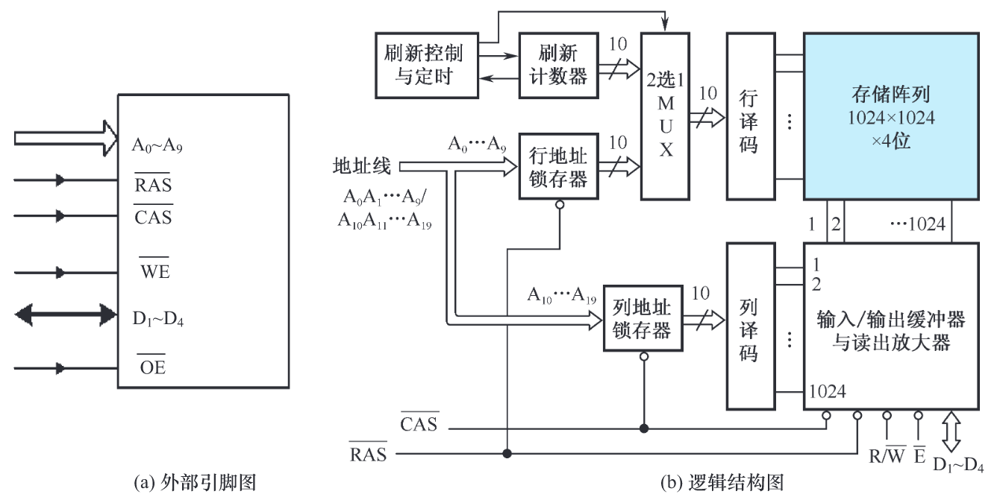{width="90%"}

- 与 SRAM 不同的是，图中增加了行地址锁存器（RAS）和列地址锁存器（CAS）
- 将地址分为行、列两部分，分时传送

### DRAM 读写时序

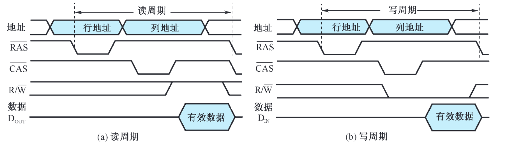{width="90%"}

### DRAM 刷新操作

当前主流的 DRAM 器件的刷新间隔时间（刷新周期）为 64ms。

- 集中式刷新策略：每一个刷新周期中集中一段时间对 DRAM 的所有行进行刷新。由于在刷新的过程中不允许读/写操作，集中式刷新策略存在“**死时间**”。
- 分散式刷新策略：每一行的刷新操作被均匀地分配到刷新周期时间内。由于 64ms 除以 8192 约等于 7.8μs，所以 DRAM 每隔 7.8μs 刷新一行。

### 突发传输模式

突发（Burst，猝发）访问：指的是在存储器同一行中，对相邻的存储单元进行连续访问的方式，突发长度可以从几字节到数千字节不等。提升等效数据访问速度。

### 同步 DRAM（SDRAM）

主要改进：在 DRAM 接口上增加时钟信号则可以降低存储器芯片与控制器同步的开销。

#### SDRAM 的特征

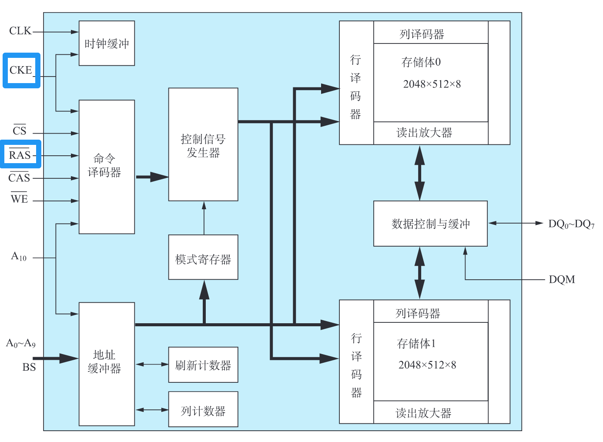{width="90%"}

- 同步操作：CKE 为时钟使能信号，只有该信号有效时，时钟输入才能作用于 SDRAM 芯片。
- 多存储体配置：SDRAM 的存储体被拆分为多个相互独立的存储体（bank）。各存储体可同时和独立工作，也可选择顺序工作或交替工作。
- 命令控制：传统的异步 DRAM 是根据控制信号的电平组合选择工作方式的，而 SDRAM 将一组控制信号的电平编码组合为“命令”。
- 模式寄存器：在 SDRAM 加电后必须先对模式寄存器进行设置，控制 SDRAM 工作在不同的操作模式下。

#### SDRAM 的控制方式

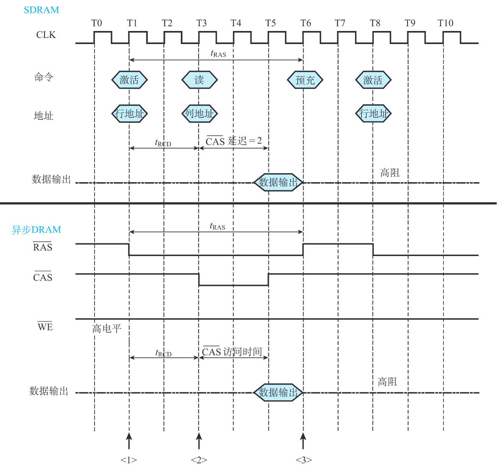{width="90%"}

### 双倍数据率 SDRAM（DDR SDRAM）

最大特点便是在时钟的上升沿和下降沿都能传输数据。

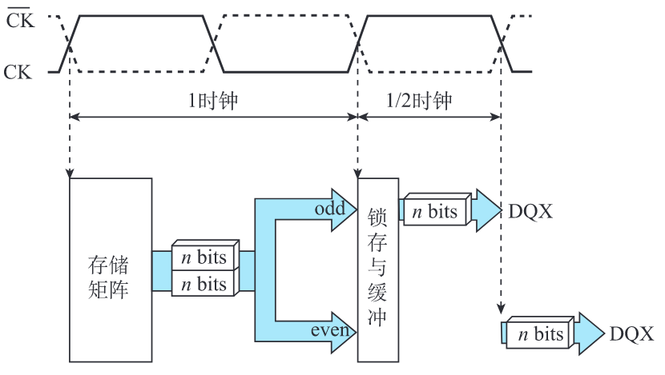{width="70%"}

- DDR1，每个时钟周期传输 2n 比特数据
- DDR2，每个时钟周期传输 4n 比特数据
- 差分时钟：因为温度和电阻特性的改变等原因，CK 上下沿间距可能发生变化，此时与其反相的 $\overline{CK}$ 就起到触发时钟校准的作用。

### CDRAM

CDRAM (Cached DRAM) 是一种附带高速缓冲存储器的动态存储器。是在常规的 DRAM 芯片封装内又集成了一个小容量 SRAM 作为高速缓冲存储器。

#### CDRAM 的芯片结构

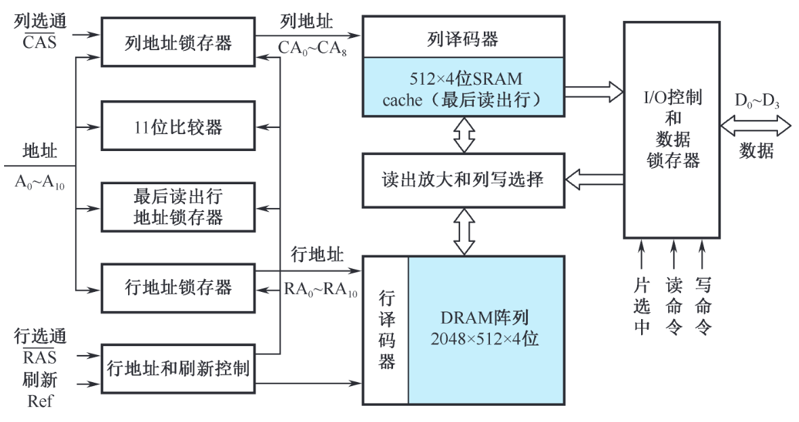{width="90%"}

- 一片 512×4 位的 SRAM 构成 cache，保存最近访问的一行数据。

- 另外增加了最后读出行地址锁存器和行地址比较器。如果后续访问的数据就在最近访问过的行中，则可直接从 cache 中读出数据而无须访问 DRAM 存储体。

- CDRAM 优点：

    1. 突发操作的速度高,如果连续访问的地址的高 11 位相同（属于同一行地址），那么只需连续变动 9 位列地址就能从 SRAM 中快速读出数据。
    2. 在 SRAM 读出期间可同时对 DRAM 阵列进行刷新。
    3. 允许在写操作完成的同时启动同一行的读操作。因为芯片内的数据输出路径（由 SRAM 到 I/O）与数据输入路径（由 I/O 到读出放大和列写选择）是分开的。

## ROM
### 概述

- Flash 闪存：
    - NOR 闪存：线性闪存。
        1. 可以像 SRAM 和传统 ROM 那样随机读出任意地址的内容，读出速度高；
        2. 存储在其中的指令代码可以直接在线执行；
        3. 可以对单字节或单字进行编程；
        4. 以区块 (sector) 或芯片为单位执行擦除操作；
        5. 拥有独立的数据线和地址线，因而接口方式与 SRAM 相似。
    - NAND 闪存：非线性闪存。每次读出以页 (page) 为单位，因而属于非随机访问的存储器。有 10 倍于 NOR 闪存的可擦除次数。

### NOR 闪存

#### NOR 的接口与逻辑结构

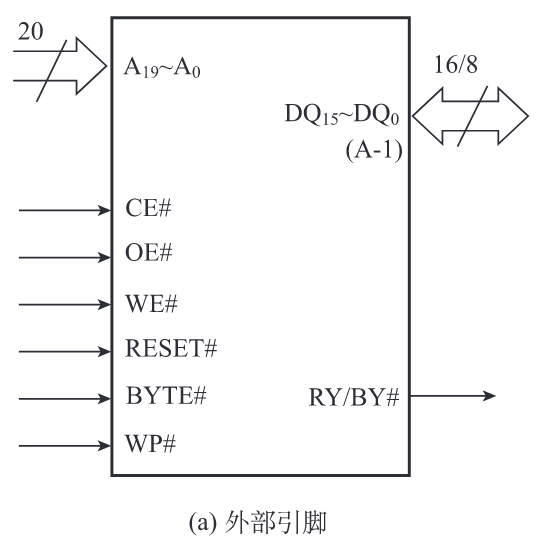{width="50%"}

#### NOR 的总线操作与工作方式

常用的判定编程和写入的状态的方法称为 **data# polling**

## 并行存储器

### 双端口存储器

同一个存储器具有两组相互独立的读写控制电路

#### 双端口存储器逻辑结构

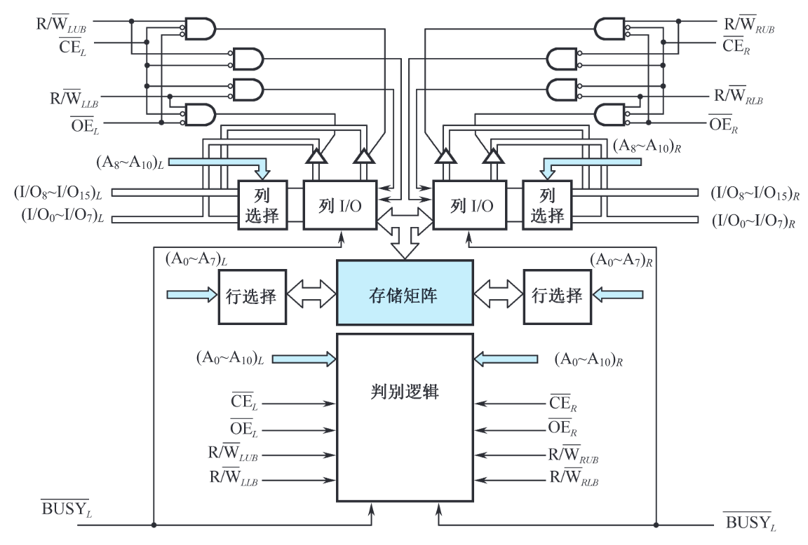{width="90%"}

#### 无冲突读写控制

当两个端口的地址不相同时，在两个端口上进行读写操作，一定不会发生冲突。

#### 有冲突读写控制

当两个端口同时存取存储器同一存储单元，而且至少有一个端口为写操作时，便发生读写冲突。

仲裁逻辑可以根据两个端口的地址匹配，或片选使能信号有效的时间，决定对哪个端口进行存取。

### 多模块交叉存储器

#### 存储器的模块化组织

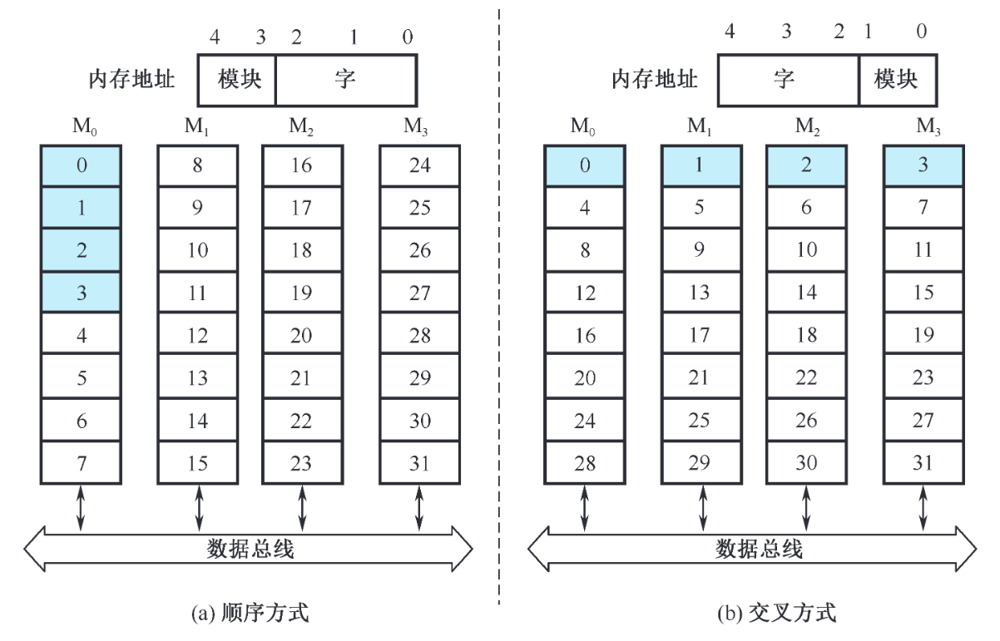{width="80%"}

