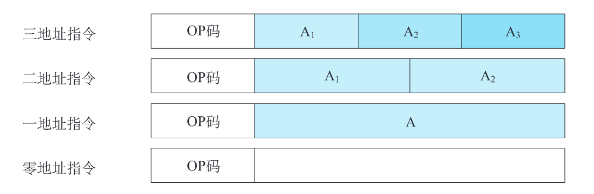
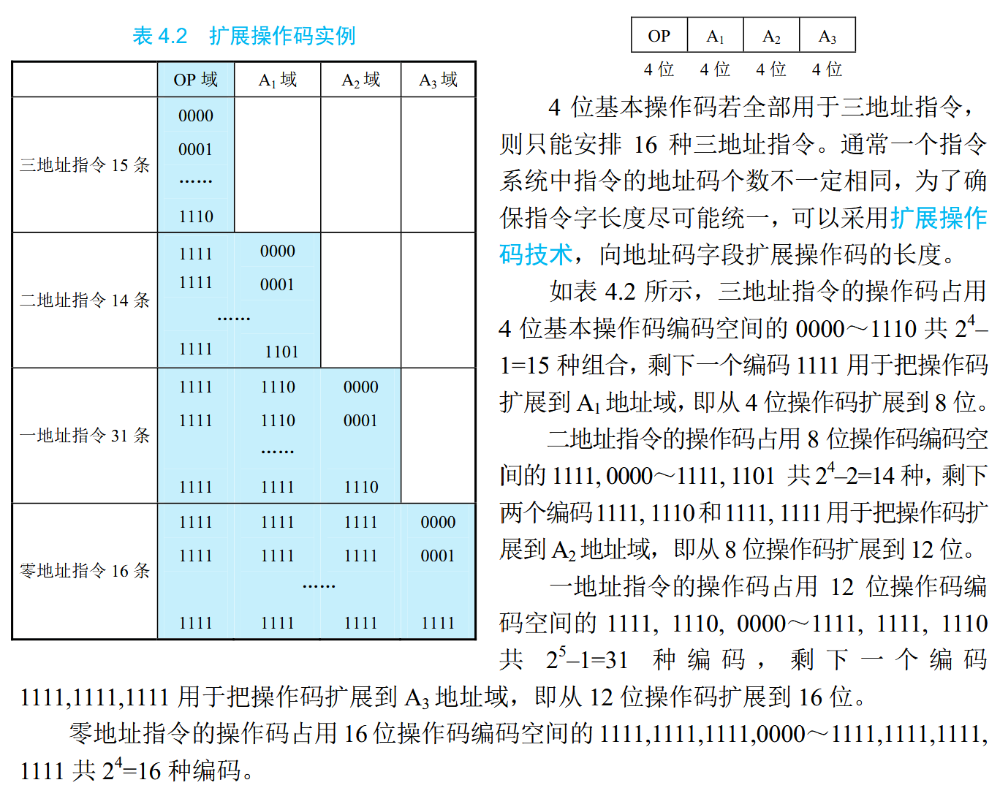
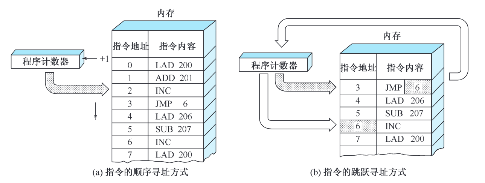
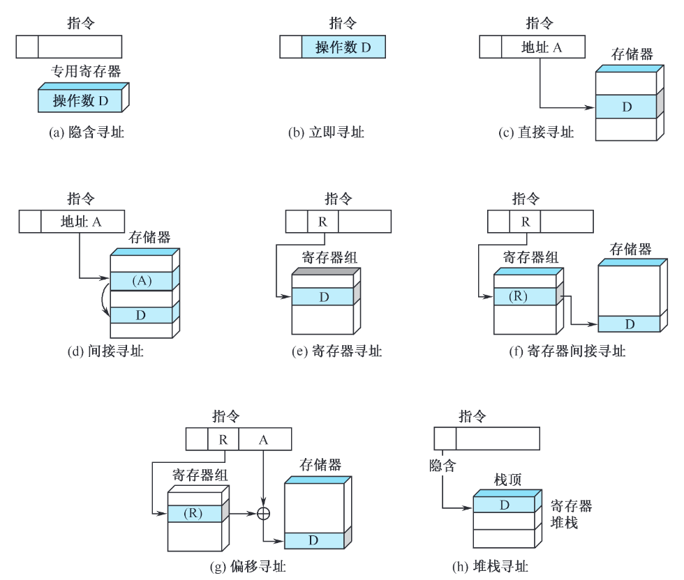

## 指令系统的定义

- 微指令：微程序级的命令，它属于硬件。
- 宏指令：若干条机器指令组成的软件指令，它属于软件。
- 机器指令：介于微指令与宏指令之间, 。通常简称为**指令**。每一条指令可完成一个独立的算术运算或逻辑运算操作。

------

- CISC：复杂指令系统计算机

- RISC：精简指令系统计算机

------

-  ISA（Instruction Set  Architecture）：指令系统体系结构
    - 寄存器组织
    - 存储器的组织和寻址方式
    - I/O 系统结构
    - 数据类型及其表示
    - 指令系统
    - 中断机制
    - 机器工作状态的定义及切换
    - 以及保护机制等

## 指令格式

在二地址指令格式中，操作数可分为：

- SS 型
- RR 型
- RS 型

### 指令字长度

- 指令字长度：一个指令字中包含二进制代码的位数
- 机器字长：计算机能直 接处理的二进制数据的位数。决定计算精度。

------

- 单字长指令：指令字长度等于机器字长度的指令
- 半字长指令：指令字长度等于半个机器字长度的指令

??? success "扩展操作码例题"
	

### 指令格式举例

教材 P132

1. 早期 8 位微型机
2. MIPS R4000
3. ARM 32 位
4. 英特尔 IA-32

## 指令和数据的寻址方式

寻址方式：分为**指令寻址**和**数据寻址**。

- 冯·诺依曼型结构的计算机中，内存中指令寻址与数据寻址是交替进行；
- 哈佛型计算机中指令寻址和数据寻址是独立进行的。

### 指令寻址方式

1. 顺序寻址
2. 跳跃寻址

### 操作数寻址方式

- 有效地址：指令真正的地址。
- 形式地址：有效地址的地址。在指令执行时，将形式地址**依据某种方式变换为有效地址**再取操作数。
- 操作数的寻址方式：将形式地址变换为有效地址的方式。

| 操作码 | 变址 | 间址 | 形式地址（偏移量） |
| ------ | ---- | ---- | ------------------ |
| OP     | X    | I    | A                  |

### 寻址方式举例

感觉没啥好说的，例题吧 TODO

### 典型指令

#### 指令分类

1. 数据传送
2. 算术运算
3. 逻辑运算
4. 程序控制
5. 输入输出
6. 字符串处理
7. 特权指令：特权指令是指具有特殊权限的指令。
8. 其他指令：状态寄存器置位、复位指令...

#### RISC 指令系统

特点：

1. 选取使用频率最高的一些简单指令，指令条数少
2. 指令长度固定，指令格式种类少，寻址方式种类少
3. 只有取数/存数指令访问存储器，其余指令的操作都在寄存器之间进行