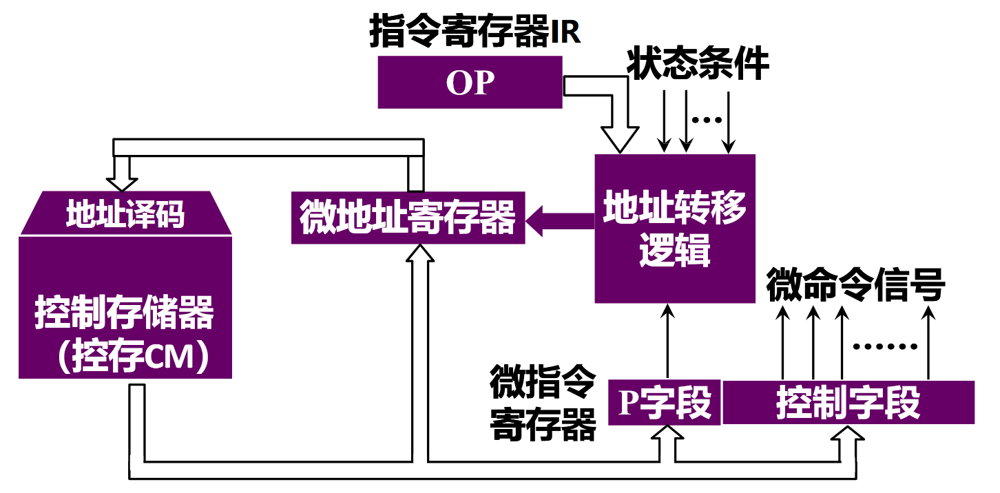
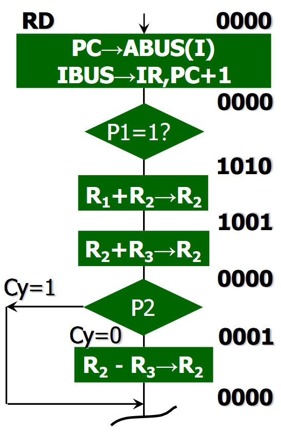
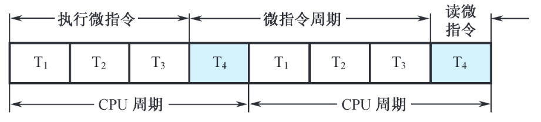
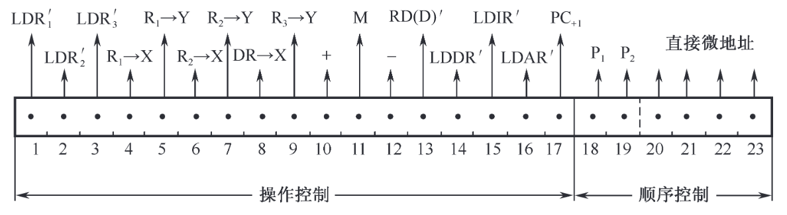
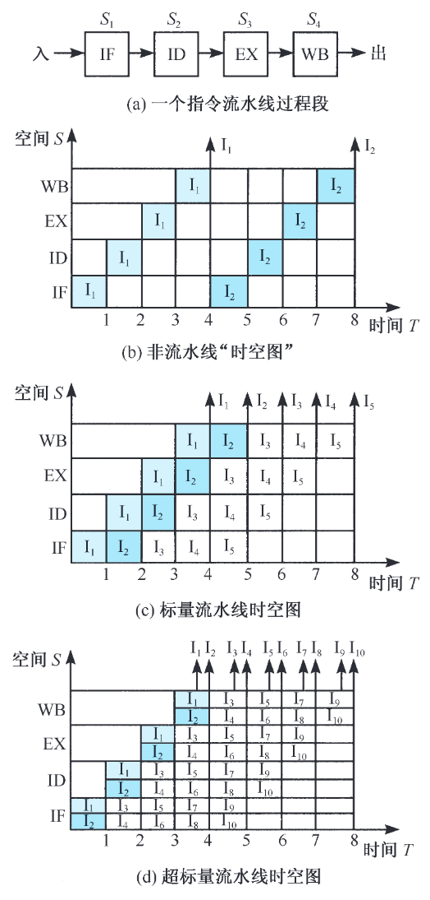
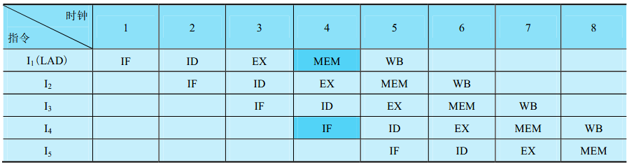

## 功能与组成

### CPU 功能

- **指令控制：**保证机器按顺序执行程序。
- **操作控制：**CPU 管理并产生由内存取出的每条指令的操作信号，把操作信号送往相应的部件。
- **时间控制：**各种指令的操作时间均受时间的严格定时。
- **数据加工：**对数据进行运算。

### CPU 组成

#### 控制器

1. “程序计数器”
2.  “指令寄存器”
3.  “指令译码器”
4.  “时序产生器”
5.  “操作控制器”

这些控制器的功能：

- 从指令 cache 种取出一条指令，并指出下一条指令在 cache 中的位置。
- 对指令进行译码和测试，产生对应的控制信号。
- 指挥数据的流动方向。

#### 运算器

1. “算术逻辑单元（ALU）”
2. “通用寄存器”
3. “数据缓冲寄存器（DR）”
4. “程序状态寄存器（状态条件寄存器，PSWR）”

### CPU 的主要寄存器

#### 数据缓冲寄存器（DR）

  - 作为 ALU 运算和通用寄存器之间的数据缓冲。
  - 补偿 CPU 和内存、外围设备之间的操作速度上的差别。

#### 指令寄存器（IR）

  - 用来保存当前正在执行的一条指令。当执行一条指令时，先把它从“指令存储器”种读出，再送到指令寄存器。

#### 程序计数器（PC）

  - 在程序执行前，PC 指向·程序第一条指令的·指存地址。之后 CPU 自动修改 PC，以便使其保存的·总是·将要执行的下一条指令的地址。

#### 数据地址寄存器（AR）

  - 用来保存当前 CPU 所访问的数据存储器（简称数存）单元的地址。

#### 通用寄存器

  - 在我们的模型中，通用寄存器有 4 个（R0~R3）。
  - 当算术逻辑单元(ALU)执行算术或逻辑运算时,为 ALU 提供一个工作区。

#### 程序状态字寄存器（PSWR）

- 保存由“算术运算指令“和“逻辑运算指令运算”的各种条件代码，如：
    - 运算结果进位标志（C）
    - 运算结果溢出标志（V）
    - 运算结果为零标志（Z）
    - 运算结果为负标志（N）
- 这些标志位通常分别由 1 位触发器保存。

### 操作控制器与时序发生器

信息怎样才能在各寄存器之间传送呢？数据通路。

操作控制器分为两类：

1. 硬布线控制器（组合逻辑控制器）
2. 微程序控制器

## 指令周期

指的是取出一条指令，并执行这条指令的时间。

指令周期通常用若干**CPU 周期数**来表示。CPU 周期又称为**机器周期**。

CPU 周期又包含若干**时钟周期**，也叫脉冲周期。

- 单周期 CPU：在一个时钟周期内完成从指令取出到得到结果的所有工作。指令系统中所有指令执行时间都以最长时间的指令为准，因而效率低。
- 多周期 CPU：把指令的执行分成多个阶段。每个阶段在一个时钟周期内完成,  因而时钟周期短。

## 微程序控制器

### 微程序控制原理

#### 微命令和微操作

- 微命令：控制部件通过控制线，向执行部件，发出的各种控制命令
- 微操作：执行部件接受微命令后所进行的操作
- 相容性微操作
- 相斥性微操作

#### 微指令和微程序

- 微指令：一个 CPU 周期中，组实现一定操作功能的微命令的组合
- 微程序：由一组微指令构成

#### 微程序构成框图

{width="80%"}

- 控制存储器：存放实现全部指令系统的微程序，它是一种只读型存储器。
  
	* 微指令周期：读出并执行微指令的时间总和

- 微指令寄存器：用来存放由控制存储器读出的一条微指令信息。
  
	* 微地址寄存器：下一条微指令的地址
	* 微命令寄存器：保存一条微指令的操作控制字段，和判别测试字段的信息

- 地址转移逻辑：承担自动完成修改微地址的任务。通过判别测试字段 P 和执行部件的“状态条件”反馈信息，去修改微地址寄存器的内容。

#### 微程序特点

- 一条机器指令对应着一段微程序，而微程序的总和便可实现整个的指令系统。
- 微程序设计可以很容易地在不同的**微体系结构**上实现相同的指令系统
	
	{width="80%"}

#### 微程序举例

- 画出十进制加法微程序流程图，由四条微指令组成：
	
	{width="30%"}

#### CPU 周期与微指令周期的关系

{width="70%"}

#### 机器指令与微指令的关系

- 前者与**主存储器**有关，后者与**控制存储器**有关
- 主存储器：存放系统程序与用户程序，容量很大
- 控制存储器：存放对应于机器指令系统的全部微程序，容量有限

### 微程序设计技术

#### 微命令编码

1. 直接表示法：每一位表示一个微命令

    {width="90%"}

2. 编码表示法：相斥性的微命令信号组成一个字段，然后通过字段的译码器，对每一个微命令信号进行译码，输出作为控制信号

3. 混合表示法

#### 微地址的形成方法

如何确定下一条微指令的地址。

1. 计数器方式：
    - 与程序计数器 PC 类似  
        - 在顺序执行微指令时，后继微地址由当前微地址加上一个增量来产生  
        - 在非顺序执行微指令时，必须通过转移方式，转去执行指定微地址的微指令  
    - 微地址寄存器通常可视为计数器，且顺序执行的微指令序列必须安排在控制存储器的连续单元中  
    - 特点：
        - 微指令的顺序控制字段较短，微地址产生机构简单  
        - 但是多路并行转移功能较弱，速度较慢，灵活性较差
2. 多路转移方式：
    - 当微程序出现分支时，有若干“候选”微地址可供选择。
    - 按顺序控制字段中 P “**判别测试**”位和“**状态条件**”位，来选择其中一个微地址。
    - 若“状态条件”有 n 位，可实现微程序 $2^n$ 路转移，且涉及微地址寄存器的 n 位。

#### 微指令格式

TODO

1. 水平
2. 垂直

## 硬布线控制器

RISC 处理器采用硬布线控制。TODO

## 流水线

### 原理

{width="40%"}

- IF (Instruction Fetch 取指)：从存储器取指令  
- ID (Instruction Decode 指令译码)：指令译码、读寄存器  
- EX (Execution 执行)：执行指令或计算地址  
- MEM (Memory)：访问存储器  
- WB (Write Back 写回)：结果写回寄存器

#### 性能指标

- 加速比：

$$
S =\frac {T_0} {T_k} = \frac {n \cdot k \cdot \tau} {(n+k-1) \tau}
$$

- 吞吐率：

$$
TP = \frac {n} {T_k} = \frac {n} {(n+k-1) \tau}
$$

- 最大吞吐率：

$$
TP_{\max} = \lim _{n \rightarrow \infty} \frac {n} {(n+k-1) \tau} = \frac 1 \tau
$$

### 三种流水线冒险

#### 结构冒险（资源相关）

流水线中两条指令同时试图使用同一资源。

{width="80%"}

解决办法：

1. 暂停一个时钟
2. 增设一个存储器，讲数据和指令放在不同存储器中

#### 数据冒险（数据相关）

一条指令的执行，依赖于更早的一条还在流水线指令的执行结果。

- 写后读相关（**RAW**）：指令 j 的执行需要使用指令 i 的计算结果，但指令 j 可能在指令 i 写入计算结果之前，就先进行了读操作。  

- 读后写相关（**WAR**）：指令 j 可能在指令 i 读取某个源操作数之前就进行了写操作。

- 写后写相关（**WAW**）：指令 j 和指令 i 的目标操作数相同，指令 j 可能在指令 i 写入计算结果之前就先行保存计算结果，导致写入顺序错误。

解决办法：

- 编译器通过指令调度来消除流水线暂停

- 由硬件动态调整指令执行顺序以减少暂停的影响
- 旁路

#### 控制冒险（控制相关）

