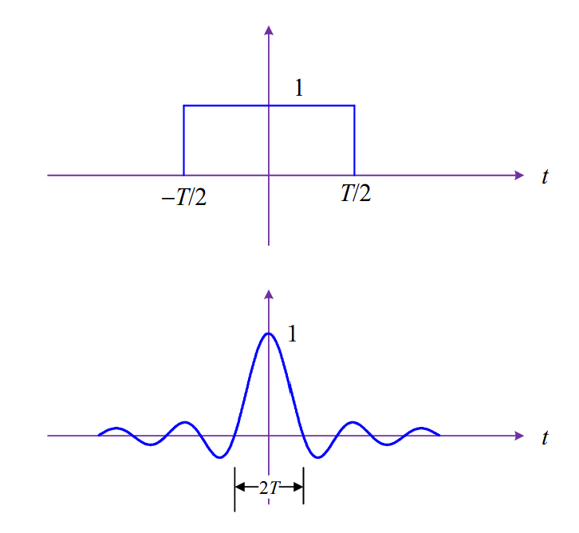

## 确定信号

### 本课常用信号

#### 正弦波

$$
A \cdot \cos(2\pi f_0t+ \theta)
$$

#### 受调制正弦波

$$
A(t) \cdot \cos(2\pi f_0t+ \theta)
$$

#### 矩形脉冲

> 矩形脉冲的持续时间有限

$$
\text{rect}\left(\frac{t}{T}\right) = \begin{cases} 1, & |t| \le \frac{T}{2} \\ 0, & \text{else} 
\end{cases}
$$

#### Sinc 脉冲

> sinc 脉冲的持续时间无限,有周期性零点

$$
\text{sinc}\left(\frac{t}{T}\right) = \text{Sa}\left(\frac{\pi t}{T}\right) = \frac{\sin\frac{\pi t}{T}}{\frac{\pi t}{T}}
$$

#### 直流信号

> 无限宽的矩形或 sinc

#### 狄拉克冲激

> 冲激函数不是常规函数,记号 δ(t) 指代的是如下极限

$$
\delta(t) = \lim_{T \to 0} \left\{ \frac{1}{T} \cdot \text{rect}\left(\frac{t}{T}\right) \right\} = \lim_{T \to 0} \left\{ \frac{1}{T} \cdot \text{sinc}\left(\frac{t}{T}\right) \right\} = \begin{cases} \infty, & t = 0 \\ 0, & t \ne 0 \end{cases}
$$

- 冲激信号采样性

$$
\int_{-\infty}^{\infty} \delta(t) g(t) dt = g(0)
$$

$$
\int_{-\infty}^{\infty} \delta(t-t_0) g(t) dt = g(t_0)
$$

$$
\delta(t-t_0) g(t) = \delta(t-t_0)g(t_0)
$$

### 复信号

复信号 = 一对实信号 = 复电压随时间变化
$$
z(t) = a(t) + j \cdot b(t) = A(t) \cdot e^{j \varphi(t)}
$$
其中：
$$
a(t) = A(t) \cdot \cos \phi(t)
$$

$$
b(t) = A(t) \cdot \sin \phi(t)
$$

**例题：**

## 信号频谱

## 线性时不变系统

## 带通信号的带通系统