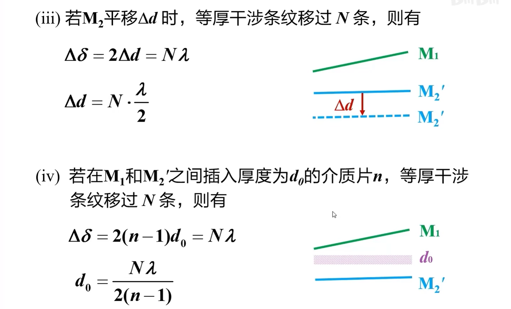
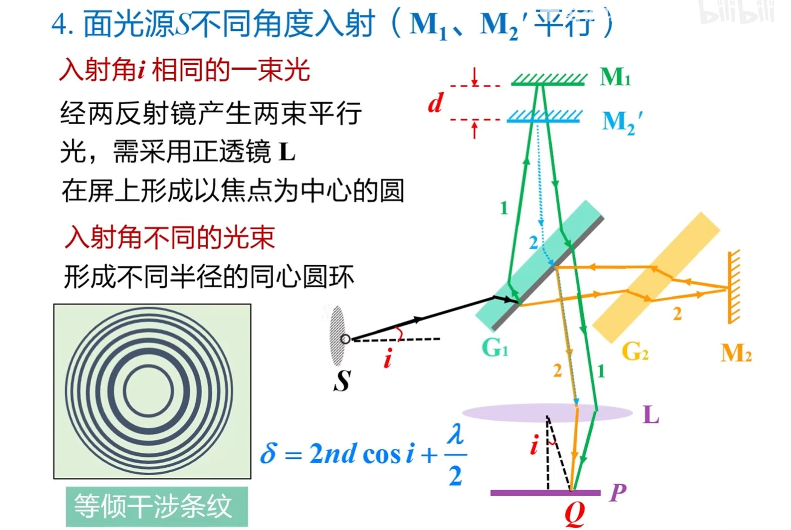
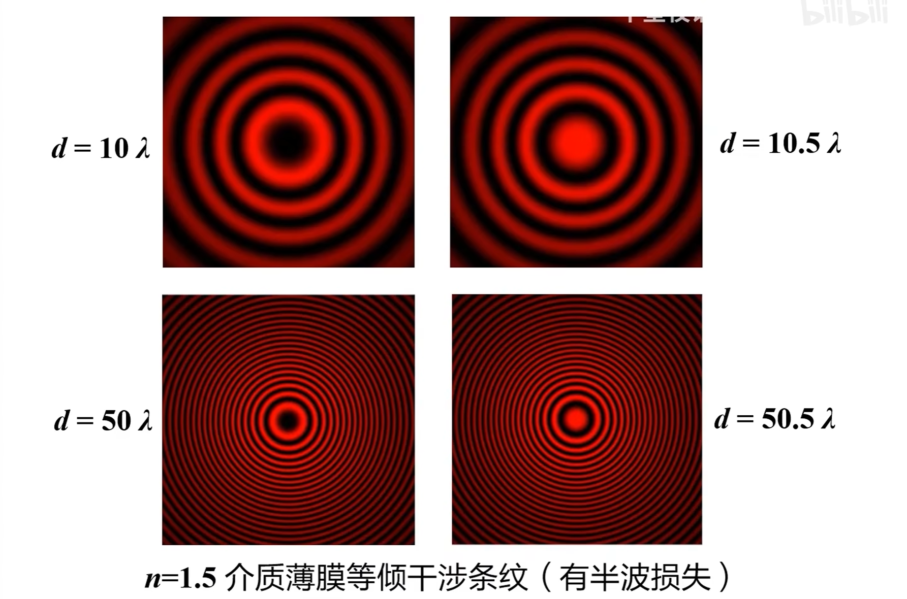
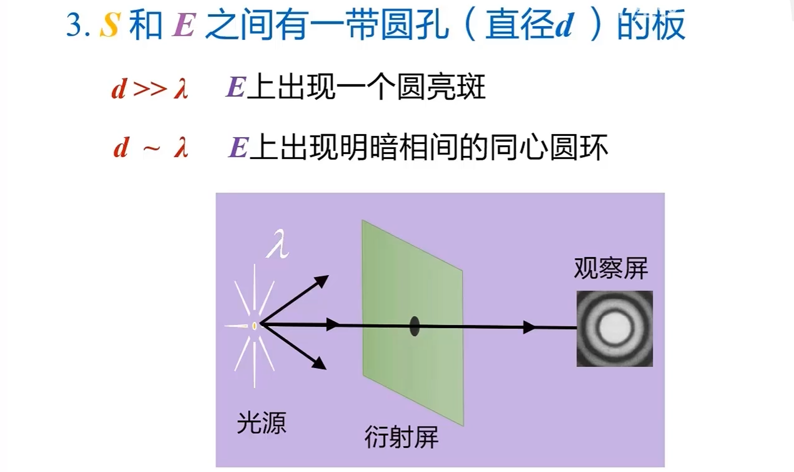
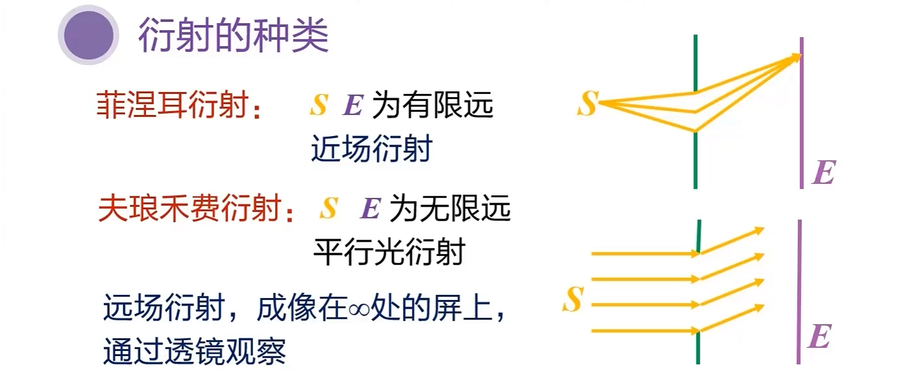
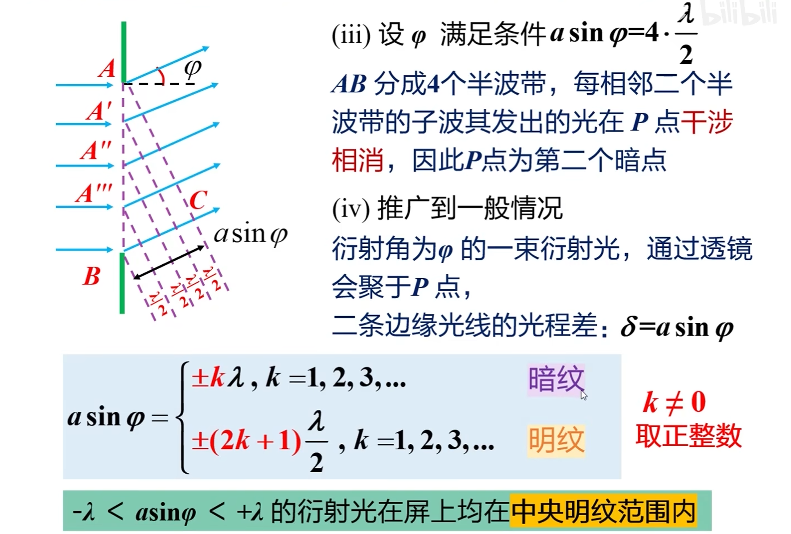
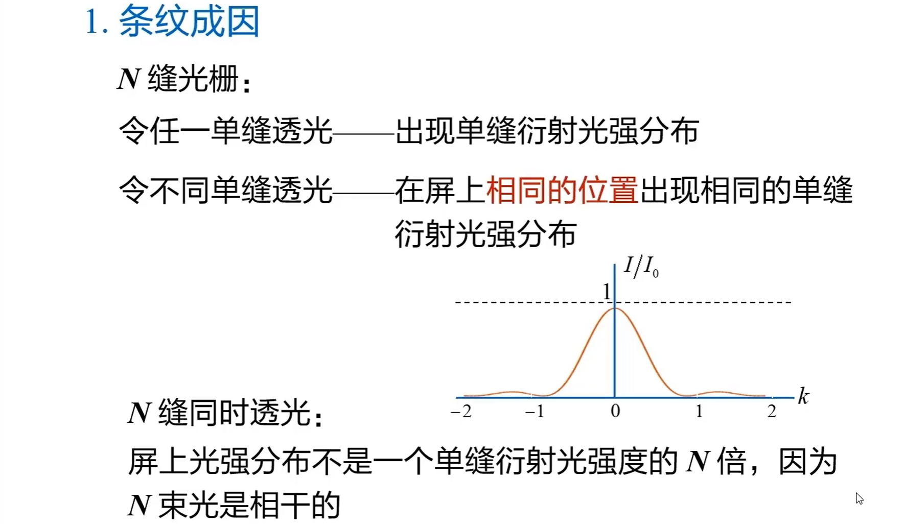
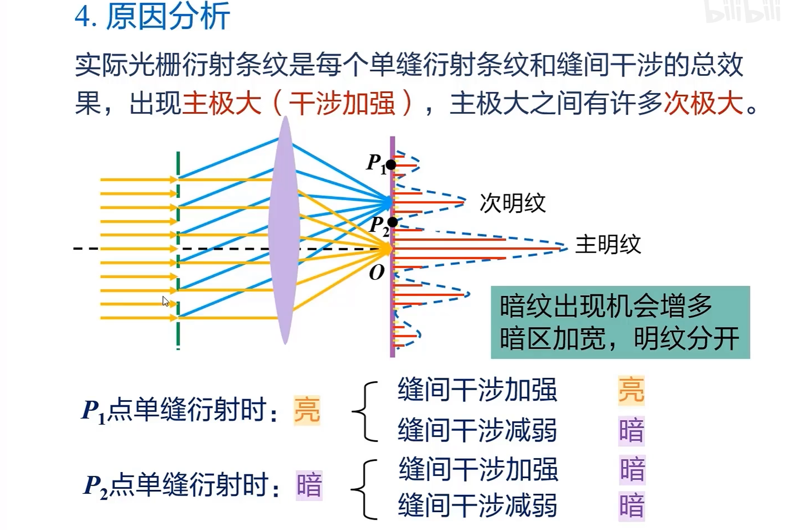
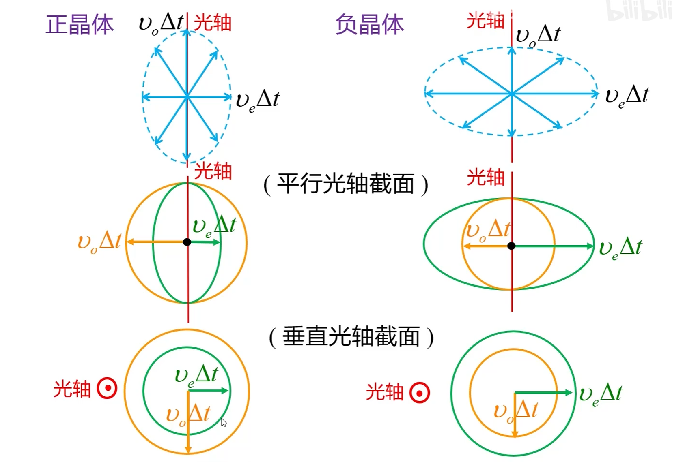

## 迈克耳逊干涉仪

### 原理

### 关于干涉条纹的讨论

其中 $(n-1)$ 代表了折射率的差。

### 面光源 $ S $ 不同角度入射

- $ \delta $ 是 1、2 两束光的光程差。

- $ n $ 是 $ M_1 $ 和 $ M_2 $ 之间的折射率，一般是空气为 1。

- 等倾干涉条纹：半径大处，干涉级次小。

### 相干长度、相干时间

#### 发生干涉的条件

#### 两个公式

## 惠更斯-菲涅尔原理

### 光的衍射现象

这就是 **泊松亮斑**。

### 惠更斯：引入子波

但是没解决 **为什么子波的强度变了？** 的问题。

### 菲涅尔：子波是相干波

### 衍射的种类

### 衍射角 $ \phi $

透镜不会引起额外的光程差。

## 单缝夫琅禾费衍射：半波带法

### 实验装置

### 半波带法

要注意的是 AC 面发出的平行光才等光程。

衍射和此前所讲的干涉不同之处：

- 明/暗纹 **条件互换**。

- $ k \ne 0 $，也就是说它只能从 1 开始。$k$ 代表了第几纹路。

#### 补充讨论

#### 例题

## 单缝夫琅禾费衍射：条纹的计算

### 明暗纹的位置

使用近似，将 $ \sin \phi $ 近似为 $ \tan \phi $。

### 条纹的宽度

### 条纹角位置和角宽度

### 附加讨论

注意这里的透镜画的过于小了，容易造成误导。

结论匪夷所思，但是至关重要。

#### 特例：平行光与透镜有夹角

## 单缝夫琅禾费衍射：光学仪器的分辨本领

### 圆孔夫琅禾费衍射

#### 艾里斑角半径公式

#### 瑞利判据

此时最小分辨角：
$$
\phi_0 = 1.22\frac{\lambda}{D}
$$
刚好就是第一级暗环的衍射角。

### 分辨本领

分辨本领 R 是 $ \phi_0 $ 的倒数。

最小分辨率：
$$
R = \frac{D}{1.22\lambda}
$$

#### 例题

## 光栅衍射

### 透射衍射光栅

### 衍射光栅的基本特点

#### 条纹成因

#### 以双缝光栅为例

#### 衍射条纹随缝数变化规律

#### 原因分析

### 条纹分析（计算主级大）

#### 中央明纹

#### 其它各级明纹条件

光栅方程类似于干涉的明纹条件：
$$
    (a+b)\sin \phi = \plusmn k\lambda, 
    ~k=0,1,2,...
$$

#### 明纹的限制条件

**缺级** 的条件：

#### 例题

#### 暗纹

## 自然光与偏振光

### 自然光

其中，自然光的表示方法。

### 偏振光

#### 完全偏振光

#### 部分偏振光

## 起偏、检偏和马吕斯定律

### 起偏和检偏

### 马吕斯定律

### 应用

**立体电影**、**特殊玻璃门** 是偏振作用。

## 折射、反射产生的偏振光

**入射面**：入射光和法线确定的平面。

### 布儒斯特定律

### 应用

用玻璃堆获得两束相互垂直的线偏振光。

## 双折射

### 晶体的双折射

#### 非寻常光

#### 光轴

#### 主平面

#### 正晶体、负晶体

### 惠更斯原理解释双折射

### 晶体偏振器

### 波晶片

#### 全波片

$$
\Delta \phi = \frac{2\pi}{\lambda} \left(n_{o} - n_{e}\right) d = 2k\pi
$$

#### 半波片

$$
相位差 \Delta \phi = \frac{2\pi}{\lambda} \left(n_{o} - n_{e}\right) d = (2k + 1)\pi
$$

#### 1/4 波片

$$
\Delta \phi= \frac{2\pi}{\lambda} \left(n_{o} - n_{e}\right) d = 2k\pi +\frac \pi 2
$$

