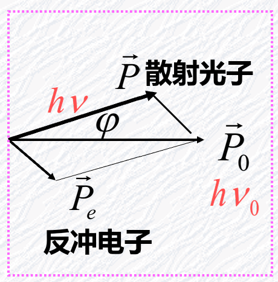

## 黑体辐射

### 热辐射物理量

#### 光谱辐射出射度

单色辐射本领。单位时间内，从物体单位表面向前方半球，发出的波长在 $\lambda$ 附近单位 **波长** 间隔内的电磁波的能量。

$$
M_\lambda=\frac {dM}{d\lambda}
$$

或按频率定义：

$$
M_\nu = \frac {dE_\nu(T)}{d\nu}
$$

辐射出射度与 T、$\lambda(v)$、物质种类、表面情况有关。

#### 总辐出度

总辐射本领。

$$
M(T)=\int^{\infty}_0 M_\lambda(T)d\lambda
$$

单位：$w/m^2$

### 黑体辐射实验规律

#### 维恩位移定律

黑体辐射本领最大值对应波长，与热力学温度的乘积是一个常数：
$$
T \lambda_m = b, \quad b=2.8978 \times 10^{-3}~m \cdot K
$$

#### 斯特藩-玻耳兹曼定律

$$
M(T)=\sigma T^4, \quad \sigma=5.67\times10^{-8} W/m^2K^4
$$

### 普朗克能量子假说

#### 黑体辐射公式

$$
M_{\nu}(T)=\frac{2\pi h}{c^2}\frac{\nu^3}{e^{h\nu/kT}-1}, \quad h=6.55\times10^{-34}\mathrm{J}\cdot\mathrm{s}
$$

打破“一切自然过程能量都是连续的”经典看法。

## 光电效应和爱因斯坦光量子论

### 光电效应实验规律

看图

### 爱因斯坦光量子论

#### 光量子假设

$$
\varepsilon=h\nu
$$

光强，单位时间打到单位面积上的粒子总能量：
$$
I = Nh\nu
$$
N 为粒子流密度。一个光子只能整个地被电子吸收。

#### 光电效应解释

$$
\frac{1}{2}m\upsilon_m^2=h\nu-A
$$

遏制电压与最大动能：
$$
eU_a=\frac{1}{2}m\upsilon_m^2
$$

### 光子的性质

- 能量：$\varepsilon=h\nu$
- 质量：$E=mc^2$，但光子静止质量为零
- 动量：$P = mc= \frac h \lambda$
- 角动量：在运动方向上 $J=\pm\hbar$，$\hbar=h/2\pi$

## 康普顿效应

### 实验

证实了爱因斯坦提出的“光量子具有动量”的假设。

X 射线在石墨上的散射。

- 出现更长波 $\lambda$​
- 随着散射角增大，$\lambda$ 强度增大，$\lambda_0$ 强度减小

波长的偏移只和散射角 $\phi$ 有关：
$$
\Delta \lambda = \lambda-\lambda_0=\lambda_c(1-\cos \phi)
$$

### 康普顿散射公式

{:style="zoom:60%;"} 
$$
\Delta \lambda = \lambda-\lambda_0 = \frac h {m_0c} (1-\cos \phi)
$$
电子的康普顿波长：
$$
\lambda_c = \frac h {m_0c} = 0.024263 ~Å
$$
$\phi = \pi$ 时候，波长改变最大：
$$
\Delta \lambda = 2\lambda_c
$$
原子序数愈大的散射体，原波长的成分愈多。

## 玻尔的量子论

### 三条假设

#### 定态假设

原子系统只能处在一系列不连续的能量状态。这些状态称为原子系统的稳定状态简称定态。相应能量分别记为 $E_1、E_2 ...$

#### 跃迁假设

$$
h\nu=E_n-E_m
$$

#### 角动量量子化假设

$$
L=n\hbar \quad \hbar=\frac h {2\pi}
$$

### 氢原子半径

$$
r_n= n^2 r_1
$$

### 氢原子能量

$$
E_n = \frac {E_1} n^2
$$

$n$ 为主量子数。

