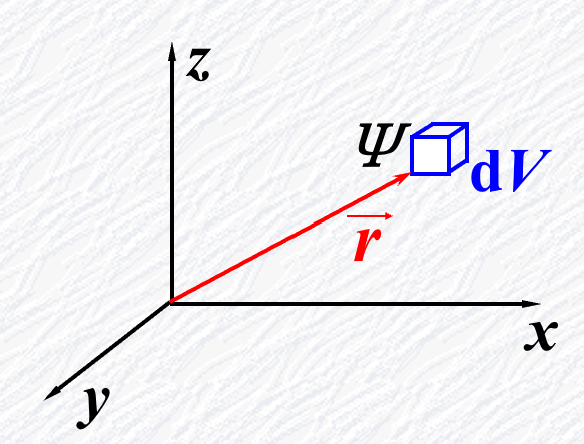

## 实物粒子波动性

### 德布罗意公式

$$
\lambda = \frac h P = \frac h {mv}
$$

$$
\nu = \frac E h = \frac {mc^2} h
$$

### 实验验证

- 戴维逊-革末实验
- G.P.汤姆逊实验：电子通过金属薄膜衍射

## 波函数统计

### 波函数

物质波波函数写成 $\Psi(\vec{r},t)$。

#### 玻恩假设

物质波不代表实在物理量的波动，而是刻划粒子在空间概率分布的概率波。

对比：光子在某处出现的概率，和该处光振幅的平方，成正比。

#### 概率密度

- 概率幅：物质波的波函数 $\Psi$ 是描述粒子在空间概率分布的“概率振幅”。
- 概率密度：$|\Psi(\vec{r},t)|^2 = \Psi(\vec{r},t) *  \Psi(\vec{r},t)$。代表 t 时刻，在 $\vec{r}$ 端点处单位体积中发现一个粒子的概率。

{: style="zoom:60%"}

双缝干涉中，双缝齐开时：

- 总概率幅：

$$
\Psi_{12} = \Psi_1 + \Psi_2
$$

- 总概率密度：

$$
\begin{aligned}
P_{12}&=\mid\boldsymbol{\Psi}_{12}\mid^2=\mid\boldsymbol{\Psi}_1+\boldsymbol{\Psi}_2\mid^2\\&=\left|\Psi_1\right|^2+\left|\Psi_2\right|^2+\left|\Psi_1\Psi_2^*+\Psi_2\Psi_1^*\right|
\end{aligned}
$$

### 波函数标准化条件

#### 有限性

根据波函数统计解释 ，在空间任何有限体积元中找到粒子的概率必须为有限值。

#### 归一性

$$
\underset{\Omega}{\operatorname*{\operatorname*{\int}}}\left|\Psi\left(\vec{r},t\right)\right|^2\mathrm{d}V=1
$$

$$
\begin{aligned}
&\int\left|\Psi_A\left(\vec{r}\right)\right|^2\mathrm{d}^3r=A\\
&\int\left|\frac{1}{\sqrt{A}}\Psi_A(\vec{r})\right|^2\mathrm{d}^3r=1
\end{aligned}
$$

称 $\frac {1} {\sqrt{A}}$  为归一化因子。

### 自由粒子波函数（TODO）

