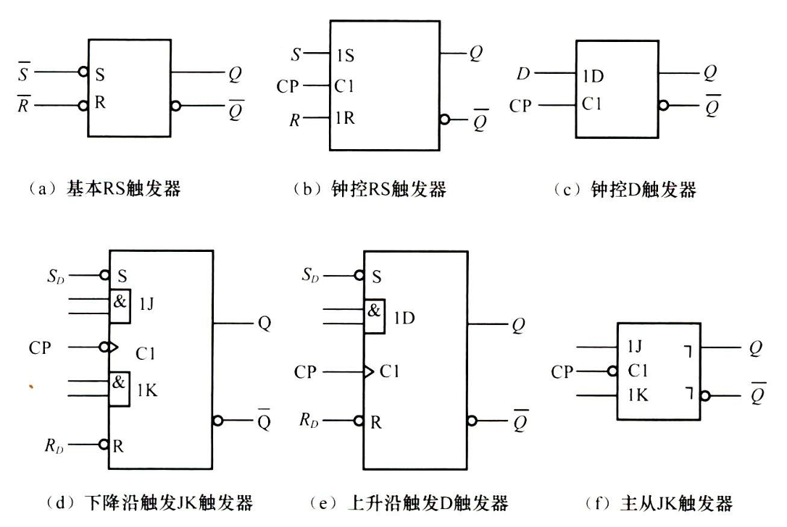
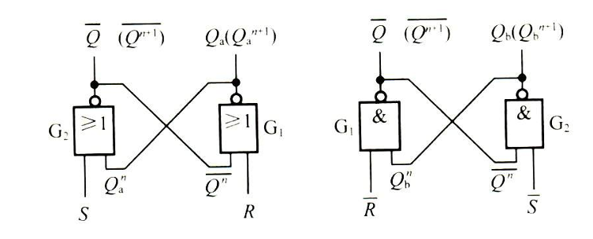
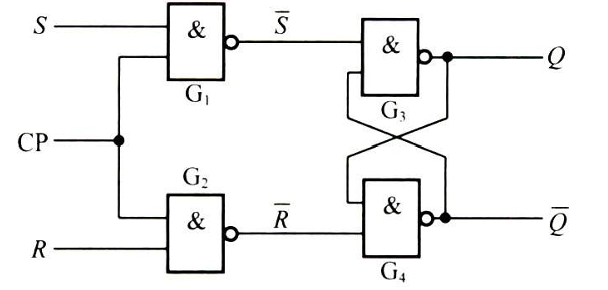
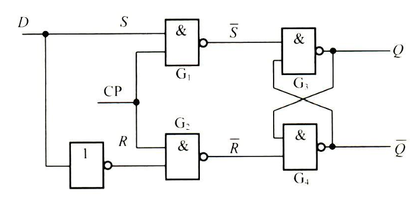
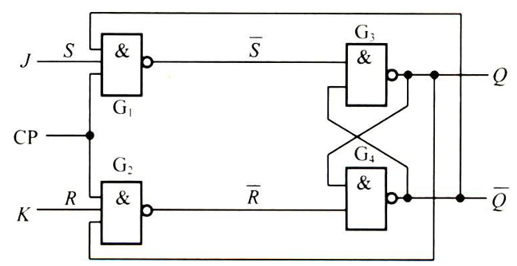
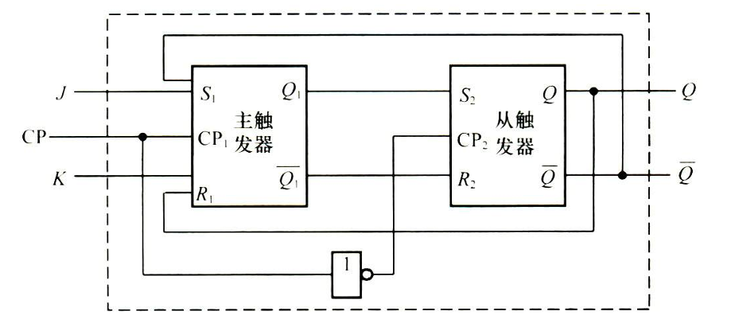
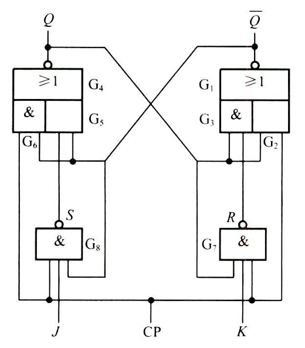

## 触发器逻辑符号

{: style="zoom:60%" align=center}

## 基本 RS 触发器

{: style="zoom:60%" align=center}

### 或非门构成

$$
\begin{cases}
Q^{n+1}=S+\overline{R}Q^n \\
\overline{R}+\overline{S}=1
\end{cases}
$$

### 与非门构成

$$
\begin{cases}
Q^{n+1}=S+\overline{R}Q^n \\
RS=0
\end{cases}
$$

| R    | S    | $Q^{n+1}$ | 功能说明 |
| ---- | ---- | --------- | -------- |
| 0    | 0    | $Q^n$     | 保持     |
| 0    | 1    | 1         | 置 1     |
| 1    | 0    | 0         | 置 0     |
| 1    | 1    | ×         | 不允许   |

> 助记：11 不允许，00 就保持，其它看 S。

## 钟控触发器

### 钟控 RS 触发器

{: style="zoom:60%" align=center}

$$
Q^{n+1} = (S + \overline{R}Q^n) \cdot CP + Q^n \cdot \overline{CP}
$$

| CP   | S    | R    | $Q^{n+1}$ | 功能说明 |
| ---- | ---- | ---- | --------- | -------- |
| 0    | ×    | ×    | $Q^n$     | 保持     |
| 1    | 0    | 0    | $Q^n$     | 保持     |
| 1    | 0    | 1    | 0         | 置 0     |
| 1    | 1    | 0    | 1         | 置 1     |
| 1    | 1    | 1    | ×         | 不允许   |

### 钟控 D 触发器

{: style="zoom:60%" align=center}

$$
Q^{n+1}=D \\
Q^{n+1}=D\cdot CP+Q^n \cdot \overline{CP}
$$

| CP   | D    | $Q^{n+1}$ | 功能说明 |
| ---- | ---- | --------- | -------- |
| 0    | ×    | $Q^n$     | 保持     |
| 1    | 0    | 0         | 置 0     |
| 1    | 1    | 1         | 置 1     |

### 钟控 JK 触发器

{: style="zoom:60%" align=center}

$$
Q^{n+1}=J\cdot \overline{Q^n} + \overline{K}\cdot Q^n
$$

| CP   | J    | K    | $Q^{n+1}$        | 功能说明 |
| ---- | ---- | ---- | ---------------- | -------- |
| 0    | ×    | ×    | $Q^n$            | 保持     |
| 1    | 0    | 0    | $Q^n$            | 保持     |
| 1    | 0    | 1    | 0                | 置 0     |
| 1    | 1    | 0    | 1                | 置 1     |
| 1    | 1    | 1    | $\overline{Q^n}$ | 翻转     |

### 钟控 T 触发器

将钟控 JK 触发器的两个输入端连接起来，构成了 T 触发器。

$$
Q^{n+1}=T\cdot \overline{Q^n}+\overline{T}\cdot Q^n
$$

| CP   | T    | $Q^{n+1}$        | 功能说明 |
| ---- | ---- | ---------------- | -------- |
| 0    | ×    | $Q^n$            | 保持     |
| 1    | 0    | $Q^n$            | 保持     |
| 1    | 1    | $\overline{Q^n}$ | 翻转     |

### 钟控触发器的缺点

- $CP = 1$ 期间，输入信号不能发生变化，应用受限，**抗干扰能力差**
- $CP = 1$ 的脉冲宽度要求较 **严**

## TTL 主从触发器

{: style="zoom:60%" align=center}

- 当 $CP=0$ 时，$CP_{1}=0,CP_{2}=1$，使主触发器封锁，保持原状态；从触发器工作，其输入信号为 $S_2= Q_1^{n}$，$R_2= \overline {Q_1^{n}}$，所以

$$
Q^{n+1}=S_2+\overline{R_2}Q^n=Q_1^n+\overline{\overline{Q_1^n}}\cdot Q^n=Q_1^n
$$

- 当 $CP=1$ 时，$CP_{1}=1$，$CP=0$，使从触发器封锁，保持原状态；主触发器工作，其输入信号为 $S_1= J\overline {Q^{n}}$, $R_1= KQ^{n}$​，所以

$$
Q_1^{n+1}=J\overline{Q_1^n}+\overline{K}Q_1^n=J\overline{Q^n}+\overline{K}Q^n
$$

### 主从  JK 触发器一次翻转

根本原因：主触发器的反馈线取自从触发器的输出，而不是自己的输出。

## 边沿触发器

只有边沿有效，其它时间的输入不影响触发器的输出，提高了抗干扰能力。

### 负边沿 JK 触发器

{: style="zoom:60%" align=center}

- $CP=0$ 时，与门 $G_2$、$G_6$ 输出为 0。$G_7$、$G_8$ 封锁，不接受 J、K 的输入，输出 S=R=1。使得触发器输出保持不变。
- $CP=1$ 时，$G_7$、$G_8$ 打开，接受 J、K 输入：

$$
Q^{n+1}=Q^n \quad \overline{Q^{n+1}}=\overline{Q^n}
$$

- 在 $CP$ 从 1 → 0 的瞬间，CP 信号被直接加到 $G_2$、$G_6$ 的输入端。但是 $G_7$、$G_8$ 有延迟。其状态方程是 JK 触发器的特征方程。

### 维持-阻塞 D 触发器

TODO
