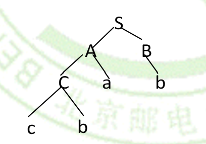

## 语言和文法

### Grammar 的结构

Grammar $G=(V,T,S,P)$：

- V 是词汇
- T 是终结符集合
- S 是起始符号
- P 是生成式集合

### Chomsky 文法体系分类

#### 0 型文法

无限制文法，与图灵机等价。

#### 1 型文法

上下文有关文法（CSG: Context-sensitive Grammar)，左部长度小于等于右部，$\sim$ 线性有界自动机。$\rightarrow$ 程序语言中用于过程调用时，形参与实参一致性检查。

#### 2 型文法

上下文无关文法（CFG: Context-free Grammar)。产生式左部为单个非终结符，对应上下文无关语言和下推自动机，用于表示句子语法结构（如表达式、嵌套结构），程序设计语言主要采用其描述语法结构。

#### 3 型文法

正则文法。

### 派生树

例题：Determine whether the word *cbab* belongs to the language generated by the grammar $G =(V, T, S, P)$, where $V = \{a, b, c, A, B, C, S\}$, $T = \{a, b, c\}$, S is the starting symbol, and the productions are

- S → AB
- A → Ca
- B → Ba, B → Cb, B → b
- C → cb, C → b 

$$
\begin{aligned}
 {S}&\Rightarrow {AB} &{S}\to {AB}\\
 &\Rightarrow {CaB}	  &{A}\to {Ca}\\
 &\Rightarrow {cbaB}  &{C}\to {cb}\\
 &\Rightarrow {cbab}  &{B}\to {b}
\end{aligned}
$$

{:style="zoom:60%"}

### 巴科斯范式（Backus-Naur Form, BNF）

用于指定 2 型文法，将相同左部非终结符的产生式合并，用 `::=` 代替 `→`，非终结符用 `< >` 括起来，右侧用 `|` 分隔。

$$
\begin{aligned}
〈identifier〉 &::=〈letter〉 | 〈identifier〉〈letter〉 | 〈identifier〉〈digit〉\\
〈letter〉&::=  a | b | ⋯  | y | z\\
〈digit〉 &::= 0 | 1 | ⋯ | 8 | 9
\end{aligned}
$$

## 无输出有限状态机

一个有限状态机 $M=(S,I,f,s_0,F)$：

- S 是所有状态的集合
- $I$ 是输入表
- $f$ 是状态转移函数
- $s_0$ 是初始状态
- $F$​ 是最终状态（或接受状态）的集合，在图中用双圆圈表示

### FSA 语言识别

可以被 FSA 状态机 M 识别的，字符串集合：$L(M)=\{x~|~ f(s_0,x)\in F\}$​。

### 不确定的有限状态机（NFSA）

同一个输入会导致转移到两个或多个状态。

### 构造等价 DFSA

画个状态表。

## 语言识别（Language Recognition）

### 正则表达式

- $\emptyset$ 表示没有字符
- $\lambda$ 表示空字符
- $( A\cup B )$ 表示该位字符由 A 或 B 表示

> $10^*$ 包含 $1$，也就是包含  $n=0$ 的情况！

### 克莱尼定律（Kleene's Theorem）

一个集合是正则的，**当且仅当 **它可以被有限状态机表示。

